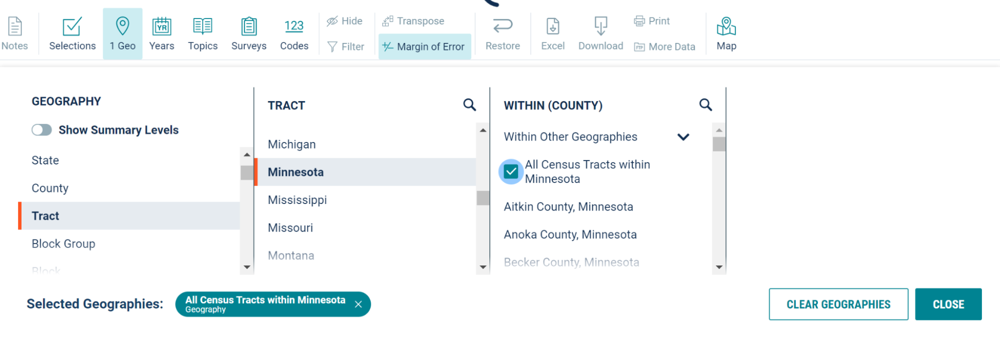
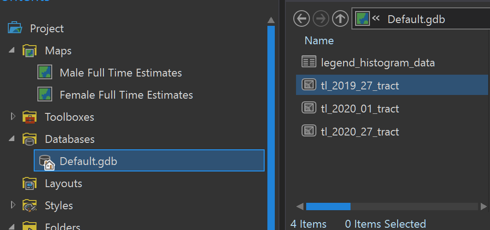
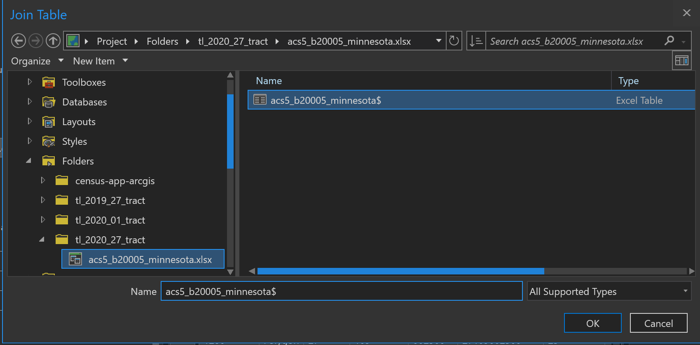
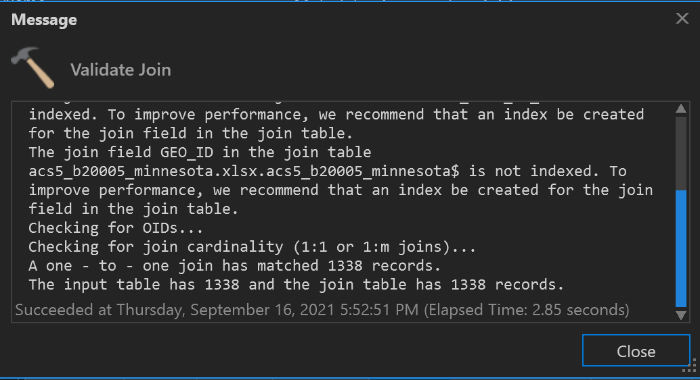
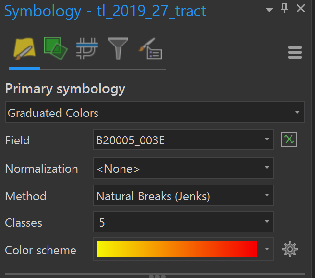
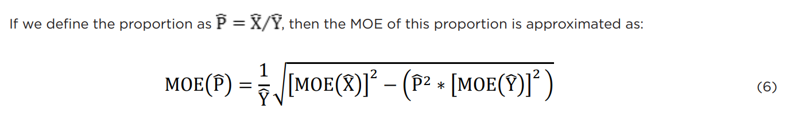
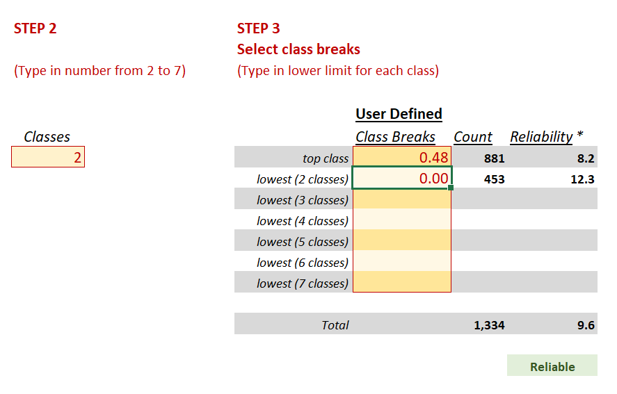

---
aliases:
- /markdown/2021/09/26/arcgis-census
categories:
- ArcGIS
- data analysis
date: '2021-09-26'
description: A tutorial to create a geodatabase, maps and layouts to visualize U.S.
  Census Data in ArcGIS Pro
layout: post
title: Visualize U.S. Census Data with ArcGIS
freeze: true
author: Vishal Bakshi
---


In this blog post, I’ll walk through my process of creating an ArcGIS geodatabase and a set of layouts visualizing U.S. Census Data. The data used for this app is from table B20005 (Sex By Work Experience In The Past 12 Months By Earnings In The Past 12 Months).

You can view the final layout PDFs at the following links:

- [Minnesota Female Full Time Worker Estimates by Tract - Counts.pdf](Minnesota%20Female%20Full%20Time%20Worker%20Estimates%20by%20Tract%20-%20Counts.pdf)
- [Minnesota Female Full Time Worker Estimates by Tract - Percentages.pdf](Minnesota%20Female%20Full%20Time%20Worker%20Estimates%20by%20Tract%20-%20Percentages.pdf)
- [Minnesota Male Full Time Worker Estimates by Tract - Counts.pdf](Minnesota%20Male%20Full%20Time%20Worker%20Estimates%20by%20Tract%20-%20Counts.pdf)
- [Minnesota Male Full Time Worker Estimates by Tract - Percentages.pdf](Minnesota%20Male%20Full%20Time%20Worker%20Estimates%20by%20Tract%20-%20Percentages.pdf)

## Table of Contents

- [Get the Data](#get-the-data)
  - [Tract Boundaries](#tract-boundaries-1)
  - [ACS 5-Year Estimates](#acs-5-year-estimates-1)
  - [Using data.census.gov](#using-data-census-gov)
  - [Using the censusapi R package](#using-censusapi)
- [Connect Data to Geodatabase](#connect-data-to-geodatabase)
  - [Tract Boundaries](#tract-boundaries-2)
  - [ACS 5-Year Estimates](#acs-5-year-estimates-2)
- [Visualize Data](#visualize-the-data)
  - [Create a Map](#create-a-map)
  - [Create a Symbology](#create-a-symbology)
  - [Create a Layout](#create-a-layout)
- [Normalize the Data](#normalize-the-data)
  - [Create Additional Layouts](#create-additional-layouts)

## Get the Data<a name="get-the-data"></a>

### Tract Boundaries<a name="tract-boundaries-1"></a>

- Download and unzip 2019 TIGER Shapefile for MN (tl_2019_27_tract.zip) (corresponds to the final year, 2019, in the ACS 5-year estimates). These will contain the Census Tract geographies needed to create a map in ArcGIS.

### ACS 5-Year Estimates<a name="acs-5-year-estimates-1"></a>

#### Using data.census.gov<a name="using-data-census-gov"></a>

- On data.census.gov, search for B20005


- Select the link to the Table B20005 with “2019 inflation-adjusted dollars”


- Click the dropdown at the top next to the label **Product** and select _2015: ACS 5-Year Estimates Detailed Tables_


- Click **Customize Table** at the top right of the page


- In the **Geo*** section, click _Tract > Minnesota > All Census Tracts within Minnesota_



- Once it’s finished loading, click **Close** and then **Download Table**


- Once downloaded, extract the zip folder and open the file _ACSDT52015.B20005_data_with_overlays_….xslx_ in Excel any tool that can handle tabular data

- Slice the last 11 characters of the _GEO_ID_ (using the **RIGHT** function in a new column) to replace the existing _GEO_ID_ column values. For example, a GEO_ID of _1400000US27029000100_ should be replaced with _27029000100_. This will later on be matched with the _GEOID_ field in the _tl_2019_27_tract_ shapefile

- Save/export the file as .XLSX

#### Using the `censusapi` R package<a name="using-censusapi"></a>

Pass the following arguments to the `censusapi::listCensusMetadata` function and assign its return value to `B20005_vars`:

<br>

```R
B20005_vars <- censusapi::listCensusMetadata(
  name="acs/acs5",
  vintage="2015",
  type="variables",
  group="B20005"
)
```
<br>

- Pass the following arguments to censusapi::getCensus and assign its return value to B20005:

<br>

```R
B20005 <- censusapi::listCensusMetadata(
  name="acs/acs5",
  vintage="2015",
  region="tract:*",
  regionin="state:27", # 27 = Minnesota state FIPS code
  vars=c("GEO_ID", "NAME", B20005_vars$name)
)
```
<br>

- Replace _GEO_ID_ (or create a new column) with the last 11 characters

<br>

```R
B20005 <- substr(B20005$GEO_ID, 10, 20)
```

<br>

- Export to an .XLSX file

<br>

```R
write.xlsx(B20005, “acs5_b20005_minnesota.xlsx”, row.names = FALSE)
```

<br>

## Connect Data to Geodatabase<a name="connect-data-to-geodatabase"></a>

Open ArcGIS Pro and start a new project.

### Tract Boundaries<a name="tract-boundaries-2"></a>

- Right click _Folders_ in the **Contents** pane and click _Add folder_ connection


- Select the downloaded (and extracted) _tl_2019_27_tract_ folder and click **OK**


- Click on _tl_2019_27_tract_ folder in the **Contents** pane

- In the **Catalog** pane, right-click _tl_2019_27.shp_ and then click _Export > Feature Class to Geodatabase_


- Confirm _Input Features_ (tl_2019_27_tract.shp) and _Output Geodatabase_ (Default.gdb or whatever geodatabase you are connected to) and then click the green **Run** button

- Refresh the Geodatabase and click on it in the **Contents** pane to view the added shapefile



### ACS 5-Year Estimates<a name="acs-5-year-estimates-2"></a>

- Under the **View** ribbon click on _Geoprocessing_ to open that pane

- In the **Geoprocessing** pane, search for _Join Field_ and click on it


- Next to _Input Table_ click on the folder icon to _Browse_. Select the _tl_2019_27_tract_ table in your geodatabase


- Click the **Input Join Field** dropdown and select _GEOID_

- Next to **Join Table** click on the folder icon to _Browse_. Select the _acs5_b20005_minnesota$_ Excel table and click **OK** (note: the Excel table is inside the XLSX file)



- Type _GEO_ID_ under **Join Table Field**

- Click on the down arrow next to _Transfer Fields_ and select B20005_002E, B20005_003E, B20005_049E, and B20005_050E


- Click on **Validate Join**



- Click on **Run**

- A success message should be displayed at the bottom of the **Geoprocessing** pane


## Visualize the Data<a name="visualize-data"></a>

In this section, I’ll create maps and layouts to visualize the population estimates using Census Tract spatial data.

### Create a Map<a name="create-a-map"></a>

- In the **Catalog pane**, right-click _tl_2019_27_tract > Add to New > Map_


- To reference the raw data: from the _Feature Layer_ ribbon, click _Attribute Table_


### Create a Symbology<a name="create-a-symbology"></a>

- Select the _tl_2019_27_tract_ layer in **Contents** pane

- Click **Appearance** under the **Feature Layer** ribbon

- Click the down arrow on **Symbology** and select **Graduated Colors**


- Select _B20005_002E_ in the **Field** dropdown and _Natural Breaks (Jenks)_ for the **Method**



- The class breaks created by this method do not reliably classify the data, which is determined using the City of New York Department of Planning [Map Reliability Calculator](https://www1.nyc.gov/site/planning/planning-level/nyc-population/nyc-population-map-reliability-calculator.page). There’s a 10.1% chance that a tract is erroneously classified.


- After adjusting the class breaks, the following result in a reliable result (less than 10% chance of misclassifying any geography on the map and less than 20% of misclassifying estimates within a class due to sampling error)


- Apply these breaks in the **Classes** tab in the **Symbology** pane


- The **Map** pane displays the updated choropleth


### Create a Layout<a name="create-a-layout"></a>

Under the **Insert** ribbon click on _New Layout_ and _Letter (8.5” x 11”)_


- On the **Insert** ribbon, click _Map Frame_ and _Default Extent_ under the _Map_ category


- Click and drag the cursor to draw the Map Frame. Under the **Layout** ribbon select _Activate_ and zoom/pan until the full choropleth is visible. Click _Deactivate_ when you’re finished.


- Add guides to create 0.5 inch margins by right-clicking on rulers clicking _Add Guide_


- Under the **Insert** ribbon click on _Legend_ and draw a rectangle underneath the map


- Right-click the legend and click _Properties_ to format the font size, text visibility (under _Legend Item_ in the dropdown next to _Legend_ in the **Format Legend** panel) and more


- On the **Ribbon** tab in the _Graphics and Text_ panel, you can choose different text types to add text to your layout. I’ve added titles and explanatory text.


- The census tracts for the city of Minneapolis are too small to be clearly visible. Under the **Insert ribbon** click _Map Frame_, select the map and draw a small rectangle over Wisconsin.

- With the new Map Frame selected, click _Reshape > Circle_ under the **Insert** ribbon. Draw a circle over the rectangular map.


- Right-click on the circular map and click _Properties_ to add a border. Add a textbox to label it as the City of Minneapolis.


- From the **Graphics and Text** panel on the **Insert** ribbon use the straight line and circle tool to add some visual cues indicating that the map frame is a detail view of the city


- Under the **Share** ribbon, select _Export Layout_ and export it to a PDF file


## Normalize the Data<a name="normalize-the-data"></a>

While the worker population estimates gives us a sense of how workers are distributed across the state, they are a proxy for population density. Census Tracts in Urban areas, like the Minneapolis, will likely have more workers than Rural areas, because they have a higher population. To supplement this layout, I’ll create layouts that show the percentage of the total sex population who are full time workers.

- To duplicate the _Male Full TIme Estimates_ layout, right-click it in the **Catalog** pane, click _Copy_ and then right click in the gray area underneath it and click _Paste_


- Rename the layout to _Male Full Time Percentages_ and open it

- Rename the two maps in the **Contents** pane


- Right-click _tl_2019_27_tract_ under _Main Map_ and click _Symbology_ to open the **Symbology** pane


- Select _B20005_002E_ (Total Male Estimate) in the _Normalization_ dropdown. This will be the value that divides a Census Tract's population estimate


- Calculate the Margin of Error (MOE) for the percentage of total male workers who are full time employed using equation 6 from the “Calculating Measures of Error for Derived Estimates” in the [Understanding and Using American Community Survey Data: What All Data Users Need to Know](https://www.census.gov/content/dam/Census/library/publications/2020/acs/acs_general_handbook_2020.pdf) handbook in order to determine the class break reliability. In the equation below, P = X/Y is the percentage of full time workers in the tract (X= B20005_003E and Y = B20005_002E)



- One reliable set of class breaks, which were few and far between, was the following:



- Apply those class breaks in the **Symbology** pane and update the text to match


### Create Additional Layouts<a name="create-additional-layouts"></a>

- Repeat the process to create the following Layouts given the following class breaks
  - Female Full Time Estimates


  - Female Full Time Percentages


---

I hope you enjoyed this tutorial.
