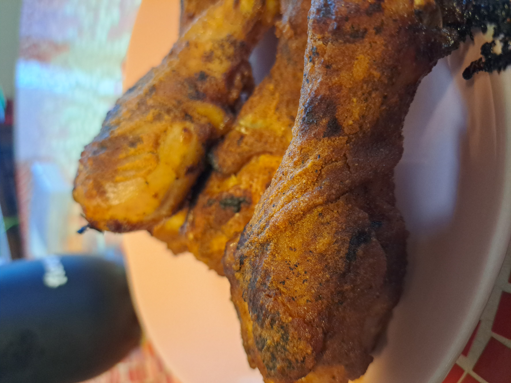

---
aliases:
- /markdown/2023/02/19/honey-bbq-chicken-drumsticks
categories:
- food
date: '2023-02-19'
date-modified: '2023-02-20'
description: An update on my goal to make 10/10 chicken wings by the 2023 NFL season.
layout: post
title: Making Chicken Wings
author: Vishal Bakshi
---

# Background
Restaurant-bought wings are pricey. Even fast-food bought wings, which can be miserably made some times---I once bought advertised _Honey BBQ Chicken Wings_ which were great the first time, but the second time looked like plain wings with barbeque sauce drizzled over them--were about $20 for 16 wings. I don't mind the price, gratefully, but I do mind consistent quality and want to avoide letdowns, so I chose to learn how to make wings. I also need to fill the gap caused by the lack of NFL and College Football during the offseason, so this is a tasty project which serves that purpose as well.

# First Attempt
I made my first batch of chicken wings on Saturday, February 11, 2023. They were edible and the sauce was delicious. But they were at most a 5/10. I follow some recipe I found online after a google search which went something like:

- Preheat oven to 400&deg;F
- Baste oil on both sides of the wings and season with salt and pepper
- Bake for 20 minutes, flipping the wings after 10 minutes
- Heat the oven to 425&deg;F
- Baste on the sauce and bake for 7 minutes then flip. Repeat a few times.
- Broil (500&deg;F) for 5-10 minutes.

My sauce was made of Ray's sugar-free BBQ sauce, mustard, soy sauce, and honey.

I did not have a basting brush and was using a spoon to lather on the sauce. It did not work well.
Also, the meat did not fall off the bones and it took more effort than worthwhile to eat them.

# Second Attempt
I was hungrier this time I suppose because I chose to make honey bbq drumsticks instead of wings. This time I got a silicone basting brush at Safeway. I modified my approach slightly:

- Preheat oven to 400&deg;F
- Actually baste this time and season the drumsticks
- Bake on one side for 15 minutes, flip and bake for another 15 minutes
- Remove the drumsticks and heat the oven to 425&deg;F
- Repeat four times, twice on each side: baste on sauce, bake for 7 minutes, remove and flip.
- Add coconut flour to the sauce (note to self: use rice flour instead)
- Repeat two times, once on each side: baste on sauce/flour mix (gravy?), bake for 7 minutes and flip.
- Broil (500&deg;F) for 5 minutes.

Using the basting brush allowed for a more even distribution of sauce on the drumsticks. The skin still wasn't crispy enough, although the meat was (more) easily coming off the bones and was juicy + delicious.

When I make it again, probably next weekend, I'll switch back to chicken wings and find a new recipe which emphasizes the cripsiness of the wings.

