---
title: WebGPU Puzzles&#58; Walk through of Official Solutions
date: "2024-11-17"
author: Vishal Bakshi
description: This blog post contains my walkthrough of the official AnswerAI WebGPU Puzzle solutions that I found challenging to understand and/or critical in helping me understand core concepts of GPU programming.
filters:
   - lightbox
lightbox: auto
categories:
    - AnswerAI
    - WebGPU
---

## Background

This file contains my walkthrough of the official WebGPU Puzzle solutions that I found challenging to understand and/or critical in helping me understand core concepts of GPU programming. You can find the Excel spreadsheet with my solution visualizations [here](https://github.com/vishalbakshi/webgpupuzzles/blob/main/webgpupuzzles.xlsx). The WebGPU puzzles are published by Answer.AI at https://gpupuzzles.answer.ai/puzzles.

## Puzzle 7

```WGSL
@group(0) @binding(0) var<storage, read_write> a : array<f32>;
@group(0) @binding(1) var<storage, read_write> out : array<f32>;

const wgs = vec3({{workgroupSize}}); // workgroup sizes
const twg = vec3({{totalWorkgroups}}); // total workgroups

@compute @workgroup_size({{workgroupSize}})
fn main(@builtin(local_invocation_id) lid: vec3<u32>,
        @builtin(global_invocation_id) gid: vec3<u32>,
        @builtin(workgroup_id) wid: vec3<u32>
        ) {

  let wgSize: u32 = wgs.x * wgs.y * wgs.z;
  let wg = wid.x + wid.y * twg.x;
  let i = lid.x + lid.y * wgs.x + wg * wgSize;
  out[i] = a[i] + 10;
}
```

```
___________________________________
Test case 1 

Workgroup Size       ( 2, 2, 1 )
Total Workgroups     ( 2, 2, 1 )

Input a  [  0  1  2  3  4  5  6  7  8 ]
Expected [ 10 11 12 13 14 15 16 17 18 ]

___________________________________
Test case 2 

Workgroup Size       ( 2, 2, 1 )
Total Workgroups     ( 3, 3, 1 )

Input a  [  0  1  2  3  4  5  6  7  8  9 10 11 12 13 14 15 16 17 18 19 20 21 22 23 24 ]
Expected [ 10 11 12 13 14 15 16 17 18 19 20 21 22 23 24 25 26 27 28 29 30 31 32 33 34 ]
```

I actually didn't quite understand this solution until I revisited it while I was working on Puzzle #14 after I recalled that this solution dealt with situations where the number of threads in a workgroup was less than the number of positions in the input array.

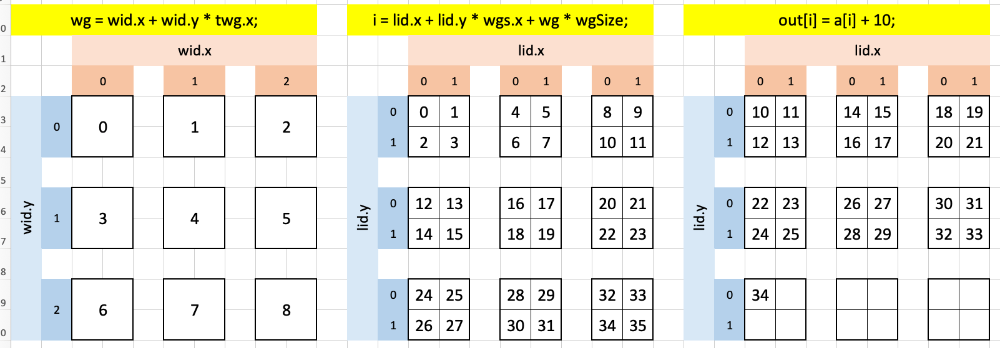

I interpret `wg` as being the global "workgroup indexer" and `i` as the global "thread indexer." In `wg`, the value of `wid.x` (0, 1, 2) is incremented by 1 as you go down `wid.y` by the term `wid.y * twg.x`. Similarly for `i`, `lid.y * wgs.x` increments the index by 1 as you go down `lid.y` while `wg * wgSize` increments the `i` by 4 as you traverse over the `wg` index of the workgroup. In this way, while no single workgroup can handle all 25 elements of the input array, spreading them out across 9 workgroups make this light work.

## Puzzle 8

This puzzle also had fewer threads per block than number of elements in the input array.

```WGSL
@group(0) @binding(0) var<storage, read_write> a : array<f32>;
@group(0) @binding(1) var<storage, read_write> out : array<f32>;

// workgroup sizes x, y, z
const wgs = vec3({{workgroupSize}});
// total workgroups x, y, z
const twg = vec3({{totalWorkgroups}}); 
// flat shared memory array
var<workgroup> smem: array<f32, {{smemSize}}>; 

@compute @workgroup_size({{workgroupSize}})
fn main(@builtin(local_invocation_id) lid: vec3<u32>,
        @builtin(global_invocation_id) gid: vec3<u32>,
        @builtin(workgroup_id) wid: vec3<u32>) {
  if (gid.x < arrayLength(&a)) {
    smem[lid.x] = a[gid.x];
  }
  workgroupBarrier(); 
  out[gid.x] = smem[lid.x] + 10;
}
```

```
___________________________________
Test case 1

Workgroup Size       ( 4, 1, 1 )
Total Workgroups     ( 2, 1, 1 )
Shared Memory  Size  ( 8, 1, 1 )

Input a  [  0  1  2  3  4  5  6  7 ]

Expected [ 10 11 12 13 14 15 16 17 ]

___________________________________
Test case 2

Workgroup Size       ( 8, 1, 1 )
Total Workgroups     ( 2, 1, 1 )
Shared Memory  Size  ( 8, 1, 1 )

Input a  [  0  1  2  3  4  5  6  7  8  9 10 11 12 13 14 15 ]

Expected [ 10 11 12 13 14 15 16 17 18 19 20 21 22 23 24 25 ]
```

The following lines load the input array into shared memory:

```WGSL
if (gid.x < arrayLength(&a)) {
    smem[lid.x] = a[gid.x];
}
```

Visualizing Test Case 1: in each workgroup, since `lid.x` is (0, 1, 2, 3), only the first four elements of shared memory are filled with data. In the first workgroup, `gid.x` is (0, 1, 2, 3) and in the second workgroup, it's (4, 5, 6, 7) so the corresponding elements of input array `a` are loaded into shared memory. 

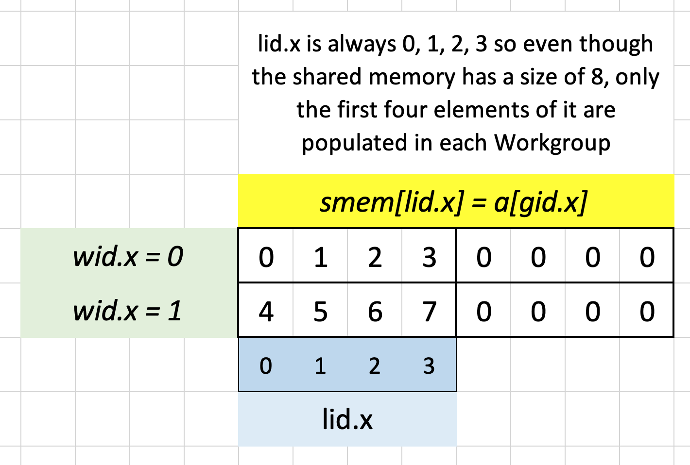

The following line assigns to `out` in each workgroup the first four elements of `smem`:

```WGSL
out[gid.x] = smem[lid.x];
```

Visualizing that in Excel for Test Case 1:

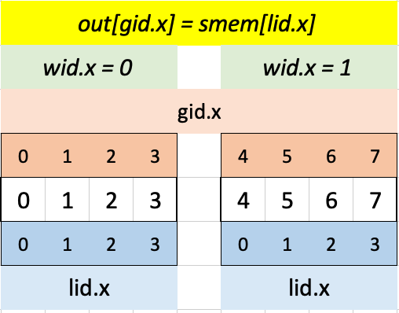

`lid.x` is always (0, 1, 2, 3) so the first four elements of `smem` are always indexed. `gid.x` is (0, 1, 2, 3) for `wid.x = 0` and (4, 5, 6, 7) for `wid.x = 1` so the first four elements of `out` are loaded with the first four elements of `smem` for the first workgroup and the second four elements of `out` are loaded with the first four elements of `smem` for the second workgroup. Adding 10 to `smem` values gives the expected output:

```WGSL
out[gid.x] = smem[lid.x];
```
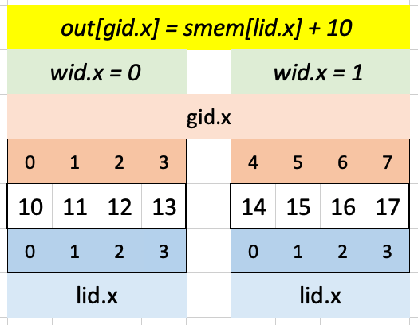

Here are is the solution visualized for Test Case 2:

The full 8-element shared memory array is filled with values from the 16-element input array `a`:

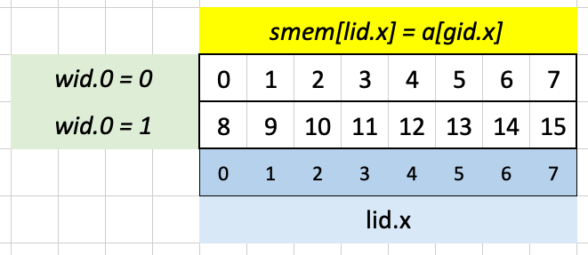

Again `lid.x` is equal in both workgroups, so the first 8 elements of `smem` are loaded into the corresponding sequence of 8 elements in `out` using `gid.x`:

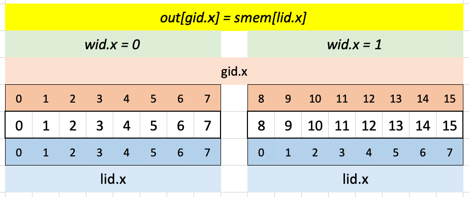

Adding 10 to the `smem` values yields the expected result:

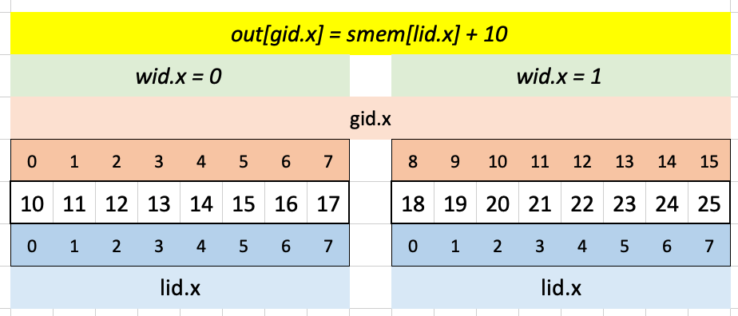

## Puzzle 9

```WGSL
@group(0) @binding(0) var<storage, read_write> a : array<f32>;
@group(0) @binding(1) var<storage, read_write> out : array<f32>;

const wgs = vec3({{workgroupSize}}); // workgroup sizes
const twg = vec3({{totalWorkgroups}}); // total workgroups
var<workgroup> smem: array<f32, {{smemSize}}>;

@compute @workgroup_size({{workgroupSize}})
fn main(@builtin(local_invocation_id) lid: vec3<u32>,
        @builtin(global_invocation_id) gid: vec3<u32>,
        @builtin(workgroup_id) wid: vec3<u32>
        ) {
    let i = lid.x + lid.y * wgs.x;
    smem[lid.x] = a[i];
    workgroupBarrier();
    out[lid.x] = smem[lid.x];
    if (lid.x > 0) {
        out[lid.x] += smem[lid.x - 1];
        if (lid.x > 1) {
            out[lid.x] += smem[lid.x - 2];
        }
    }
}
```

```
___________________________________
Test case 1

Workgroup Size       ( 8, 1, 1 )
Total Workgroups     ( 1, 1, 1 )
Shared Memory  Size  ( 8, 1, 1 )

Input a  [  0  1  2  3  4  5  6  7 ]
Expected [  0  1  3  6  9 12 15 18 ]

___________________________________
Test case 2

Workgroup Size       ( 10, 1, 1 )
Total Workgroups     ( 1, 1, 1 )
Shared Memory  Size  ( 10, 1, 1 )

Input a  [  0  1  2  3  4  5  6  7  8  9 ]
Expected [  0  1  3  6  9 12 15 18 21 24 ]
```

Since we have only one workgroup with size (8, 1, 1) in Test Case 1, `wgs.x` is `0` and `lid.y` is `0`, so `i` ends up being equal to `lid.x`. The shared memory array `smem` has the same size as the input array `a` (and the workgroup) so `smem[lid.x] = a[i]` loads in the entire array `a` into shared memory.

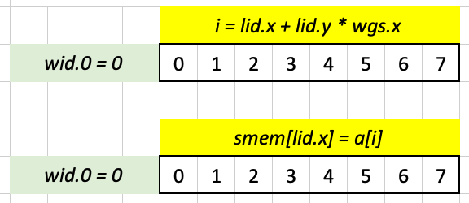

Next, we load into `out` the entire array `smem` with the following line:

```WGSL
out[lid.x] = smem[lid.x];
```

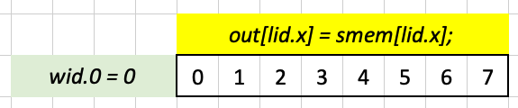

Our goal is to "sum together the last 3 positions of `a` and store it in `out`." To do this, we first "slide" or "shift" `smem` one element to the right with the code `smem[lid.x - 1]`, and add it to `out`. We only do this for `i` values above `0` since we don't want to index into `smem` with `-1`:

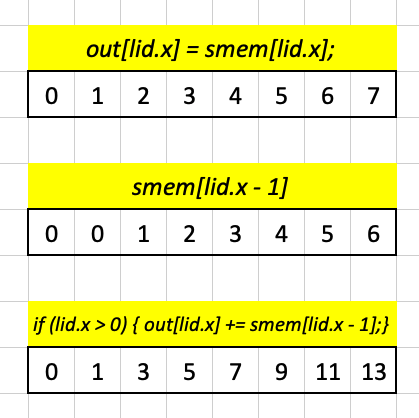

We shift `smem` by 2 elements to the right (again only doing it for `i` values that won't result in a negative index, `i > 1`) and add that to `out` to get our expected result:


## Puzzle 10

```WGSL
@group(0) @binding(0) var<storage, read_write> a : array<f32>;
@group(0) @binding(1) var<storage, read_write> b : array<f32>;
@group(0) @binding(2) var<storage, read_write> out : array<f32>;

const wgs = vec3({{workgroupSize}});
const twg = vec3({{totalWorkgroups}});
var<workgroup> smem: array<f32, {{smemSize}}>;

@compute @workgroup_size({{workgroupSize}})
fn  main(@builtin(local_invocation_id) lid: vec3<u32>,
         @builtin(global_invocation_id) gid: vec3<u32>) {
    
   // assumes wgs.x > arrayLength(&a);
   smem[lid.x]  = a[gid.x] * b[gid.x];
   
   workgroupBarrier();
             
    if (gid.x == 0) {
        for (var i: u32=0; i<arrayLength(&a); i+=1) {
            out[0] += smem[i];
        }
    }
}
```

```
___________________________________
Test case 1 

Workgroup Size       ( 4, 1, 1 )
Total Workgroups     ( 1, 1, 1 )
Shared Memory  Size  ( 4, 1, 1 )

Input a  [  0  1  2  3 ]
Input b  [  0  1  2  3 ]

Expected [ 14 ]

___________________________________
Test case 2 

Workgroup Size       ( 5, 1, 1 )
Total Workgroups     ( 1, 1, 1 )
Shared Memory  Size  ( 5, 1, 1 )

Input a  [  0  1  2  3  4 ]
Input b  [  0  1  2  3  4 ]

Expected [ 30 ]
```

To take the dot product between two 1-D array, we need to take their cumulative element-wise sum. The official solution starts by loading these element-wise sums into shared memory with:

```WGSL
smem[lid.x]  = a[gid.x] * b[gid.x];
```

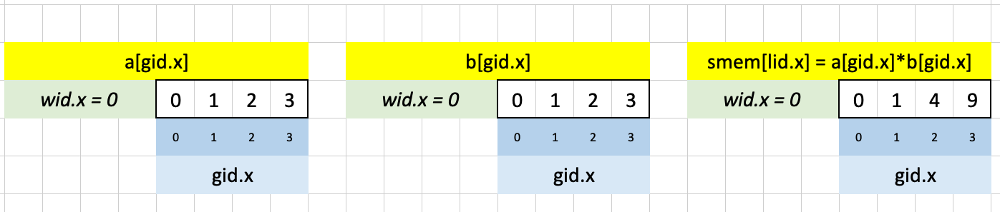

After that, we simply iterate through the shared memory array and accumulate the sum with:

```WGSL
if (gid.x == 0) {
    for (var i: u32=0; i<arrayLength(&a); i+=1) {
        out[0] += smem[i];
    }
}
```

IIUC, the guard `if (gid.x == 0)` prevents more than one thread from working on this task.

## Puzzle 11

```WGSL
@group(0) @binding(0) var<storage, read_write> a : array<f32>;
@group(0) @binding(1) var<storage, read_write> b : array<f32>;
@group(0) @binding(2) var<storage, read_write> out : array<f32>;

const wgs = vec3({{workgroupSize}});
const twg = vec3({{totalWorkgroups}});

var<workgroup> smemA: array<f32, wgs.x * wgs.y * wgs.z + 4>;
var<workgroup> smemB: array<f32, 4>;

@compute @workgroup_size({{workgroupSize}})
fn  main(@builtin(local_invocation_id) lid: vec3<u32>,
         @builtin(global_invocation_id) gid: vec3<u32>,
         @builtin(workgroup_id) wid: vec3<u32>
         ) {
    // Each workgroup is responsible computes total workgroup size
    // values of out and caches total workgroup size + 4 values
    // of a
    let wgSize: u32 = wgs.x; // assumes wgs.y = wgs.z = 1
    smemA[lid.x] = a[gid.x];
    if (lid.x < 4) {
        smemB[lid.x] = b[lid.x];
        if (wid.x * wgSize + wgSize + lid.x < arrayLength(&a)) {
            smemA[wgSize + lid.x] = 
                a[wid.x * wgSize + wgSize + lid.x];
        } else {
            smemA[wgSize + lid.x] = 0.0;
        }
    }
    workgroupBarrier();
    var sum: f32 = 0.0;
    for (var i: u32 = 0; i < 4; i += 1) {
        if (gid.x + i < arrayLength(&a)) {
            sum = sum + smemA[lid.x + i] * smemB[i];
        }
    }
    out[gid.x] = sum;
}
```

```
___________________________________
Test case 1

Workgroup Size       ( 8, 1, 1 )
Total Workgroups     ( 2, 1, 1 )
Shared Memory  Size  ( 12, 1, 1 )

Input a  [  0  1  2  3  4  5  6  7  8  9 10 11 12 13 14 ]
Input b  [  0  1  2  3 ]

Expected [ 14 20 26 32 38 44 50 56 62 68 74 80 41 14  0 ]

___________________________________
Test case 2

Workgroup Size       ( 8, 1, 1 )
Total Workgroups     ( 3, 1, 1 )
Shared Memory  Size  ( 12, 1, 1 )

Input a  [  0  1  2  3  4  5  6  7  8  9 10 11 12 13 14 15 16 17 ]
Input b  [  0  1  2  3 ]

Expected [ 14 20 26 32 38 44 50 56 62 68 74 80 86 92 98 50 17  0 ]
```

In Test case 1, our workgroup has 8 threads, our shared memory arrays have 12 spots, and our input has 15 elements. We start by loading the first 8 elements of `a` into `smemA` with `lid.x` and `gid.x`:

```WGSL
smemA[lid.x] = a[gid.x];
```

Here's what that looks like in Excel. Each workgroup gets assigned its consecutive sequence of 8 elements:

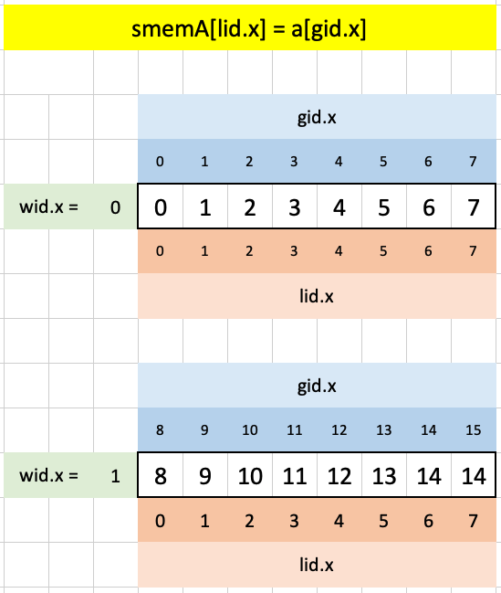

Next, to load in the remaining 4 elements of `a` into `smemA` and all four elements of `b` into `smemB` we run the following code:

```WGSL
if (lid.x < 4) {
    smemB[lid.x] = b[lid.x];
    if (wid.x * wgSize + wgSize + lid.x < arrayLength(&a)) {
        smemA[wgSize + lid.x] = a[wid.x * wgSize + wgSize + lid.x];
    } else {
        smemA[wgSize + lid.x] = 0.0;
    }
}
```

The guard `lid.x < 4` ensures that we are only handling 4 elements at a time. The next line is simple, and loads the full contents of `b` into `smemB`:

```WGSL
smemB[lid.x] = b[lid.x];
```

Now we get into some more tricky stuff to assign the correct set of 4 final elements to shared memory in the appropriate workgroup. Let's first visulize the more involved index (where `wgSize` is `wgs.x` which is `8` in Test case 1):

```WGSL
wid.x * wgSize + wgSize + lid.x
```

Visualizing this index in Excel for each workgroup, noting that it's restricted to 4 elements (due to our guard `lid.x < 4`) as it builds off `lid.x`:

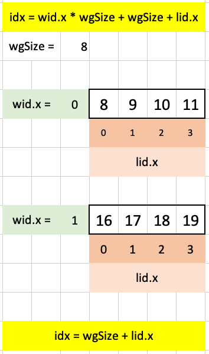

The other index that we use is `wgSize + lid.x` which is more straightforward (it adds `8` to each of the four elements of `lid.x`):

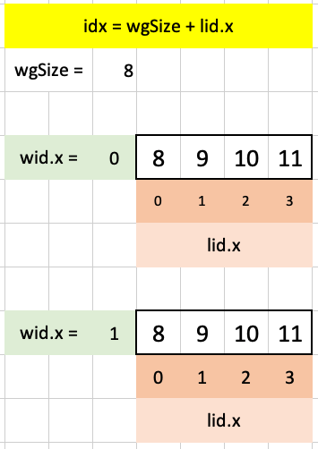

This index will be used to _extend_ the index into the lat 4 elements of shared memory array past the `8` elements available in `lid.x` or `gid.x` for each workgroup with the following code:

```WGSL
if (wid.x * wgSize + wgSize + lid.x < arrayLength(&a)) {
    smemA[wgSize + lid.x] = a[wid.x * wgSize + wgSize + lid.x];
} else {
    smemA[wgSize + lid.x] = 0.0;
}
```

For the first workgroup, the maximum value of `wid.x * wgSize + wgSize + lid.x` is less than `arrayLength(&a)` so we load in the 9th to 12th elements of `a` into `smemA`. For the second workgroup, the maximum value of `wid.x * wgSize + wgSize + lid.x` is more than `arrayLength(&a)` so we assign 0s:

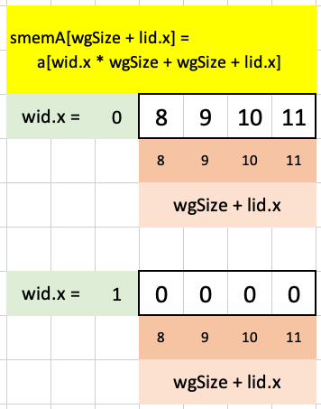


In this way, we have assigned a maximum of 12 elements of `a` into `smemA`, _extending_ the available indexes `gid.x` and `lid.x` past their maximum of 8 elements using `wid.x` and `wgs.x`:

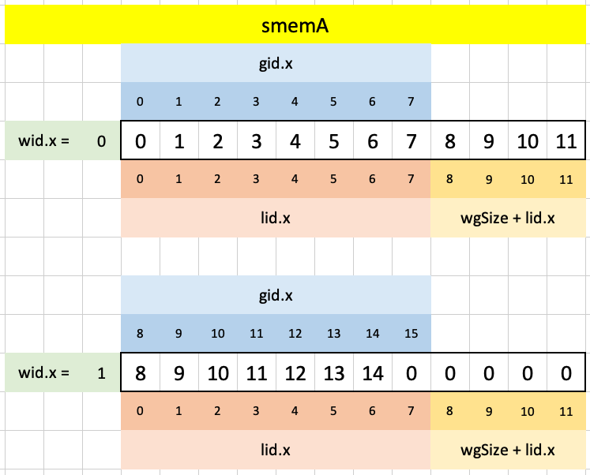

With our data loaded into shared memory arrays we can now go about performing 1-D convolution between `a` and `b` with the following code:

```WGSL
var sum: f32 = 0.0;
for (var i: u32 = 0; i < 4; i += 1) {
    if (gid.x + i < arrayLength(&a)) {
        sum = sum + smemA[lid.x + i] * smemB[i];
    }
}
out[gid.x] = sum;
```

Understanding this loop was a pivotal point in my understanding of parallelism. While we are iterating over `i` which is a 32-bit unsigned integer, we are performing 8 element-wise operations in each loop iteration at the same time (since we are using `lid.x` to index into `smemA`) in each workgroup (which is why we use `gid.x` to index into `out` to assign the correct value of `sum`).

What's counterintuitive at first is that `sum` is a single `f32` 32-bit floating point number, but since we are using `lid.x` and `gid.x` it is being manipulated 16 different ways (8 threads across 2 workgroups). So although to me it initially _looked_ like `sum` was behaving as an array, it's not. The array-like behavior is the parallelism of the GPU.

The following line:

```WGSL
sum = sum + smemA[lid.x + i] * smemB[i];
```

is visualized in Excel for the first workgroup as follows:

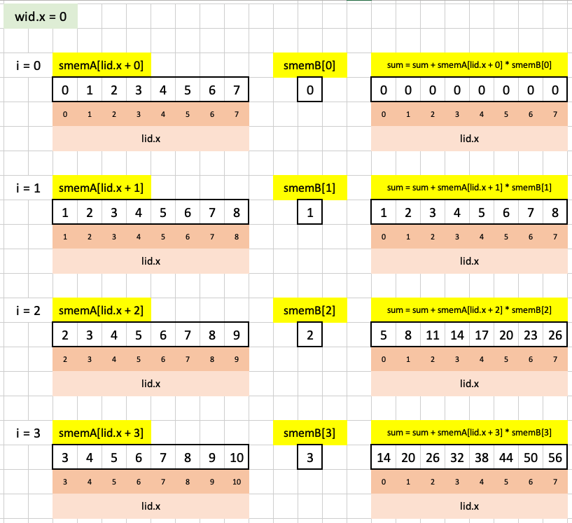

Note that in each iteration of the loop we are shifting `smemA` and `smemB` by 1 element to the left and taking the elementwise product (across 8 threads). From the individual thread's perspective, it's a product between two numbers, accumulating their sum over each loop iteration.

Here's a visualization of the loop iterations in the second workgroup:

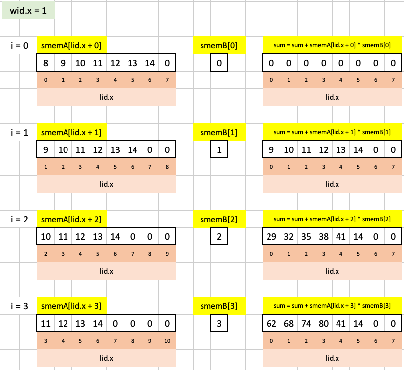


After each loop is finished, we assign the resulting number to its corresponding location in `out` to get our final result:

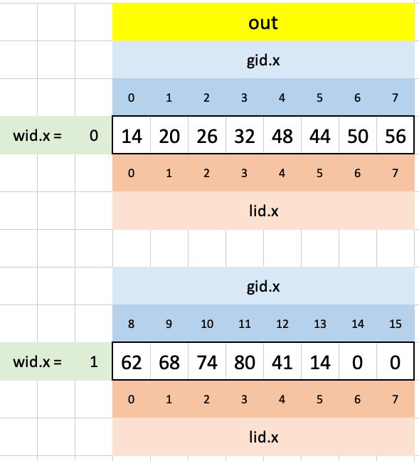

## Puzzle 12

```WGSL
@group(0) @binding(0) var<storage, read_write> a : array<f32>;
@group(0) @binding(1) var<storage, read_write> out : array<f32>;

const wgs = vec3({{workgroupSize}});
const twg = vec3({{totalWorkgroups}});
var<workgroup> smem: array<f32, {{smemSize}}>;

@compute @workgroup_size({{workgroupSize}})
fn main(@builtin(local_invocation_id) lid: vec3<u32>,
        @builtin(global_invocation_id) gid: vec3<u32>,
        @builtin(workgroup_id) wid: vec3<u32>) {
    smem[lid.x] = a[gid.x];
    workgroupBarrier();
    for (var skip: u32 = 1; skip < wgs.x; skip = skip * 2) {
        if (lid.x % skip == 0 
            && lid.x + skip < wgs.x 
            && gid.x + skip < arrayLength(&a)) {
            smem[lid.x] = smem[lid.x] + smem[lid.x + skip];
        }
        workgroupBarrier();
    }
    if (lid.x == 0) {
        out[wid.x] = smem[0];
    }
}
```

```
___________________________________
Test case 1

Workgroup Size       ( 8, 1, 1 )
Total Workgroups     ( 1, 1, 1 )
Shared Memory  Size  ( 8, 1, 1 )

Input a  [  0  1  2  3  4  5  6  7 ]
Expected [ 28 ]

___________________________________
Test case 2

Workgroup Size       ( 8, 1, 1 )
Total Workgroups     ( 2, 1, 1 )
Shared Memory  Size  ( 8, 1, 1 )

Input a  [  0  1  2  3  4  5  6  7  8  9 ]
Expected [ 28 17 ]
```

In this puzzle we want to take the block-wise cumulative sum. For Test case 1, there is only 1 block (workgroup) so we want the sum of the full array, which is `28`. For Test case 2, we have two 8-thread blocks and a 10-element input array. The cumulative sum for the first block is the sum of the first 8 elements (`28`) and the cumulative sum for the second block is the sum of the next two elements (`17`). 

The first line of the solution is simple: we want to load into shared memory the corresponding set of 8-elements from the input array:

```WGSL
smem[lid.x] = a[gid.x];
```

Visualizing this in Excel for each workgroup:

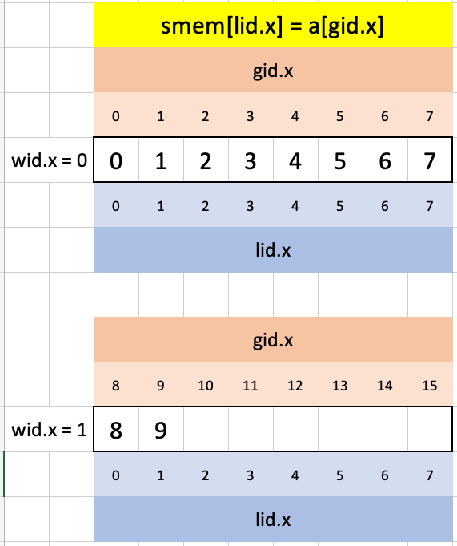

The next chunk of code is quite involved---its goal is to find the cumulative sum of the elements stored in shared memory following certain guards:

```WGSL
for (var skip: u32 = 1; skip < wgs.x; skip = skip * 2) {
    if (lid.x % skip == 0 
        && lid.x + skip < wgs.x 
        && gid.x + skip < arrayLength(&a)) {
        smem[lid.x] = smem[lid.x] + smem[lid.x + skip];
    }
    workgroupBarrier();
}
```

Here's what that code looks visualized in Excel where each column of arrays corresponds to each iteration of the loop. The cells highlighted in green in each array are the elements which pass the guard conditions in the `if`-statement:

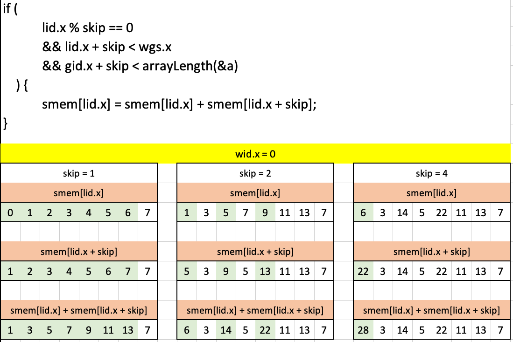

For `skip` = 1, the first six elements pass the guard conditions. In each case (`lid.x` of 0, 1, 2, 3, 4, 5), `lid.x % skip == 0` is true, `lid.x + skip < wgs.x` is true, and `gid.x + skip < arrayLength(&a)` is true. For the seventh element (`lid.x = 7`):

- `lid.x % skip == 0`: `7 % 1 == 0` is true
- `lid.x + skip < wgs.x`: `7 + 1 < 8` is false
- `gid.x + skip < arrayLength(&a)`: `7 + 1 < 8` is false

For `skip` = 2: only the 0th, 2nd and 4th element pass the guard conditions. While the 6th element does pass the first guard (`lid.x % skip == 0`: `6 % 2 == 0` is true) it fails the second two guards as `6 + 2` is not less than `wgs.x` or `arrayLength(&a)`.

Finally for `skip` = 4, only the 0th element passes all guard conditions. The 4th element does pass the first condition (`lid.x % skip == 0`: `4 % 4 == 0` is true) but fails the second two guards as `4 + 4` is not less than `wgs.x` or `arrayLength(&a)`.

For each `skip` we slide the elements over by `skip` and sum them to the previous iteration's `smem`.

In Test case 2, we have the same prefix sum (`28`) for the first block. We also have a second block for which the prefix sum is much simpler since the `skip` value in only one iteration of the for loop passes all guard conditions.


For `skip` = 1: 

- `lid.x % skip == 0`: is true for all 7 elements.
- `lid.x + skip < wgs.x`: is true for all 7 elements.
- `gid.x + skip < arrayLength(&a)`: `8 + 1 < 10` is true **only for the first element**, so that's the only sum that takes place (8 + 9 = 17).

For `skip` = 2 and `skip` = 4:

- `lid.x % skip == 0`: is true for some elements.
- `lid.x + skip < wgs.x`: is true for some elements.
- `gid.x + skip < arrayLength(&a)`: is true **for no element**, therefore the code inside the if-condition never runs.

Understanding the prefix sum algorithm took an unreasonable amount of time for me, and I'm still not completely comfortable, but the following visual did help solidify for me how it works. Green-highlighted cells are pairwise sums corresponding to the given `skip`. At the bottom I've listed out within which pairwise sums the given original array element is included.

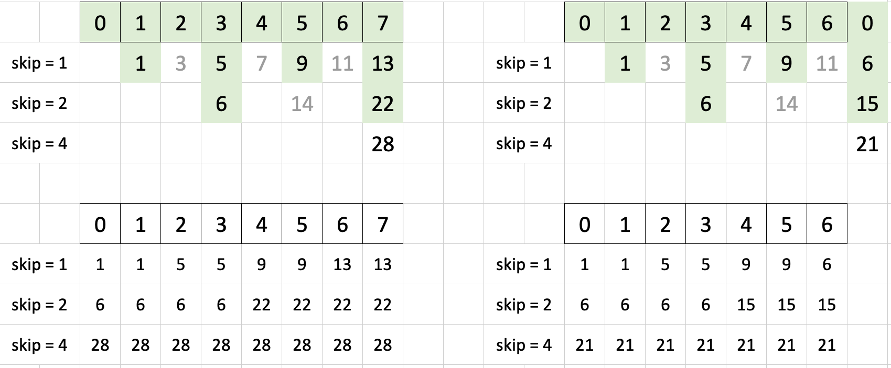

## Puzzle 13

```WGSL
@group(0) @binding(0) var<storage, read_write> a : array<f32>;
@group(0) @binding(1) var<storage, read_write> out : array<f32>;

const wgs = vec3({{workgroupSize}});
const twg = vec3({{totalWorkgroups}});
var<workgroup> smem: array<f32, {{smemSize}}>;

const nRows = 4;

@compute @workgroup_size({{workgroupSize}})
fn main(@builtin(local_invocation_id) lid: vec3<u32>,
        @builtin(global_invocation_id) gid: vec3<u32>,
        @builtin(workgroup_id) wid: vec3<u32>) {
    let nCols = arrayLength(&a) / nRows;
    smem[lid.x] = a[wid.y * nCols + lid.x];
    workgroupBarrier();
    for (var skip: u32 = 1; lid.x + skip < nCols; skip *= 2) {
        smem[lid.x] += smem[lid.x+skip];
    }
    
    if (lid.x % nCols == 0) {
        out[wid.y] = smem[0];
    }
}
```

```
___________________________________
Test case 1

Workgroup Size       ( 8, 1, 1 )
Total Workgroups     ( 1, 4, 1 )
Shared Memory  Size  ( 8, 1, 1 )

Input a  
        0    1    2    3    4    5  
        6    7    8    9   10   11  
       12   13   14   15   16   17  
       18   19   20   21   22   23

Expected [ 15 51 87 123 ]

___________________________________
Test case 2

Workgroup Size       ( 8, 1, 1 )
Total Workgroups     ( 1, 4, 1 )
Shared Memory  Size  ( 8, 1, 1 )

Input a  
        0    1    2    3  
        4    5    6    7  
        8    9   10   11  
       12   13   14   15

Expected [  6 22 38 54 ]
```

The goal of this exercise is to find the sum of each "row" in the input array. I put "row" in quotation marks because the input array is actually 1-D, so we look at the example to determine how many rows and columns we want.

I'll walk through Test case 1.

The number of rows is a constant 4:

```WGSL
const nRows = 4;
```

The number of columns is the length of the array divided by the number of rows:

```WGSL
let nCols = arrayLength(&a) / nRows;
```

Each row of the input array is stored in a separate workgroup's shared memory. This is achieved by multiplying `nCols` by `wid.y` before adding `lid.x`:

```WGSL
smem[lid.x] = a[wid.y * nCols + lid.x];
```

Here's what that index, `wid.y * nCols + lid.x`, looks like for each row:

|`wid.y`|`wid.y * nCols + lid.x`|
|:-:|:-:|
|`0`|`0, 1, 2, 3, 4, 5`|
|`1`|`6, 7, 8, 9, 10, 11`|
|`2`|`12, 13, 14, 15, 16, 17`|
|`3`|`18, 19, 20, 21, 22, 23`|

Visualizing how, using the index `wid.y * nCols + lid.x`, we load the input array `a` into each workgroup's shared memory `smem`:

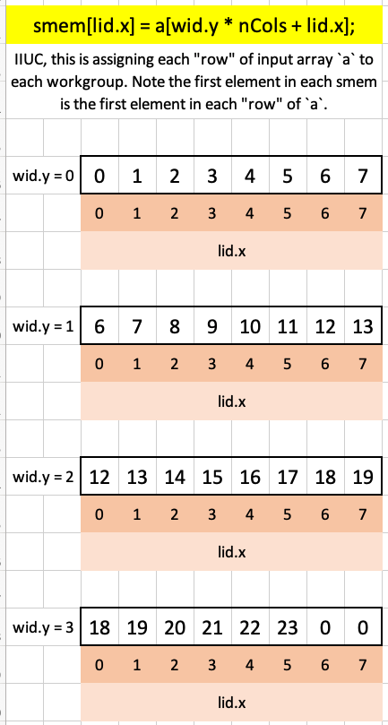

Next, similar to the previous puzzle's prefix sum algorithm, we iterate through each row, accumulating the sum by iterating over array elements in increasing `skip` amounts:

```WGSL
for (var skip: u32 = 1; lid.x + skip < nCols; skip *= 2) {
    smem[lid.x] += smem[lid.x+skip];
}
```

Visualizing that for-loop in the first workgroup, in which we find the sum of the first row of `a` (highlighted in green):

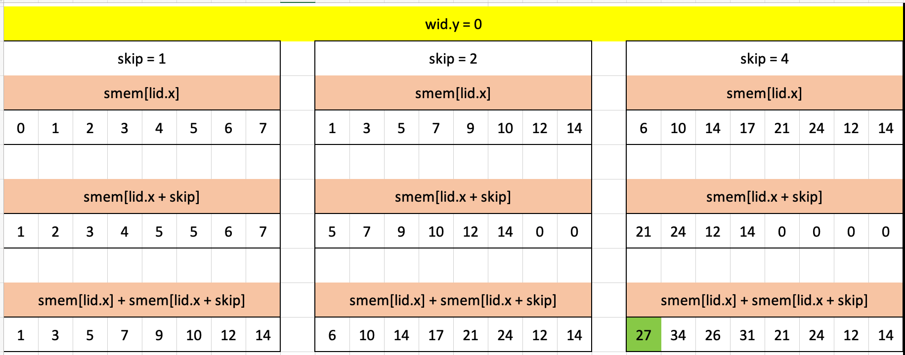

I'm not 100% sure why we don't have guards in this puzzle as we did in Puzzle 12, but my guess is that we don't need it here since the number of threads in the workgroup (8) is the same as the shared memory size (8).

Visualizing the for-loops that occur in the other three workgroups, one for each row of the input array with the final cumulative sum highlighted in green:

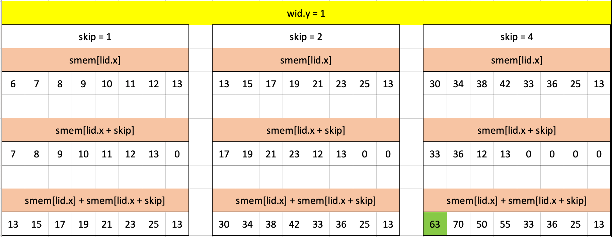

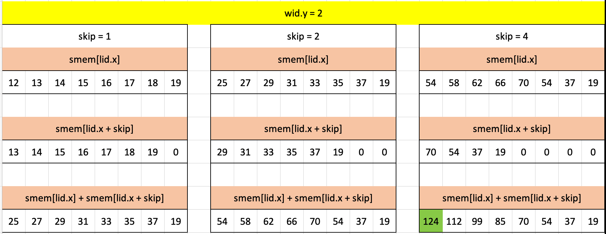

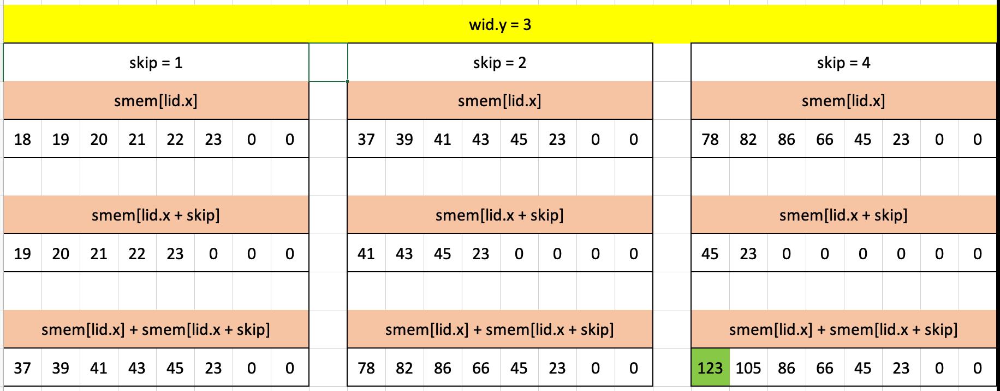

## Puzzle 14

```WGSL
@group(0) @binding(0) var<storage, read_write> a: array<f32>;
@group(0) @binding(1) var<storage, read_write> b: array<f32>;
@group(0) @binding(2) var<storage, read_write> output: array<f32>;

const wgs = vec3({{workgroupSize}});
const twg = vec3({{totalWorkgroups}});
const tileSize = vec3({{workgroupSize}});
var<workgroup> a_shared: array<f32, 256>;
var<workgroup> b_shared: array<f32, 256>;

@compute @workgroup_size({{workgroupSize}})
fn main(
  @builtin(local_invocation_id) lid: vec3<u32>,
  @builtin(global_invocation_id) gid: vec3<u32>,
  @builtin(workgroup_id) wid: vec3<u32>) {
    let N = u32(sqrt(f32(arrayLength(&a))));
    let i = wid.x * wgs.x + lid.x;
    let j = wid.y * wgs.y + lid.y;
    let local_i = lid.x;
    let local_j = lid.y;

    var acc: f32 = 0.0;

    for (var k: u32 = 0u; k < N; k = k + tileSize.x) {
      if (j < N && k + local_i < N) {
        a_shared[local_j * tileSize.x + local_i] 
        = a[j * N + (k + local_i)];
      } else {
        a_shared[local_j * tileSize.x + local_i] = 0.0;
      }
      if (i < N && k + local_j < N) {
        b_shared[local_j * tileSize.x + local_i] 
        = b[i + (k + local_j) * N];
      } else {
        b_shared[local_j * tileSize.x + local_i] = 0.0;
      }

      workgroupBarrier();

      let local_k_max = min(tileSize.x, N - k);
      for (var local_k: u32 = 0u; 
            local_k < local_k_max; 
            local_k = local_k + 1u) {
        acc += a_shared[local_j * tileSize.x + local_k] 
          * b_shared[local_k * tileSize.x + local_i];
      }

      workgroupBarrier();
    }

    if (i < N && j < N) {
      output[i + j * N] = acc;
    }
}
```

```
___________________________________
Test case 1

Workgroup Size       ( 3, 3, 1 )
Total Workgroups     ( 1, 1, 1 )
Shared Memory  Size  ( 3, 3, 1 )

Input a  
        0    1  
        2    3

Input b  
        0    1  
        2    3

Expected 
        2    3  
        6   11

___________________________________
Test case 2

Workgroup Size       ( 1, 1, 1 )
Total Workgroups     ( 2, 2, 1 )
Shared Memory  Size  ( 3, 3, 1 )

Input a  
        0    1  
        2    3

Input b  
        0    1  
        2    3

Expected 
        2    3  
        6   11

___________________________________
Test case 3

Workgroup Size       ( 4, 4, 1 )
Total Workgroups     ( 1, 1, 1 )
Shared Memory  Size  ( 4, 4, 1 )

Input a  
        0    1    2  
        3    4    5  
        6    7    8

Input b  
        9   10   11  
       12   13   14  
       15   16   17

Expected 
       42   45   48  
      150  162  174  
      258  279  300

___________________________________
Test case 4

Workgroup Size       ( 2, 2, 1 )
Total Workgroups     ( 2, 2, 1 )
Shared Memory  Size  ( 2, 2, 1 )

Input a  
        0    1    2  
        3    4    5  
        6    7    8

Input b  
        9   10   11  
       12   13   14  
       15   16   17

Expected 
       42   45   48  
      150  162  174  
      258  279  300

___________________________________
Test case 5

Workgroup Size       ( 2, 2, 1 )
Total Workgroups     ( 2, 2, 1 )
Shared Memory  Size  ( 2, 2, 1 )

Input a  
        0    1    2    3  
        4    5    6    7  
        8    9   10   11  
       12   13   14   15

Input b  
        0    1    2    3  
        4    5    6    7  
        8    9   10   11  
       12   13   14   15

Expected 
       56   62   68   74  
      152  174  196  218  
      248  286  324  362  
      344  398  452  506
```

Walking through this puzzle's official solution was another pivotal point in my understanding of GPU parallelism. I'll start with Test case 1.

There are three, what I call, "core indexes" that this solution establishes: `local_i`, `local_j` and `local_j * tileSize.x + local_i`. We can see that `local_i` indexes across rows while `local_j` indexes down columns. `local_j * tileSize.x + local_i` indexes the threads left-to-right and top-to-bottom.

```WGSL
let N = u32(sqrt(f32(arrayLength(&a))));
let i = wid.x * wgs.x + lid.x;
let j = wid.y * wgs.y + lid.y;
let local_i = lid.x;
let local_j = lid.y;
```
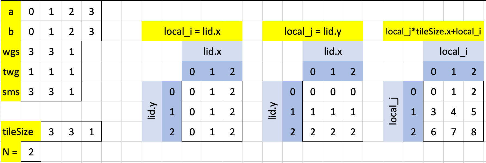

The indexes `i` and `j` (which we'll look at shortly), because we have only 1 workgroup for Test case 1, are the same as `local_i` and `local_j`, respectively.

Let's next tackle the code which loads input arrays `a` and `b` into shared memory `a_shared` and `b_shared`, respectively:

```WGSL
if (j < N && k + local_i < N) {
    a_shared[local_j * tileSize.x + local_i] = a[j * N + (k + local_i)];
} else {
    a_shared[local_j * tileSize.x + local_i] = 0.0;
}

if (i < N && k + local_j < N) {
    b_shared[local_j * tileSize.x + local_i] = b[i + (k + local_j) * N];
} else {
    b_shared[local_j * tileSize.x + local_i] = 0.0;
}
```

Note that this code runs inside a for-loop:

```WGSL
for (var k: u32 = 0u; k < N; k = k + tileSize.x) { ... }
```

but since `N` is `2` and `tileSize.x` is `3` for this test case this outermost loop runs only once.

The visualization below is, at the highest level, broken into two boxes: one for `a_shared` (left) and one for `b_shared` (right).

```WGSL
if (j < N && k + local_i < N) {
    a_shared[local_j * tileSize.x + local_i] = a[j * N + (k + local_i)];
} else {
    a_shared[local_j * tileSize.x + local_i] = 0.0;
}
```

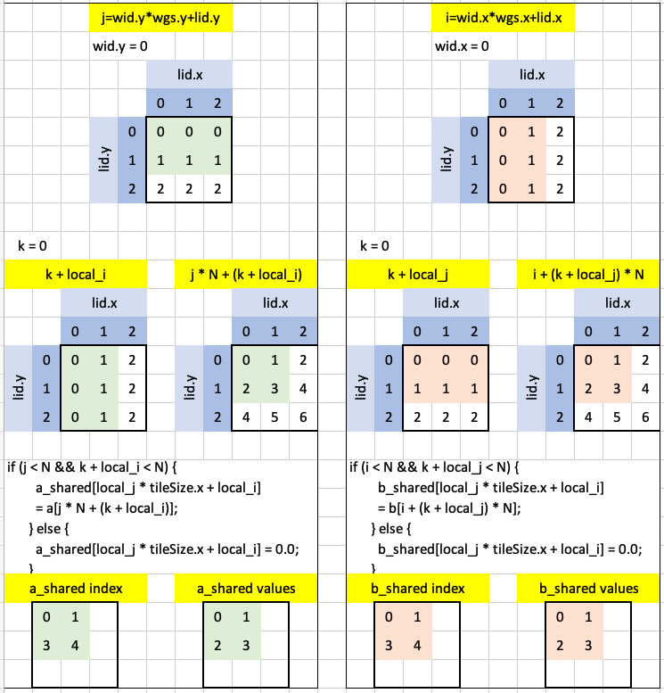

Let's walk through `a_shared` first.

The cells highlighted in green are the threads that satisfy the guard condition `j < N`. In this single iteration of the outermost loop, `k = 0`. The second condition in the guard is `k + local_i < N`, the threads in the workgroup which satisfy this condition are highlighted in green. When combining the use of indexes `j` and `k + local_i` we see that the threads which satisfy the full condition `j < N && k + local_i < N` are highlighted in green. There are four such threads and they are indexed 0, 1, 2, 3---these are used to index into `a` when assigning values to `a_shared`:

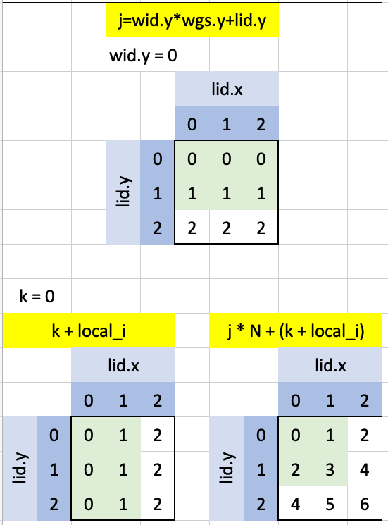

The grid on the right shows the values of `a` that are assigned to `a_shared` at the indexes in the grid shown on the left:

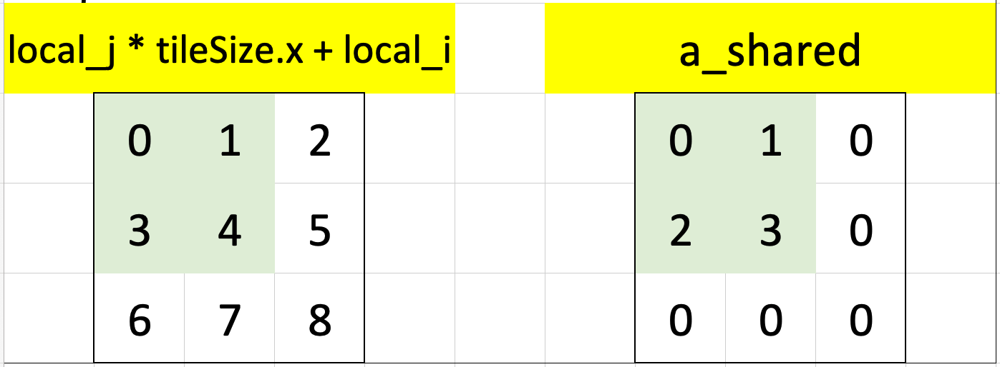

Here's a mapping of index to value for `a_shared`---this is key in understanding the next part of the code:

|Index|Value|
|:-:|:-:|
|0|0
|1|1
|3|2
|4|3


We can now go into the inner-most loop:

```WGSL
let local_k_max = min(tileSize.x, N - k);
for (
        var local_k: u32 = 0u; 
        local_k < local_k_max; 
        local_k = local_k + 1u
    ) {
        acc += a_shared[local_j * tileSize.x + local_k] * b_shared[local_k * tileSize.x + local_i];
}
```

`local_k_max` is `2` (`N - k`), so the loop iterates twice, as shown in the visualization below:


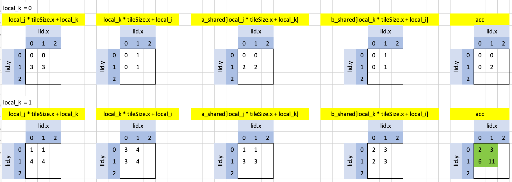

Going left-to-right in each loop iterations:

- `local_j * tileSize.x + local_k`: the index into `a_shared`.
- `local_k * tileSize.x + local_i`: the index into `b_shared`.
- `a_shared[local_j * tileSize.x + local_k]`: the values of `a_shared` used in the loop iteration.
- `b_shared[local_k * tileSize.x + local_i]`: the values of `b_shared` used in the loop iteration.
- `acc`: the element-wise product of `a_shared[local_j * tileSize.x + local_k]` and `b_shared[local_k * tileSize.x + local_i]`.

Note that while `acc` looks like an array, it's actually just a single floating point value (`var acc: f32 = 0.0;`) which has a different value in each workgroup thread. That is the power of indexing!

Looking at the matrix multiplication between `a` and `b` as we would do it by hand:

$$\left[\begin{matrix}0 & 1 \ 2 & 3\end{matrix}\right] \times \left[\begin{matrix}0 & 1 \ 2 & 3\end{matrix}\right] = \left[\begin{matrix}2 & 3 \ 6 & 11\end{matrix}\right]$$

The top-left value in the result (2) is the dot product between the first row of `a` and the first column of `b`. In our GPU-implementation, that dot product occurs across two loop iterations and different threads as shown in the purple-highlighted cells below:

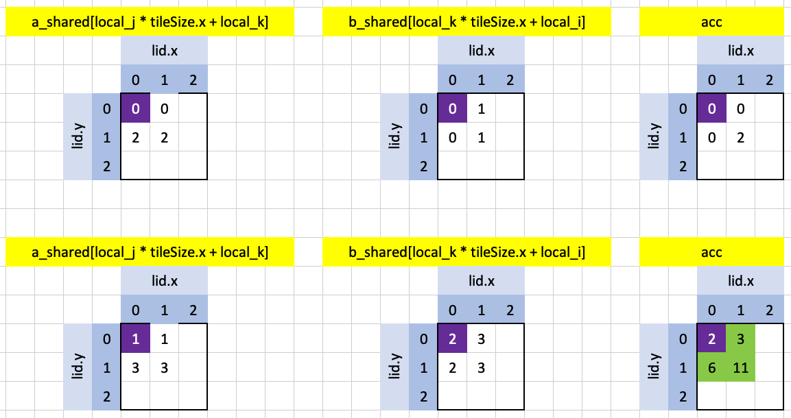

Let's now take a look at test case 2.

Here are the constants and "core indexes" for this test case (same code, different organization than test case 1).

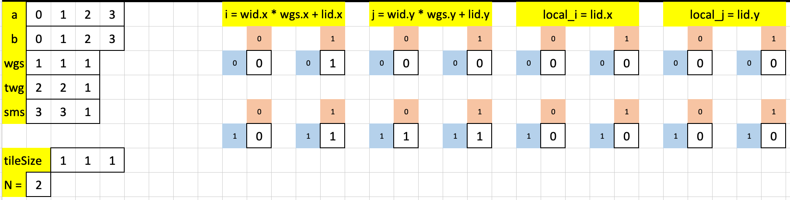

For this test case, the outermost loop runs twice and each time the innermost loop runs once. Here's the first iteration of the outermost loop:

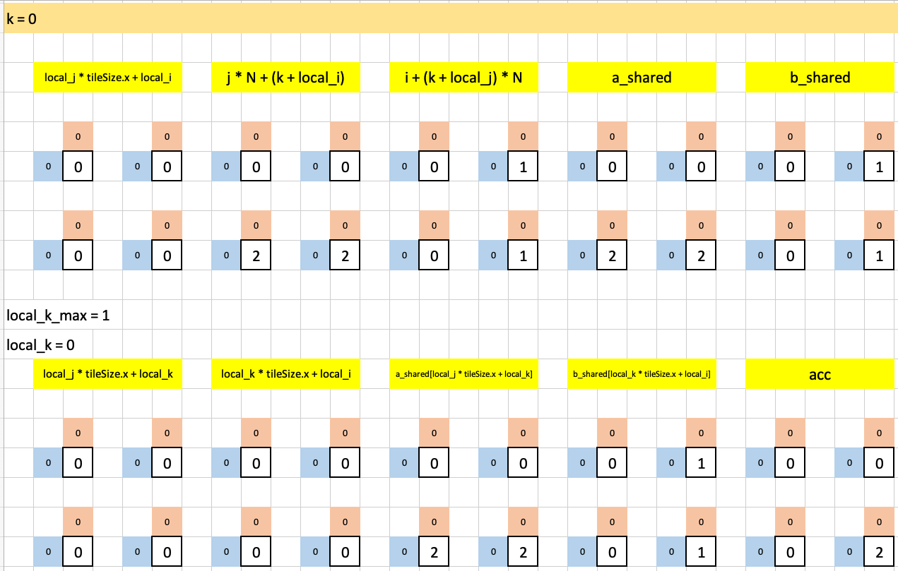

and here's the second iteration of the outermost loop (with its single iteration of the innermost loop):

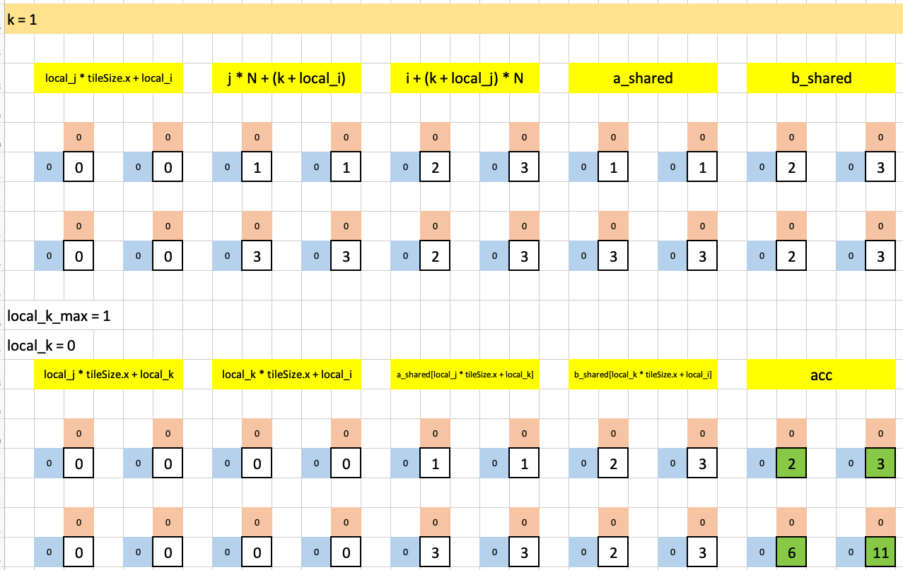

Note that the value of `acc` at the end of each outermost loop iteration is the same as test case 1 except that now, since we have 4 workgroups each with 1 thread, each value of the four values of `acc` in test case 2 are assigned to one workgroup each.

Let's move on to test case 3, in which we now are performing matrix multiplication between two 3x3 matrices in a single workgroup, analogous to test case 1.

The constants and core indexes:

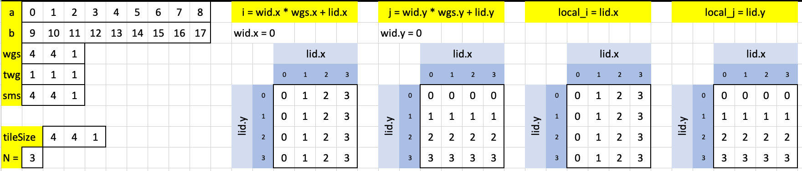

The outermost loop, for this test case, runs only once. Here are the indexes used and values of `a_shared` and `b_shared`:

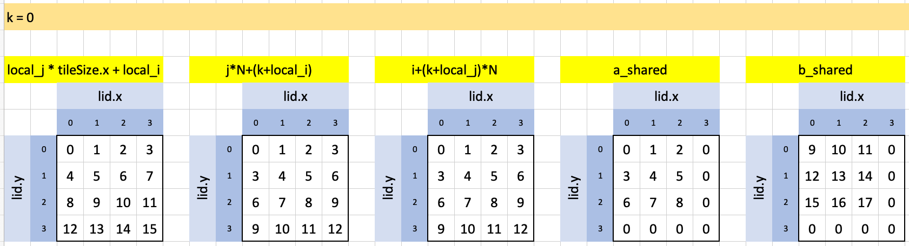

`local_k_max` is `3` so the innermost loop runs three times, with the final result highlighted in green:

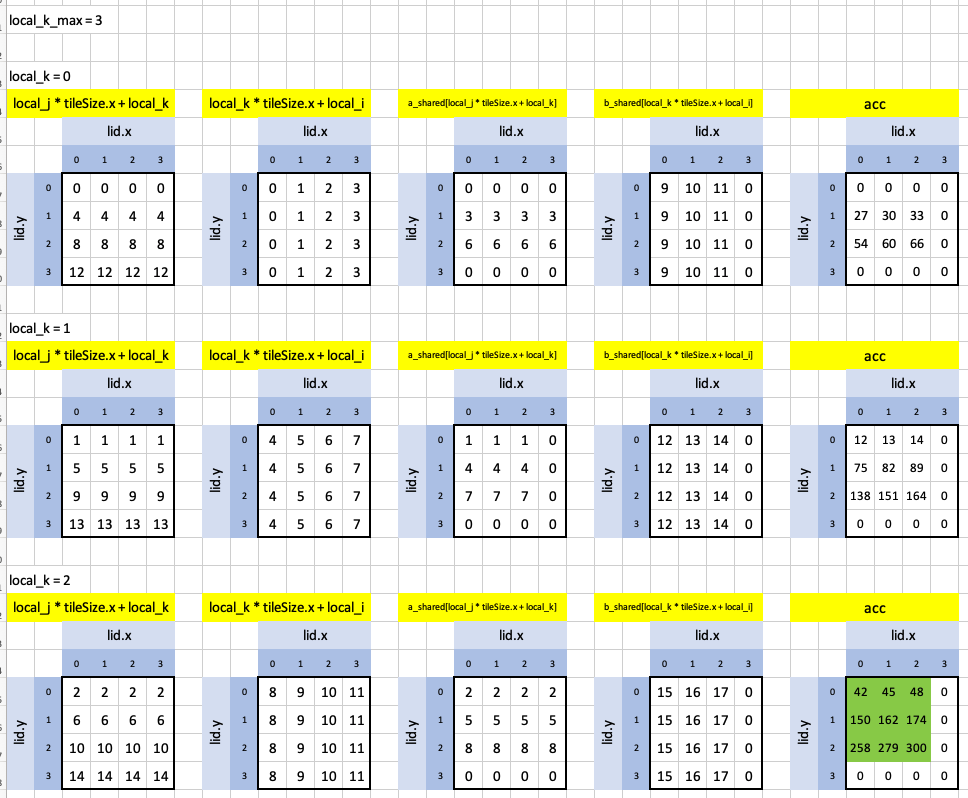

Moving on to test case 4, which is unique so far in the sense that the number of threads per workgroup (2x2 = 4) is less than the number of elements in each matrix being multiplied (3x3 = 9). However, the core indexes and inner- and outermost loops still suffice.

The constants and core indexes:

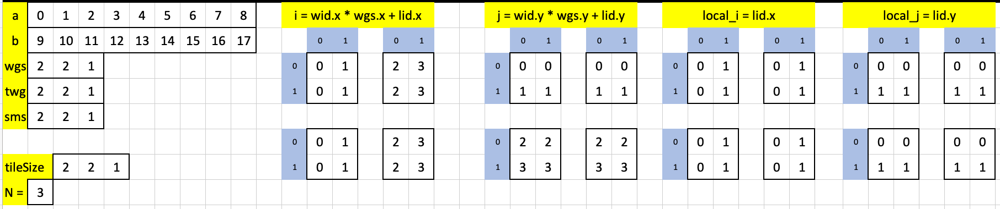

The outermost loop has two iterations. Here is the first iteration, in which the innermost loop runs twice:

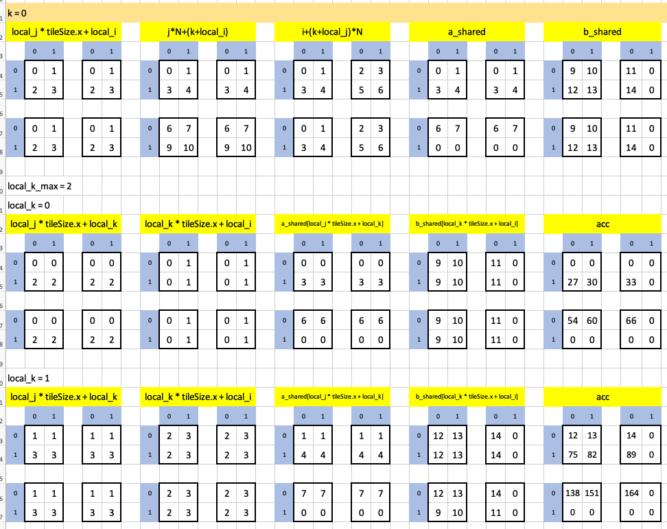

In the second-most iteration of the outermost loop, the innermost loop runs only once, note the final result highlighted in green:

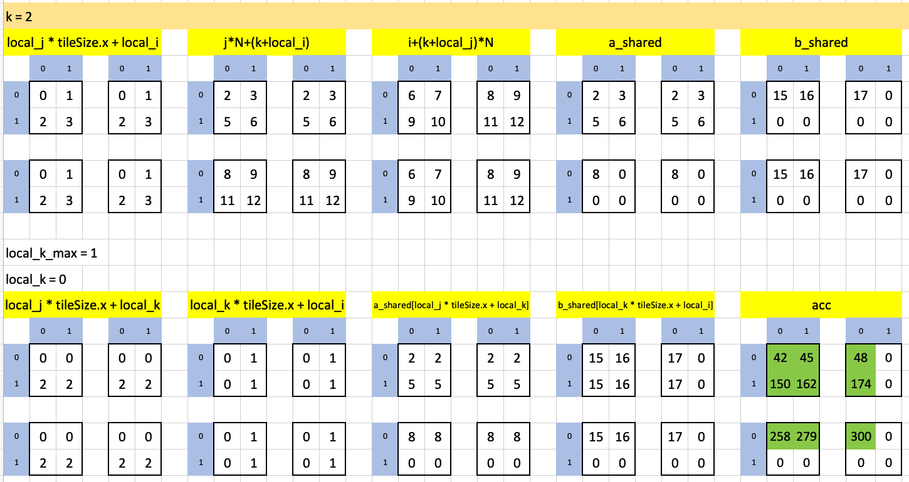

Here's a visualization of how the dot product of the first row of `a` (0, 1, 2) and the first column of `b` (9, 12, 15) accumulates through element-wise products across different loop iterations to yield the final result of `42`:

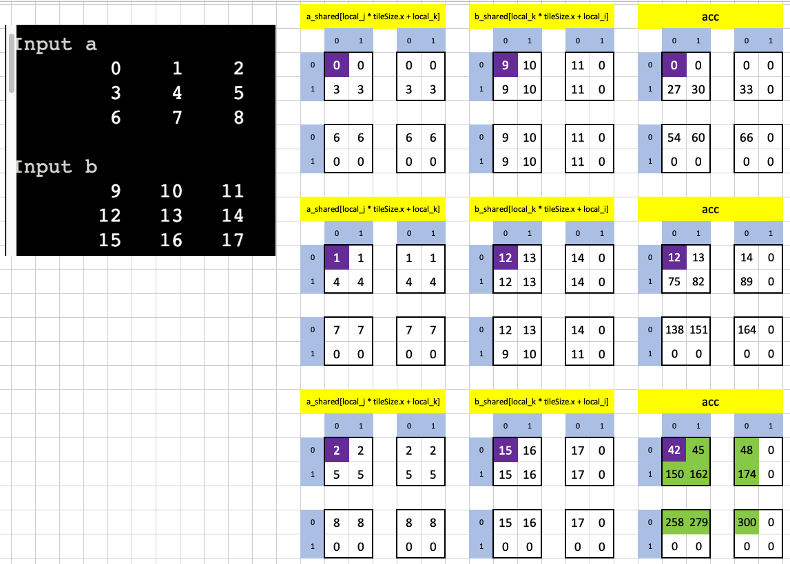

The last test case is test case 5, in which the number of available threads (16) matches the number of elements in each input array (16).

The constants and core indexes:

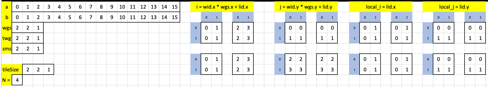

The outermost loop runs twice and each time the innermost loop runs twice as well. Here's the first iteration of the outermost loop:

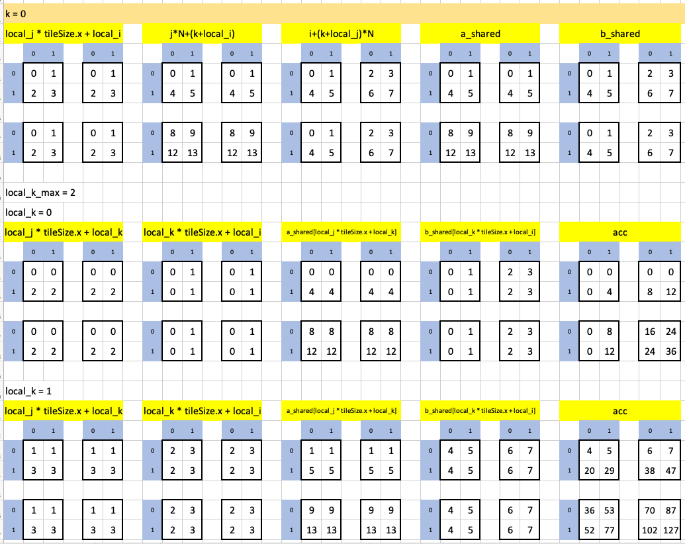

Here is the second iteration of the outermost loop (the inner loop runs twice). Note the final result highlighted in green, uses up all threads:

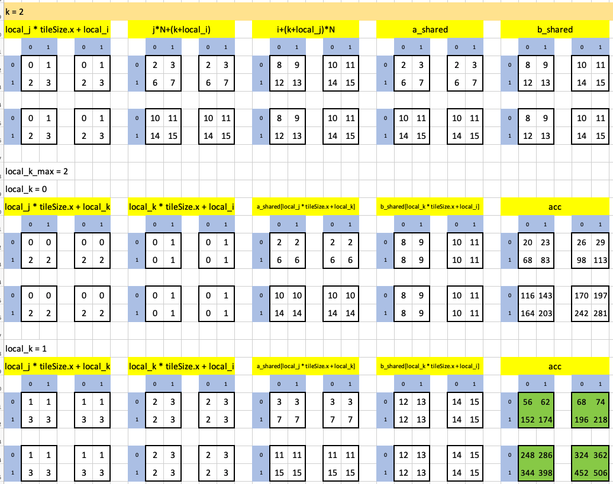

Here I visualize the dot product between the first row of `a` (0, 1, 2, 3) and the first column of `b` (0, 4, 8, 12) to yield the result `56`.

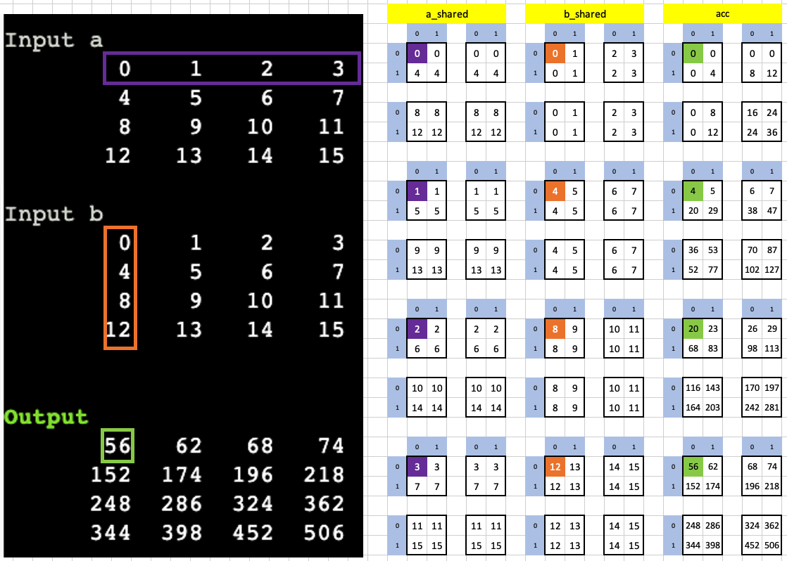

That's a wrap for the official solutions' walk through! You can find the Excel spreadsheet [here](https://github.com/vishalbakshi/webgpupuzzles/blob/main/webgpupuzzles.xlsx).