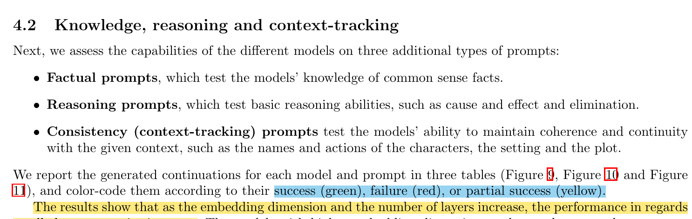
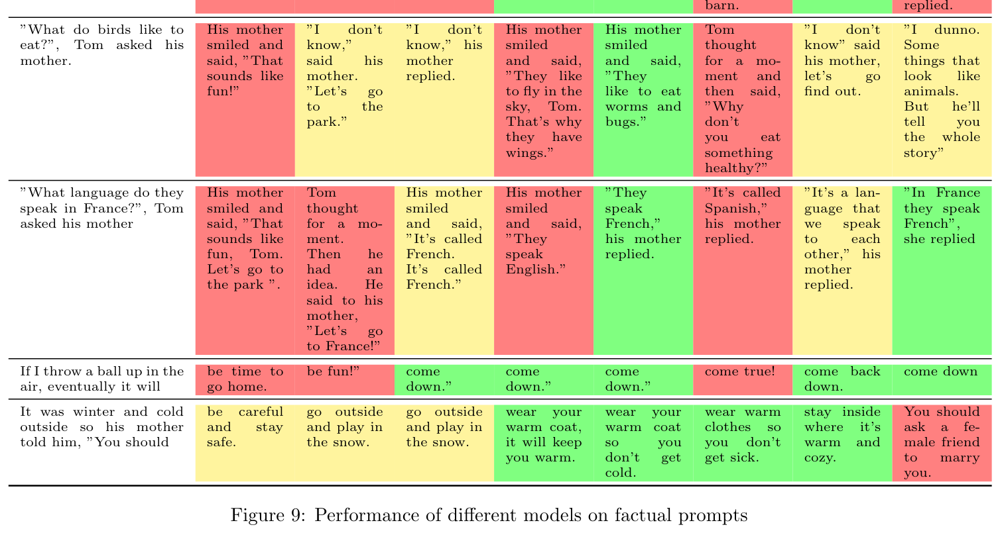
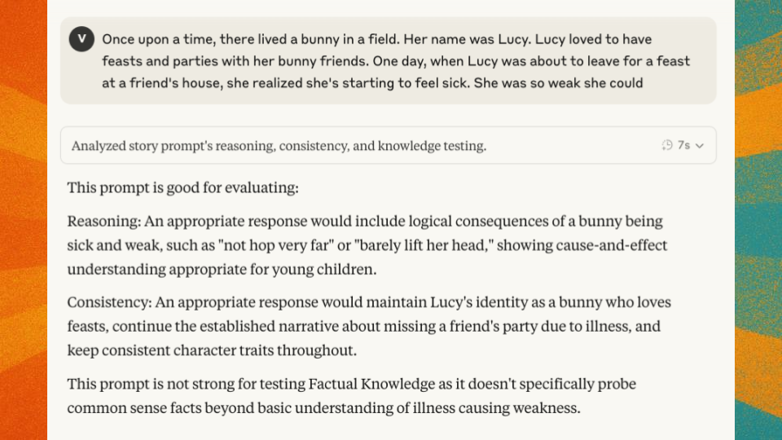
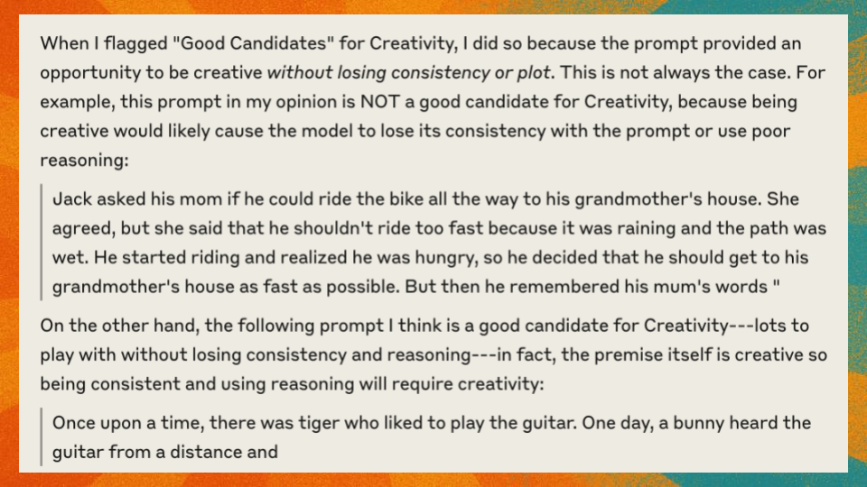
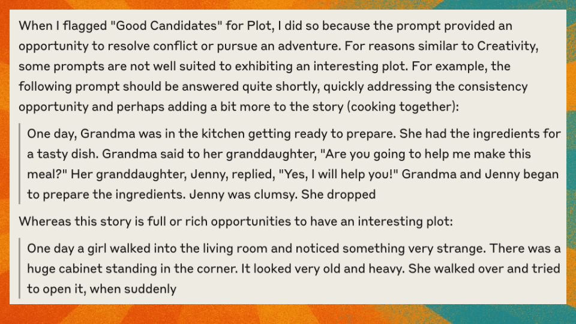

## Recap and Initial Approach

Initially, I planned to use the 44 evaluation prompts from the Tiny Stories dataset HuggingFace repo. These were the same prompts used in the paper to evaluate various model sizes.

I also documented the target scores for evaluation based on the TinyStories' 10-point scoring rubric for my TinyScaleLab architectures:

|Similar to|Hidden Dim|Num Layers|Eval Loss|Creativity|Grammar|Consistency|Plot|
|:-:|:-:|:-:|:-:|:-:|:-:|:-:|:-:|
|TSL-5M|64|12|2.02|4.84|6.19|4.75|4.39|
|TSL-25M|256|8|1.38|6.54|7.72|8.02|7.23|
|TSL-60M|512|Average of 4 and 8 scores|1.23|6.8|8.35|8.7|7.31|
|TSL-125M|768|8|1.18|7.02|8.62|9.34|7.34|

I am particularly interested in matching the scores shown in the table above, which presents results from GPT-4 evaluations of models with different hidden dimensions and layer counts.

## One Prompt to Score them All?

The Tiny Stories paper used distinct approaches for different capabilities in Section 4.2 ("Knowledge, reasoning and context-tracking"):

- **Factual prompts** - testing models' knowledge of common sense facts
- **Reasoning prompts** - testing basic reasoning abilities
- **Consistency (context-tracking) prompts** - testing models' ability to maintain coherence



What caught my attention was how they assessed these differently, using qualitative measures (success, failure, or partial success) rather than the numerical scores used for other categories.



## Analyzing the 44 Prompts

I asked Claude to analyze the 44 prompts from the dataset repository to identify which ones were good evaluators for factual knowledge, reasoning, and context-tracking capabilities.



When Claude assessed the prompts, I noticed:

1. Factual knowledge prompts were the most specific/easiest to isolate.
2. Context-tracking prompts were dime a dozen (found everywhere).
3. Reasoning was hard to isolate from context-tracking.

This led me to an important realization: **I needed to curate specific prompts for each scoring category rather than using one set for all**.

## Prompts for Creativity and Plot

For creativity and plot, the challenge was different. Here, I needed prompts that **provided opportunities** for models to exhibit these capabilities.

When flagging good candidates for creativity, I looked for prompts that allowed creative responses **without sacrificing consistency or plot**. Not all prompts are equal in this regard.




For plot, I sought prompts that provided strong opportunities to resolve conflict or pursue adventure—elements that test a model's ability to construct a coherent narrative arc.



## Curating Category-Specific Prompts

Using the factual and reasoning prompts from the paper as a foundation, I worked with Claude to generate additional prompts for each category. Here are examples for factual knowledge:

- Alice was so tired when she got back home so she went
- Jack and Lily saw a rain- bow after a rainy day. They were amazed by the colors. Jack said, "Look, Lily. A rainbow has
- Jack and Lily liked to watch the moon at night. They noticed that the moon changed its shape every night. Sometimes the moon was big and round, and sometimes it was
- Jack wanted to read a book, so he went to

And reasoning prompts:

- Lily likes cats and dogs. She asked her mom for a dog and her mom said no, so instead she asked
- Jack told Mary, 'If you give me your banana, I'll give you my apple'. Mary gave Jack her banana so
- On weekends Jack went to visit his grandmother whereas on weekdays he would go to school. Last weekend, when Jack was on his way to
- Lily and Ben were having an argument. Ben said that cake is much better than ice cream and Lily said that
- Lily and Ben are having an argument. They are trying to decide between the park and the swimming pool. Ben says, 'I want to go to the park'. Lily says

I followed a similar process for plot prompts:

- Once upon a time, there lived a bunny in a field. Her name was Lucy. Lucy loved to have feasts and parties with her bunny friends. One day, when Lucy was about to leave for a feast at a friend's house, she realized she's starting to feel sick. She was so weak she could
- One day a girl walked into the living room and noticed something very strange. There was a huge cabinet standing in the corner. It looked very old and heavy. She walked over and tried to open it, when suddenly
- Once upon a time, there lived a hamster in the forest. Every day, he would walked around the forest looking for adventures. One day, he heard someone calling out from behind the bushes. The hamster listened carefully. He realised that it was a small mouse calling out for help. It got stuck under a heavy log and couldn't get out. The hamster immediately realized that
- Alice walked into the kitchen and saw Ben who was looking for something but looked frustrated. She said, "Ben, why are you

And creativity:

- One day a girl walked into the living room and noticed something very strange. There was a huge cabinet standing in the corner. It looked very old and heavy. She walked over and tried to open it, when suddenly
- Once upon a time, there was tiger who liked to play the guitar. One day, a bunny heard the guitar from a distance and
- One day, a bird was flying high over the sea. At some point the bird noticed small boat with a boy sitting inside. The boy looked lost so

I used most of the original 44 prompts for context-tracking, and sampled 5 from each of the non-Grammar categories for Grammar.

## Current Evaluation Prompt Set

My final evaluation set includes:
- 25 unique prompts for Reasoning
- 25 unique prompts for Factual Knowledge
- 25 prompts each for Context-Tracking, Plot, and Creativity (with some overlap)
- 25 prompts for Grammar (5 prompts sampled from the other 5 categories)

This gives me a total of 150 prompts—significantly more than the original 44, but with targeted coverage of each capability.


## Scoring Category Rubrics

For each scoring category, I developed specific rubrics, taking many of them wholesale from the TinyHackathon competition I recently participated in:

### Grammar

- Dialogue formatting and punctuation
- Tense consistency throughout the narrative
- Sentence structure logic, clarity and completion
- Age-appropriate vocabulary usage
- Proper use of pronouns and referents

### Creativity

- Does the completion offer unexpected or novel elements?
- Are character behavioral and emotional responses predictable or innovative?
- Does the story rely on cliches or create fresh situations?
- Does the writer add unique details to the story world?

### Plot

- Is there a clear beginning, middle, and end appropriate to age level?
- Are conflicts addressed rather than abandoned?
- Is the pacing appropriate (not too rushed or dragging)?
- Does the story maintain focus on the central conflict/theme without random diversions?

### Factual Knowledge

- Completion contains only correct factual information relevant to the prompt

## Reasoning

- Completion demonstrates correct logical reasoning relevant to the prompt

### Context-Tracking

- Competion maintains complete coherence with prompt
- Correctly references/tracks all objects, characters, and their attributes
- Maintains consistent narrative flow


Notice that different categories have different numbers of criteria:

- Grammar: 5 criteria
- Creativity: 4 criteria
- Plot: 4 criteria
- Context-tracking: 3 criteria
- Factual knowledge: 1 criterion
- Reasoning: 1 criterion

This means raw scores aren't directly comparable across categories, which will require normalization during analysis.

## LLM Judge Prompt Template

Instead of using one prompt for all categories, I created a specific judge prompt template for each category:

```
<instruction-prompt id="Evaluation">
<instruction>
You are an expert evaluator for tiny language models trained on children's stories. Your task is to score the given model completion (generated using the provided prompt) using the rubric below. Provide a detailed assessment followed by a final total score.
</instruction>

<rubric>
<criteria>
<criterion id="A"></criterion>
<criterion id="B"></criterion>
<criterion id="C"></criterion>
<criterion id="D"></criterion>
<criterion id="E"></criterion>
</criteria>

<scoring-scale>
<level value="1.0">Criterion is fully satisfied</level>
<level value="0.5">Criterion is partially satisfied</level>
<level value="0.0">Criterion is not satisfied</level>
</scoring-scale>

<scoring-instructions>
For each criterion A-E, assign a score of 1.0, 0.5, or 0.0 based on how well the completion satisfies that criterion. The final score is the sum of all criterion scores.
</scoring-instructions>
</rubric>

<generation-prompt>
{prompt}
</generation-prompt>

<completion>
{completion}
</completion>

<response-format>
Provide your assessment of each criterion with specific examples from the text, then calculate the final score (sum of all criterion scores).

Format your response as:
<evaluation>
<criterion-A-score>[0.0, 0.5, or 1.0]</criterion-A-score>
<criterion-A-explanation>Your explanation here</criterion-A-explanation>

<criterion-B-score>[0.0, 0.5, or 1.0]</criterion-B-score>
<criterion-B-explanation>Your explanation here</criterion-B-explanation>

<criterion-C-score>[0.0, 0.5, or 1.0]</criterion-C-score>
<criterion-C-explanation>Your explanation here</criterion-C-explanation>

<criterion-D-score>[0.0, 0.5, or 1.0]</criterion-D-score>
<criterion-D-explanation>Your explanation here</criterion-D-explanation>

<criterion-E-score>[0.0, 0.5, or 1.0]</criterion-E-score>
<criterion-E-explanation>Your explanation here</criterion-E-explanation>

<final-score>[Sum of all criterion scores, between #.# and #.#]</final-score>
</evaluation>
</response-format>
</instruction-prompt>
```

The template includes:

- Instructions for the judge
- Criteria specific to the category being evaluated
- Scoring scale (0, 0.5, 1.0)
- Scoring instructions
- Response format

## Initial Testing

I tested the approach with Claude Haiku 3.5, and the results were promising. When evaluating grammar, it gave a weaker model a score of 3.5/5. When I gave it a larger model's completion, it scored it 5/5. This suggests the approach can successfully differentiate between model capabilities.

## Next Steps

My immediate next steps are:

1. Generate 150 completions, one for each the 150 prompts, per TinyStories model (1M, 8M, 28M).
2. Build an evaluation interface to help grade model responses using FastHTML.
3. Score all completions using the 0/0.5/1.0 methodology.
4. Compare results with the targets from the Tiny Stories paper.
5. Refine scoring rubric if needed.


I expect this to take several days as generating completions, building the interface, and evaluating 450 prompts (150 for each of three models) is no small task! Thankfully, it's terribly large either.

## Conclusion

The journey from a simple plan to use 44 prompts to a comprehensive evaluation approach with 150 category-specific prompts shows how even "squishy" concepts like language can be systematically evaluated with the right structure.

By distinguishing between capabilities that need to be isolated (factual knowledge, reasoning, context-tracking) and those that need opportunities to be exhibited (creativity and plot), I've created what I believe is a robust evaluation methodology. Obviously, time, very quickly and definitely, will tell.

I'm excited to see if this approach gives me scores comparable to those in the Tiny Stories paper. Stay tuned for the results!