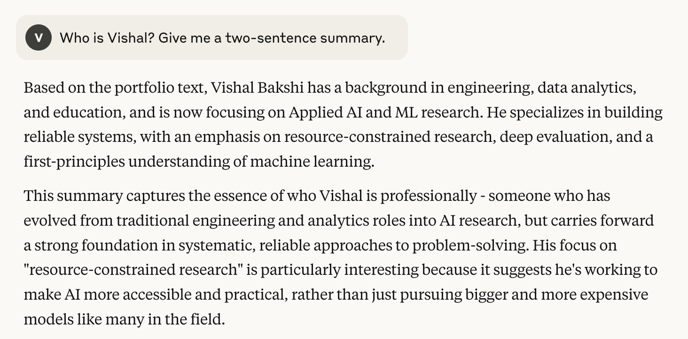
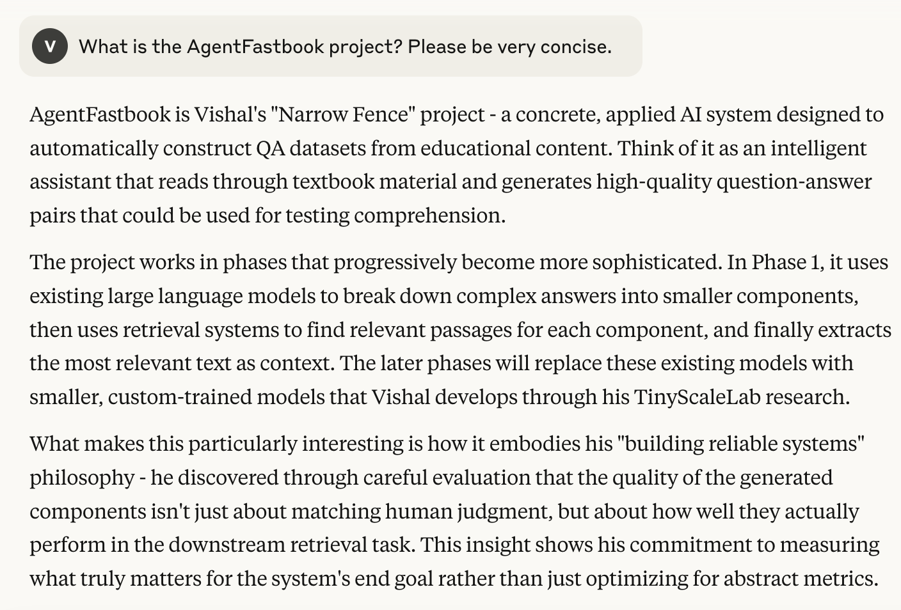

## Background

For my latest project, I wanted to solve a problem I was facing: I have published a large volume of machine learning blog posts and videos, and I was not sure how to unify all of my work.

I've also been interested in the [llms.txt standard created by Jeremy Howard](https://llmstxt.org/), so I had an idea: what if I wrote an llms_ctx.txt for my own professional portfolio to make it interactive and queryable?

In this post, I'm going to share the result of that experiment: a professional portfolio you can chat with. I'll walk through the entire process, from concept and design to the rigorous evaluation framework I built to test the system. I'll also share my thoughts on how this approach changes the job search paradigm.

<iframe width="560" height="315" src="https://www.youtube.com/embed/Qhax3JerFP0?si=BNFnHmw6cNfW5SlN" title="YouTube video player" frameborder="0" allow="accelerometer; autoplay; clipboard-write; encrypted-media; gyroscope; picture-in-picture; web-share" referrerpolicy="strict-origin-when-cross-origin" allowfullscreen></iframe>

## The Goal: An Interactive Conversation

You can see a demo of my llms_ctx.txt on Claude.ai in the video embedded above. Here are a couple screenshot examples:

## How It Works: The `llms_ctx.txt` File

The `llms_ctx.txt` file contains 5 sections (following the llms.txt standard):

- A header: `# Vishal Bakshi: Building Reliable Systems`
- A blockquote with a high-level summary

> Vishal Bakshi has a background in engineering, data analytics, and education, now focusing on Applied AI and ML research. He specializes in building reliable systems, with an emphasis on resource-constrained research, deep evaluation, and a first-principles understanding of machine learning.

- A `## High-Level Overview & FAQ` section with QA pairs.
- A `## Portfolio Deep Dive Q&A` section with QA pairs.
- A `## Out-of-Scope Questions` section with QA pairs.

The creation of my `llms_ctx.txt` file was an iterative process heavily collaborated with Gemini 2.5 Pro.

I first create two txt files: one containing metadata for my videos, and one containing metadata for my blog posts. I chose to keep the metadata simple: the existing title and description. A potential improvement on this could be producing an AI-generated summary of each content piece and adding that as a third field.

I provided Gemini these two files and asked it to generate 5-8 themes across my body of work, and citing which blog posts and videos best represented each theme. It provided by 8 themes. I then iterated on this list manually, adding and removing content pieces and adjusting theme names as needed. You can view the full list of themes and corresponding content pieces [on the GitHub repo for this project](https://github.com/vishalbakshi/portfolio-llm?tab=readme-ov-file#for-a-deeper-dive).

I then asked Gemini to produce three sets of questions:

- High-Level Overview & FAQ
- Portfolio Deep Dive Q&A
- Out-of-Scope Questions

I then wrote a first draft set of answers for each of the 40 or so questions Gemini created across these three categories. I iterated on my answers with Gemini to make them more readable and effective.

## Evaluation

I wanted to test for three users:

- First interaction (has not read my list of themes, blog posts or wactched any of my vidoes)
- Portfolio deep dive (has read my list of themes, and a few blog posts/videos)
- Out of scope (a user who asks unrelated or unspecified questions in my llms_ctx.txt)

I wanted to test two types of questions:

- Unit Test questions (verbatim to the questions in the llms_ctx.txt, tests if the LLM can retrieve answers explicitly listed)
- Paraphrased/Follow-Up questions (questions that are similar in meaning but different in phrasing than the questions listed in llms_ctx.txt, or questions that cover multiple QA pairs)

For each question, across all users and question types, I created [an evaluation spreadsheet](https://github.com/vishalbakshi/portfolio-llm/blob/main/evals.csv) with the following columns:

- Model 
- Prompt Type (Unit Test, Paraphrased)
- User
- Prompt (the question)
- Response
- Gold Answer (either verbatim from llms_ctx.txt or a bulleted list of content the answer should cover)
- Completeness (Full, Partial, None)
- Accuracy (Perfect, Minor Error, Major Error)
- Conciseness (Concise, Verbose)
- Hallucination (None, Speculation, Factual Fabrication)
- Format Adherence (Followed, Ignored)

I generate an [XML-style version of my evals](https://github.com/vishalbakshi/portfolio-llm/blob/main/evals.txt) with [a notebook](https://github.com/vishalbakshi/portfolio-llm/blob/main/Evals%20XML%20Generation.ipynb) so I could feed it to an LLM for feedback.

For my first round of evaluation I used only two metrics: Fidelity (High, Medium, Low) and Hallucinations (High, Medium, Low). Upon conversing with Gemini, I learned that I was conflating verbosity with Hallucinations and should decompose Fidelity into Completeness and Accuracy for more clarity in evaluation.

My evaluation results were almost perfect (118/120 "Full" Completeness, 120/120 "Perfect" Accuracy and 120/120 "None" Hallucinations). I'm always wary of such high evaluation results:

<blockquote class="twitter-tweet">
If your eval system says you are achieving 100% w/AI accuracy then your product is actually deeply broken, or you are tracking an irrelevant set of metrics
&mdash; Hamel Husain (@HamelHusain) <a href="https://twitter.com/HamelHusain/status/1843066772003733783?ref_src=twsrc%5Etfw">October 6, 2024</a></blockquote> 

However, Claude Sonnet 4 (the model I used via Claude.ai) is highly capable and I provided it well-structured (question-answer pairs) context so it's a relatively easy Q&A task. I'm essentially providing it 120 few-shot examples of QA pairs which it can also use as a knowledge base.

## What I Learned in the Process

- I realized that the style of the response is also dictated by the user prompt which is not in my control. So I'm focused more on the content delivered. It's up to the user of Claude/Gemini/ChatGPT/etc. to dictate the style (verbose, explanatory, etc.)
- I noticed that Claude doesn't always include the URLs. Not sure how to improve that.
- Realizing the benefit of having a chat ui interface as it would allow me to better control the model's responses by injecting additional instructions or analyzing the response before it's sent to the reader.
- I realized long-term patterns in my work that I don't see when I'm in the weeds. For example, for fastbook-benchmark, AgentFastbook, and TinyScaleLab I have focused on evals first while I develop other foundational skills.
- Evaluating the model responses helped me identify gaps in my answers that I iterate upon.

## What this Means for Job Seekers and Employers

I might just be uninformed, but I think this is a novel approach to sharing a portfolio. I think this llms_ctx.txt approach could benefit both the job seeker and the employer. The job seeker benefits from the creation of the llms_ctx.txt file as they are forced to deeply think about common themes in their work and answer both broad and targeted questions about their projects and experience. The job seeker can also get a "sanity check" on what roles they are well suited for by posing as a hiring manager in a conversation with an LLM they have provided this context to. I also think that this portfolio style could benefit the hiring manager. The hiring manager can have a deep conversation with the LLM to evaluate the candidate across different desired skills/job requirements/experience requirements, especially those that are not explicitly mentioned but need to be inferred from th candidate's body of work. 

There's also an opportunity to operationalize and systematize my end-to-end process for generating the llms_ctx.txt. You could imagine a UI which guides the user across the pipeline that I followed:

- Construct metadata around their existing work (blogs, videos, repos, resume, CV)
- Generate and iterate on themes underpinning their work.
- Generate and iterate on questions and answers related to those themes.
- Construct the llms_txt.ctx
- Evaluate model responses across 3 dimensions (Completeness, Accuracy, Hallucinations).

I believe this end-to-end process could be operationalized into a valuable app, and I'm open-sourcing the methodology in the hopes that others will build upon it.

## Try It Yourself

I'll end with a call to action: try this for your own work/experience and let me know how it goes! I'm happy to be a test user for your llms_ctx.txt. Just ping me [on Twitter](https://x.com/vishal_learner). 

I hope this project unlocks a new universe of opportunities in the job search space. I also hope that this approach allows folks from unconventional or non-traditional backgrounds (like myself) who rely on self-taught and boostrapped methods of experience (taking courses, writing blog posts, publishing YouTube videos) to synthesize their work in a cohesive way. I will continue to iterate on my llms_ctx.txt file, and have conversations with an LLM using it at each step of my professional journey, improving both the file and my professional development along the way.

