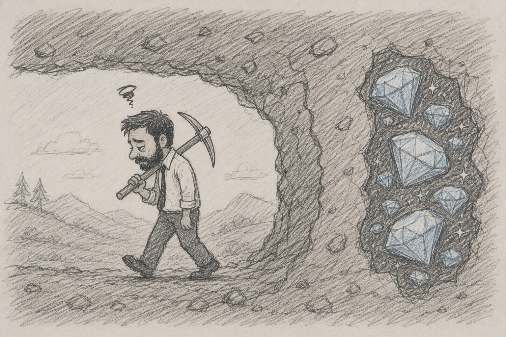

I recently came across a LinkedIn post sharing lessons from the book *The Go-Giver (A Little Story about a Powerful Business Idea)* by Bob Burg and John David Mann. I picked it up at a local bookstore and read it this week.

The Go-Giver is a parable about a go-getter named Joe who, through his relationship with a man named Pindar, learns the Five Laws of Stratospheric Success:

1. The Law of Value: Your true worth is determined by how much more you give in value than you take in payment.  
2. The Law of Compensation: Your income is determined by how many people you serve and how well you serve them.  
   1. A message I've heard multiple times from Terry Crews' interviews.  
3. The Law of Influence: Your influence is determined by how abundantly you place other peoples' interests first.  
4. The Law of Authenticity: The most valuable gift to offer is yourself.   
5. The Law of Receptivity: The key to effective giving is to stay open to receiving.

The opening description of Joe captures his essence:

\> *He worked hard, worked fast, and was headed for the top.*  
*\> Still, sometimes it felt as if the harder and faster he worked, the further away his goals appeared.*

I related to Joe in more ways than one.

---

For many years of my career, I hyper-focused on Laws 1-3 and learned (incredibly difficult and valuable) lessons.

So as I was reading the first half of the book revealing the first three values (not knowing that their counterbalances would emerge in laws four and five, along with a critical discussion in the Q+A) I started to become tense and weary. 

*Are they really asking me to lean harder into under-promise with over-delivery, spending longer hours as I put the needs of others in front of mine?* 

*Am I wrong and have I simply not been growing in directions that were most conducive to my success?* 

*Am I going to have to stop reading this book because the first three laws clearly lead to burnout?*

Thankfully, I kept reading and learned that of course the answer to all three questions was a resounding: ***No\!***

## The Five Laws are a Minimally Sufficient Set

The power of these laws is that they are a minimally sufficient set. The brilliance in the design of these laws is in the interplay between them; a built-in system of checks and balances.

Take the first three laws in isolation:

*\> Your true worth is determined by how much more you give in value than you take in payment.*  
*\> Your income is determined by how many people you serve and how well you serve them.*  
*\> Your influence is determined by how abundantly you place other peoples' interests first.*

I used to equate **value** with **effort.** I think Joe used to as well.

And so to scale my influence and income, I would try to both:

* scale my effort (more projects, more clients, more tasks) which leads to burnout, and/or  
* make my effort more efficient (through consistent experience, learning and professional development) which is difficult if not impossible to execute from inside burnout.

Now interject with Law 4

*\> The most valuable gift to offer is yourself.* 

What does it mean that I *am* the value? This required answers to questions like:

*Who am I? What is my authentic identity?*   
*Where do I belong?*  
*What do I need to be fully present, confident and engaged?*  
*How do I communicate what I see?*  
*How do I understand what you see?*  
*How do I build relationships to have that discussion?*

Now **value** equates with (something like) **engaged** **presence.**

And to scale influence and income, I scale my engaged presence (through training, teaching, explainers, demonstrations, diagrams, MVP code, documentation, agent skills, etc)  to scale others’ capacity. This is what often motivates ICs to become managers.

A go-getter doesn’t need to be a go-giver to achieve this. And a go-getter will still try to scale effort, or make effort more efficient.

Now interject with Law 5

*\> The key to effective giving is to stay open to receiving.*

Receiving praise without diminishing it.  
Receiving criticism without shutting down or getting defensive.  
Receiving rest, recovery and play without letting career-mode colonize it.  
Receiving joy and satisfaction without fear of complacency.  
Receiving care and support without fear of abandonment.

In other words, receiving what others give you, as gifts and not debts.

It's truly poetic that the two Laws (\#4 and \#5) that unblock the other three, and that have opened and will open more doors to my success, are about self-love and self-acceptance which allow the nourishment and growth of myself.

To scale influence and income, this nourishment and growth flows back to the other laws, as I bring my fully engaged presence (\#4), equipped with a better understanding of more people’s interests (\#3 and \#2), to be more generous to others (\#1).

The five laws truly work as a system\!

---

*The Go-Giver* landed more as a spiritual experience than an intellectual, or even business read. I’ll be buying t[he other books in the series](https://thegogiver.com/order-now/) over the next few weeks and months, and will share my reflections here.  
