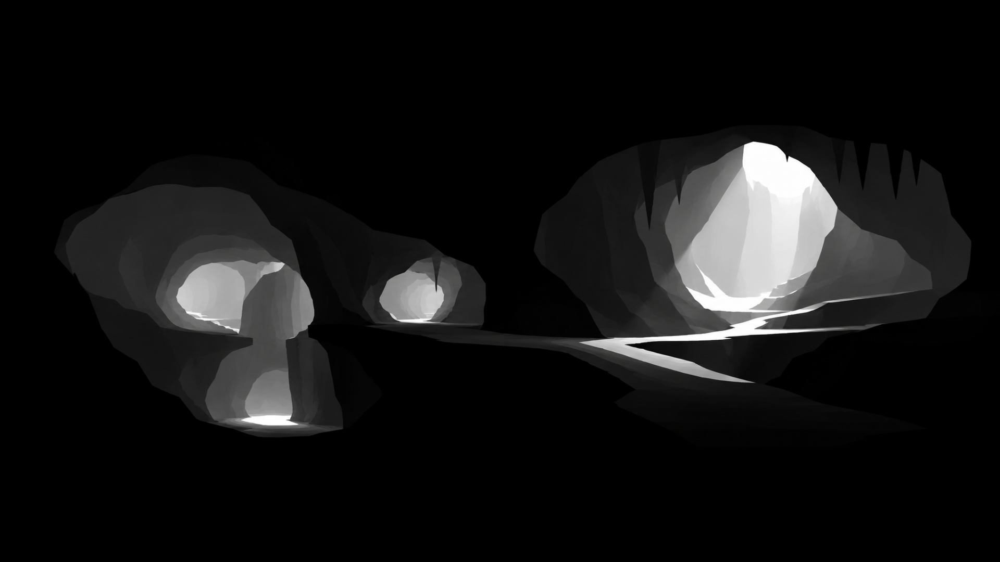

The Cavern represents the space of solutions. It’s vast. Not infinite, but large enough that no one person can map it. Even large groups can’t map it in full. 

The Cavern is an interconnected network of tunnels and open spaces.  It’s mostly dark, with some light coming in from the outside.

Everyone in your organization has heard that he objects inside the Cavern are known to be useful in solving problems. Not everyone is convinced any of the objects will solve the problem they care about. Some problems are shared, with varying degrees of overlap, some are distinct. Everyone agrees the Cavern is worth exploring.

ML, Data Science, Analytics, Product, Engineering, Sales, Marketing (and more) go into the darkness together. There’s a limited number of flashlights. Stumbling, bumping into things, getting bruised and cut, eventually you start to get a sense of the general shape of the space.  

Some teams are naturally inclined to inspect the walls, some the floors. Some like the wider tunnels, some the narrower ones. Some are trying to find where the water is coming from, others are trying to make sure you can exit if needed. Some are familiar with plants, some with insects. 

Some people need wider light beams, some need stronger ones, some need narrower ones. Some need white light, some yellow, some blue. You figure out how to share the flashlights. 

A system emerges.

At first the search feels random, but that’s because you’re building the map from nothing. Most team members have been in caverns, but not this one, and not for these set of problems spread across these people. 

At some point the map's content reaches a critical mass and touches on people’s instincts:

_Hey, can someone point their flashlight here?_

_Here as well, I’m pretty sure this is what we want._

_Sorry, can you give me a hand with this rock?_

Multiple people oblige and are activated. Now you're watching shadows and light beams dance across the wall, people are bumping into each other. This is arguably worse than before, but things settle. 

Some people realize their flashlights aren’t helping so they turn them off or point them elsewhere. People find a way to walk past each other through tight spaces. 

A couple beams focus on where light was needed. They reveal objects of interest.

_I’ve studied this object before and I’m pretty sure this is going to solve your problem._

_No, I need something like that over there that doesn’t have B._

_Wait, why? You’re not doing X, you’re doing Y. You don’t need B for X._

_No, I’m doing Z, which is basically a derivative of B._

Healthy debates begin on who needs what and why. Passions about objects collide with passions about problems. Disagreements arise. Nobody seems to fully understand each other, but that's expected and they’re patient, and they grind it out to form harmony between their goals. They find ways to prioritize who tries which object and for what purpose. 

A system emerges.

_Is everyone ready to go?_

A sea of conversation begins. Tensions start to develop. Some folks don’t think these objects are ready. They need to modify them so they don’t break. Some need to find something more robust in the Cavern. Some folks are getting antsy and feel they’ve tested those objects enough and are ready to leave with them. People interested in shared objects make their case. They find common ground: everyone wants to know if these objects are useful outside the Cavern. They agree to take turns between trying them out in the world and bringing them back to the Cavern.

A week has passed. 

Teams outside report back on how these objects are working for them. The results are mixed. 

Teams in the Cavern report on what they’ve improved. The results are mixed. 

_Okay I decided to use 4 out of 6 objects you had found. They work great on S sometimes._

_Yeah that makes sense, most of the time here those never work on S. How often is "sometimes"?_

People in the Cavern and outside it keep those logs handy and updated. Each return to the Cavern has mixed results. Sometimes meaning diverges, sometimes it converges.

_Wait, they work on S out there 45% of the time. I wouldn’t consider that "sometimes". That’s twice as reliably as they work here._

They go deeper into the logs. Sometimes incompatibilities are caught ahead of time, sometimes they blindside both teams. 

_Wow these work REALLY well on T. What is T?_

_T is the new R, because they didn’t work for R._

_You put the objects in this order, right?_

_We tried but it doesn’t integrate with Q, which is where R happens._

_What is Q?_

They adapt as needed. Their intuition gets stronger.

_W is just not improving out there. Can you help us figure out why?_

_I see four reasons why it wouldn't. Which ones apply to your situation?_

Compatible meaning leads to compatible reasoning. 

A system emerges.