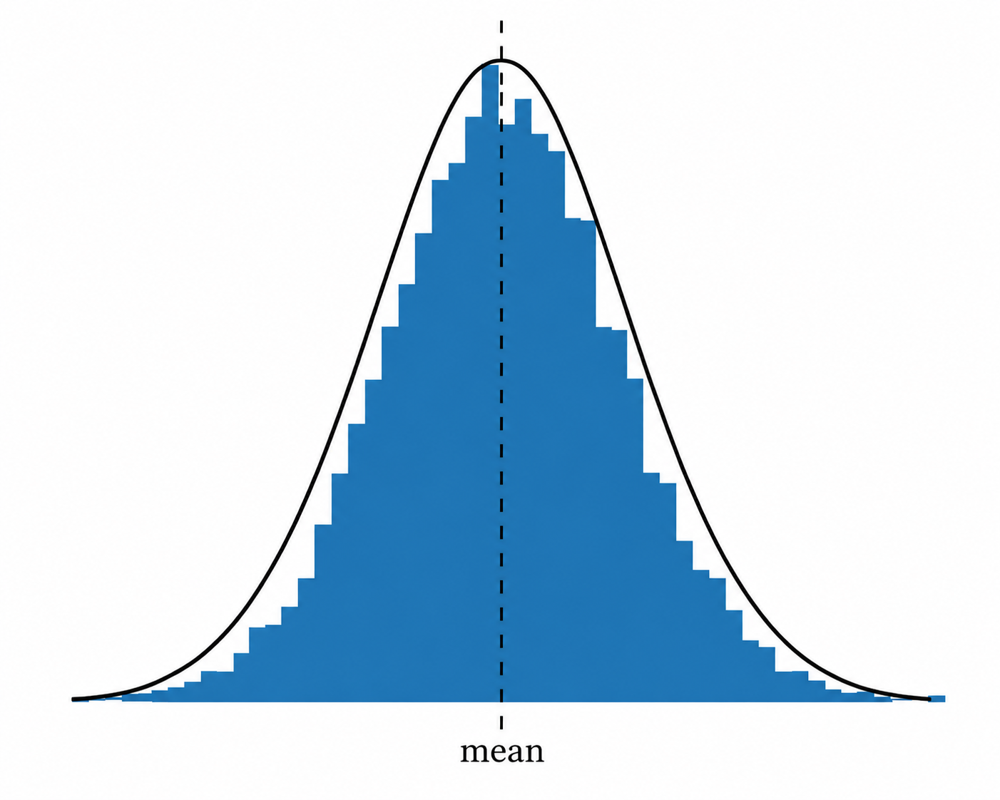
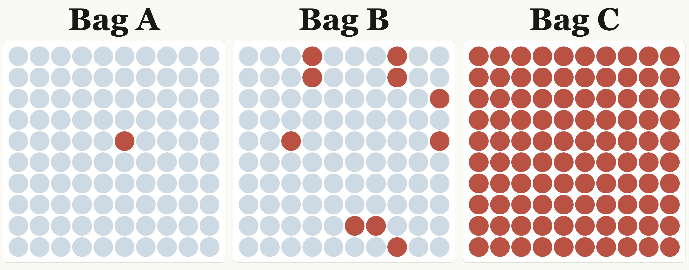
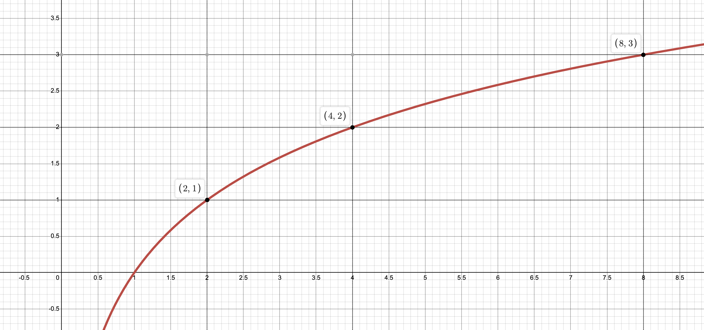

This is my first of a series of articles on one of the most fascinating concepts: the Normal distribution.

You may know it by the more colloquial term "bell curve".

Many things are (almost) normally distributed: population human height, population blood pressure, birth weights, annual rainfall, standardized test scores, shoes sizes, body temperature...the list goes on.

I've spent about a dozen or so hours across three or four Claude Opus 4.6 High conversations this year thinking about and understanding the normal distribution. This series will give me an opportunity to share what I've learned and by extension, how I'm using the Normal Distribution as a metaphor for my life and career.

While there are numerous mathematically heavy books on the topic, I wanted to find something more intuitive and accessible for non-mathematicians to guide my thinking and writing. Luckily, Claude found me this site: [https://longintuition.com/2020/07/20/max-entropy-intuition](https://longintuition.com/2020/07/20/max-entropy-intuition).

In this article, I want to focus on logarithmic thinking, but instead of telling you, I want you to first experience it with me. It'll feel silly but bear with me.

## A counting exercise

Do each of the following in order and out loud, and as you're doing each, notice how it feels (easy, hard, tedious, relief, fun, annoying, etc.).

- count to one.
- count to ten.
- count to one hundred.

Each subsequent target is 10x the previous one (1 -> 10 -> 100). Counting to 10 should feel 10 times as effortful as counting to 1. And counting to 100 should feel ten times as effortful as counting to 10.

But when I did this exercise, counting to 100 felt closer to 100x more tedious than counting to 10.

Why?

## Why counting feels the way it does

I don't know for sure, but I can make an informed guess.

I grew up in a schooling system where counting and number lines were the fundamental ways of approaching scale. I'm not alone! But we didn't start that way as babies.

Many years ago, I listened to an NPR Radiolab episode called "Innate Numbers." They talk about how babies naturally think logarithmically:

> LULU: ... the way that [babies are] actually experiencing quantities is not just a dumbed-down version of what adults do, it's a completely different version of what adults do.
>
> STANISLAS DEHAENE: Mm-hmm. They seem to care about the logarithm of the number.
>
> LULU: Imagine in your head the distance between one and two
>
> ROBERT: Okay.
>
> LULU: What is that?
>
> ROBERT: One.
>
> LULU: Right. Now imagine the distance between eight and nine.
>
> ROBERT: One also.
>
> LULU: They feel like the same distance from each other.
>
> ROBERT: Yeah.
>
> LULU: Well, that's because we think of numbers in these discrete, ordered chunks.
>
> STANISLAS DEHAENE: One, two, three, four.
>
> LULU: But now if you were to think about it logarithmically …
>
> STANISLAS DEHAENE: Like the baby.
>
> LULU: ... the distance between one and two is huge! It's this vast space. And the distance between eight and nine? Tiny.
>
> ROBERT: Why is that?
>
> LULU: Well, because one to two is doubling.
>
> ROBERT: Ah, interesting.
>
> LULU: But eight to nine ...
>
> STANISLAS DEHAENE: It's a ratio of close to one. Like, only one point something.
>
> ROBERT: Huh.
>
> LULU: Now here's the spooky thing about this: you might think what must happen is that eventually as we grow up, we just naturally switch from logarithmic thinking to the numbers we all know now.
>
> ROBERT: Uh-huh?
>
> STANISLAS DEHAENE: But this is not true.
>
> LULU: According to Stan, if left to your own devices, you'd never switch.
>
> ROBERT: What do you mean?
>
> LULU: You would stay in this logarithmic world forever

## Division is my way in

Claude Opus 4.6 High tried different approaches to convince me that my experience of the effort required to count to 1, 10 and 100 should match the actual scale from 1 to 10 to 100.

One such approach:

Imagine there are three bags, each with 100 marbles. You draw one marble from each. In each case, the first marble you draw is red.

Bag A: 1 red marble, 99 other (1% chance).

Bag B: 10 red marbles, 90 other (10% chance).

Bag C: 100 red marbles (100% chance)

Claude: How surprised would you be that you drew a red from each Bag?

Me: If I'm being honest the probability jump visualy from 10% to 100% seems way more than the jump from 1% to 10%. How do we get me to see that it's the same?

Claude: ~probably sighing~

What we found is that division is my way into logarithmic thinking.

Multiplication (1 -> 10 -> 100), to me, doesn't feel logarithmic even when it is. Not when counting out loud, and not when looking at a simple visual.

However, the decrease in counting effort from 100 to 10 did feel like the decrease in counting effort from 10 to 1. In other words: the relief I'd feel if I had to count to 1 (instead of 10) feels the same as the relief I'd feel counting to 10 (instead of 100).

I finally tangibly, felt logarithmic thinking. Maybe for the first time in my adult life.

(Yes this was a spiritual experience).

But what is the point of all this other than having you and I feel silly when counting numbers?

Information! Specifically, how to measure surprise.

## 1/p: how far from we are from certainty

Let's go back to the three bags.

The likelihood of pulling a red marble on the first draw from bag A is 1%. How surprised would you be if you drew a red from Bag A on your first draw? Very surprised.

From Bag B? Pretty surprised.

From Bag C? Not surprised at all.

How do we quantify "very", "pretty" and "not" surprised?

One such way is to measure our surprise is to ask: how much more likely is certainty (100%) than the initial probability (1%, 10% or 100%)?

The initial probability for drawing a red from bag A is 1%. When we actually draw the red, the probability of drawing it is now 100% (i.e. it already happened).

Mathematically: if p is the initial probability, 1/p is how much more likely certainty is than the initial probability.

1 / 0.01 = 100:  certainty (100%) is 100 times the initial probability (1%).

1 / 0.1 = 10:  certainty is 10 times the initial probability (10%).

1 / 1 = 1:  certainty is 1 times the initial probability (100%).

## More complex examples

Suppose you're an engineer and you have stand-up tomorrow. Most likely, you will experience stand-up-like things at the meeting. It's unlikely that you will hear an announcement that the CEO resigned or that your manager was fired.

Before an event happens, you assign it some probability in your head, even if you don't realize you're doing it. It's why we experience surprise when something unexpected happens!

Say you assign the probability of "standup-like-things happening" at stand-up tomorrow as 95%, hearing news of the CEO resigning at 1% and hearing that your manager was fired at 4%.

Calculating 1/p:

1 / 0.95 = 1.05

1 / 0.01 = 100

1 / 0.04 = 25

If stand-up-like things happen, certainty was 1.05 times the initial probability. You're not very surprised. It was almost guaranteed to happen.

If you hear the CEO is resigning, the certainty of that information event is a hundred times the initial probability. You're extremely surprised.

And if you hear your manager was fired, that event happening is 25 times its initial probability. A very surprising experience.

## Why using 1/p isn't ideal for complex scenarios

If you experience only one event every day (are you a subatomic particle?), and want to compare your experience across days, 1/p works for your purposes.

Day 1: standup-like-things happen (1/p = 1.05).

Day 2: CEO resigns (1/p = 100).

Day 2 was almost 100 times as unexpected as Day 1.

As soon as you start experiencing and comparing multiple events across days, 1/p becomes problematic:

Suppose that 1/p for many events in Day 1 is: [1.05, 10.6, 20, 100, 45.7, 1.25, 2.04, 3.5, 300 (yikes!)]

And 1/p for events in Day 2: [1.05, 1.10, 1.05, 35]

We can multiply together the 1/p ratios to get one value for each day.

Day 1: 2,723,772,555

Day 2: 42.4

Was Day 1 truly sixty-four million times as unexpected as Day 2? Or did it just have 2.5x the number of events, many of them being very unlikely?

Multiplication compounds quickly. So we can't differentiate an increase in the amount of events from an increase in their unexpectedness.

Addition compounds slower. How do we convert multiplication into addition?

## Enter the logarithm

Logarithm asks: how many times does the base multiply into the argument?

log base 2 of 2 asks: how many times does 2 multiply into 2? The answer: 1.

log base 2 of 4 asks: how many times does 2 multiply into 4? The answer: 2.

log base 2 of 8 asks: how many times does 2 multiply into 8? The answer: 3.

Notice the pattern:

log(2) = 1

log(4) = 2

log(8) = 3

8 = 2 x 4

log(8) = log(2) + log(4) = 1 + 2  = 3

Multiplication (2 x 4) converted to addition (1 + 2)!

Let's now compare the unexpectedness of our days using log(1/p):

Day 1: log(1.05) + log(10.6) + log(20) + log(100) + log(45.7) + log(1.25) + log(2.04) + log(3.5) +  log(300) = 31.3

Day 2: log(1.05) + log(1.10) + log(1.05) + log(35) = 5.4

Day 1 was six times as unexpected as Day 2. Adding an event now adds linearly to the unexpectedness of that day!

This process of converting multiplication into addition is called linearization. We use our linear scale for counting and quantifying so that we can move up and down the number line in discrete, equal chunks, so that adding an event adds its impact on the day.

## Why base 2?

An event has two possible states: it happened or it didn't happen. Encoding that numerically, we get a bit: 1 if it happened, 0 if it didn't happen.

The amount of unexpectedness (sum of log(1/p)) of an event is information measured in bits.

31.3 bits can roughly be interpreted as: if you had a list of 2,723,772,555 items, one of them being the sequence of events that happened on Day 1, it would take 31.3 halvings (i.e. cutting the list in two) to boil it down to that one item that happened. That's a lot of possibilities and a lot of unexpectedness for that one sequence of events to happen!

## What's next?

So, where's the Normal distribution? If you're following along with the supplemental reading, we're about 20% through the text. In future articles, I'll navigate through the meaning of entropy, why it's maximization is important, how that leads us to probability distributions, and all the way to our final destination: the Normal distribution.

The capstone article to this series is where I'll share my thoughts on how I think of life, career, and work experiences using the Normal distribution as a metaphor.
