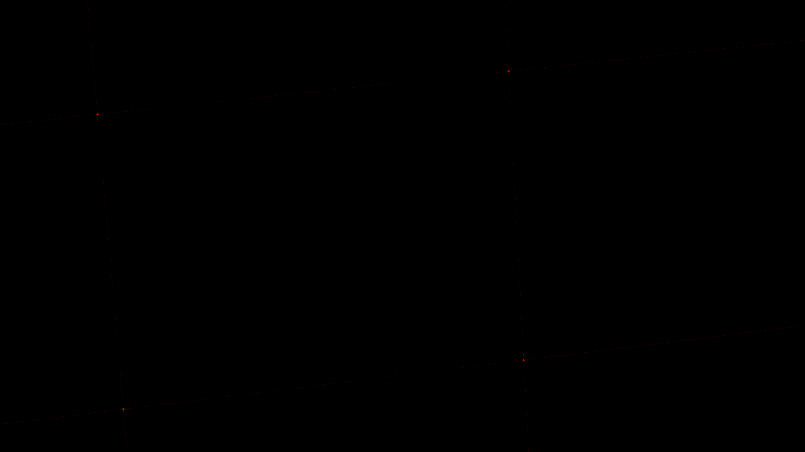

---
title: I Prefer Nothingness
date: "2026-08-21"
author: Vishal Bakshi
description: Earlier this summer, I had my first sensory deprivation tank experience....
filters:
   - lightbox
lightbox: auto
categories:
    - Miscellaneous
---

Earlier this summer, I had my first sensory deprivation tank experience. As I was considering booking a session, I came across a number of reviews describing a variety of experiences. Some folks slept better than they ever had before, some had hallucinatory experiences, some had out-of-body experiences, and so on. I honestly didn't know what to expect. 

The tank is pitch black (so much so that I saw nothing with my eyes open or closed) and is filled with about 10 inches of water with hundreds of pounds of Epsom salt. My ears underwater; all ambient sound was muffled. 

It's hard to track time in that environment. The first 10 minutes or so, I started getting bored and restless to the point where I was considering standing up. But I let it pass. I would feel my limbs twitch and would unnecessarily adjust my body, causing me to float about and bump into the walls. Eventually, I settled. 

I imagined "this is what being in outer space probably feels like". A sense of expansiveness. I felt like an astronaut on Spaceship Earth. 

I went in and out of almost-sleep, maybe twice. 

Maybe halfway through the 90 minutes, I thought something like: _this is truth_. _This is true reality_. I was fully present and fully experiencing the absence of sensory stimuli. It was a rich and full-bodied experience. 

At 90 minutes, soft music started playing. I opened my eyes and I turned on the underwater lights. They were blinding. I sat there, head buried in hands, surrending to the inevitable exit from peace.

I gathered my things and exited the chamber, disoriented upon re-entry into ambient light and sounds. I had an awkward exchange with the polite attendant

I pushed the front door open, and stepped out onto the street, back into the fully lit environment. 

I felt a billion bits of information violently crashing into my eyes. I immediately shut them and took a step back.  

As I adjusted and looked around at the billboards, cars, and storefronts, I felt like I was on a movie set. Suddenly, everything made sense. 

In the following weeks, I had a simple technique to find my way back into that state of nothingness: close my eyes. Had a stressful call? Close my eyes. Tired of staring at the screen? Close my eyes. Overwhelmed by the sun? Close my eyes.

As the weeks progressed, surprisingly, that was no longer was effective. Perhaps my baseline of stimulation was too far above nothingness. Instead, I find that leaning on my back and staring at the ceiling gives me a similar effect. I empty my cache. I go on standby, and I'm just present with myself as I would be with a friend. _Here we are, just staring at the ceiling_.

Even more surprisingly, I haven't felt the urge to go back. I'm sure I will in the future, but something in me doesn't want to rely on those conditions to feel that experience. I want to bring that experience out into the well-lit environment. 

