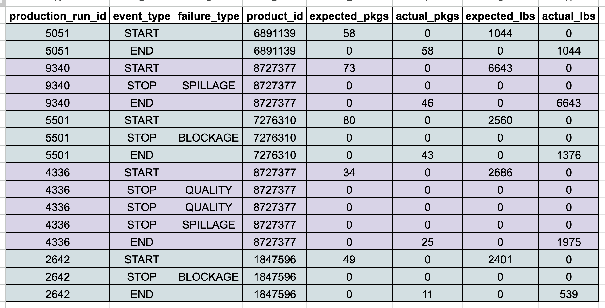

Suppose two people are walking through a garden. One asks the other, 

> "What do you see?" 

In that second, a billion bits of information hit their retina. Ten million of those flood their brain via the optic nerve and of those, they're conscious of only a dozen bits. 

> "Gah! Some of the roses are dying. We missed the full bloom again!"

Technically that might be true, but what's more informative is not what that says about the garden but what that says about what they see in the garden and what that means to them.

In data science and machine learning, looking at data works the same way.

Suppose you have the following dataset, from a pet food production facility's conveyor belt logs (which I generated synthetically using this notebook).

Raw data is a clue about what the data collector cares about. It's the answer to the question:

> What does the business see? 

Of the billion bits of information available to the business, these 8 columns, containing dozens to thousands of bits each (based on data type) is what gets captured.

We see that a conveyor belt STARTs, ENDs and STOPs, and that STOPs are always associated with a failure_type. Is that always the case? We should confirm that with a production SME.

Looking at data also tells us what's not there. In this case, I always ask the most obvious questions possible.

For example, the expected_pkgs and expected_lbs columns beg the questions:

- What's the relationship between the two? 
- Does expected_lbs = expected_pkgs x package weight?
- Where do we store data on package weight?
- Should we assume that all packages are the same weight for each product ID? Maybe. But perhaps product_id actually means product_category_id like a particular flavor of kibble that might come in both 8 lb and 25 lb bags.

Looking at data will naturally cause us to form hypotheses on the most important question:

> Why does this data matter to the business?

An amount of production is "expected", and the "actuals" are sometimes different. There are various STOP events and each is associated with a non-blank failure_type. The business is likely trying to minimize the reduction in expected production, and to help us help them, have provided us with this data.

We can prepare further insightful questions:

- Is the eventual goal to minimize the reduction in expected production? If so, by when? What happens if you aren't able to?
- What are you expecting us to deliver towards that goal?
- What physically happens during a BLOCKAGE or SPILLAGE? How long a delay does that cause?
- What qualifies a package as low or high QUALITY? Do products get taken off for inspection during stoppage?
- How do delays affect upstream manufacturing and downstream shipments?
- Can you show us some pictures or videos of the production runs in process?
- Who controls the conveyor belt settings? What settings are configurable?
- What other data do we have available?
- What have you already tried?
- What solutions are feasible to implement today? This month? This year?

A clarifying piece of advice I received earlier this year:

> The goal of the machine learning scientist is to quantify uncertainty for the business in some way

With a myriad of options available and a myriad of constraints, data can help us serve this goal. To have any chance at doing so effectively, and hopefully efficiently, we have to start by sitting down to look at the data.