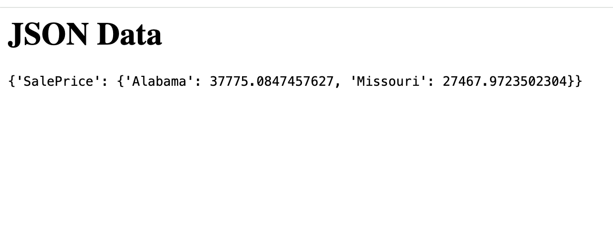
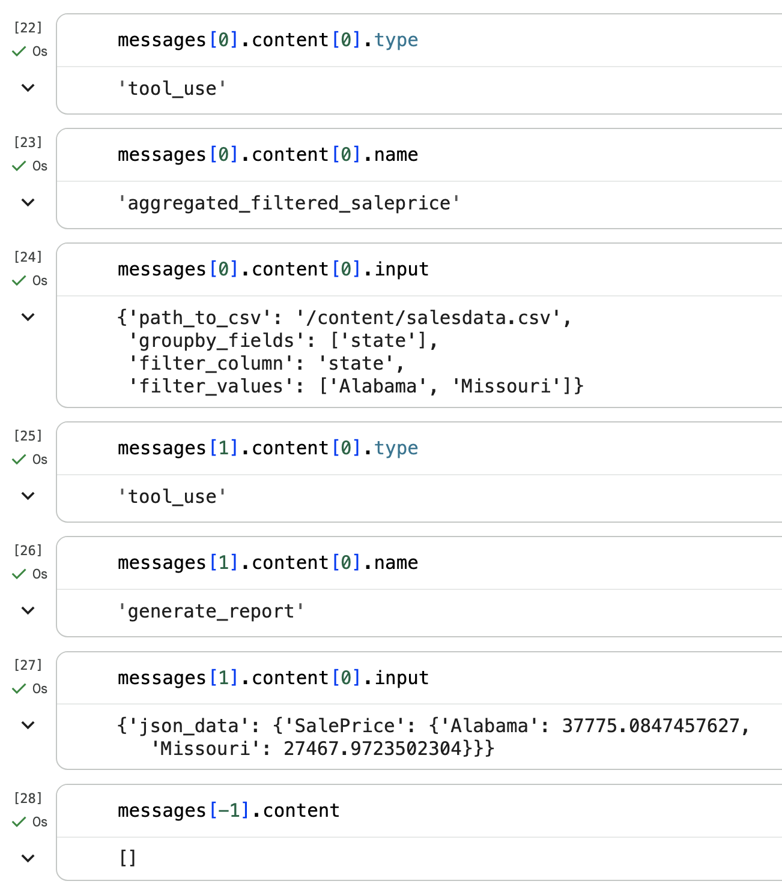

The framing of LLMs as an interface is not new.

The unstructured-to-structured and structured-to-unstructured framing came from [Evan Balzuweit](https://www.linkedin.com/in/ebalzuweit/) during a chat I had with him earlier this year.

Other references:

[Wolfram](https://reason.com/2024/05/19/the-powerful-unpredictability-of-ai/#:~:text=I%20think%20the%20thing%20to%20realize%20about%20AIs%20for%20language%20is%20that%20what%20they%20provide%20is%20kind%20of%20a%20linguistic%20user%20interface.):

> I think the thing to realize about AIs for language is that what they provide is kind of a linguistic user interface.

[Lawrence](https://arxiv.org/pdf/2504.10101):

> This means that LLMs provide a new interface between our thinking and the digital representations that they can assimilate

In this article, I'll to explore LLMs as an interface in the following workflow:

> human natural language input → LLM parses into structured data → pass it to deterministic executable scripts → LLM parses structured data into natural language output to human

## Comparing LLMs to Other Interface Options for Data Analysis

Suppose you want to create an interface where humans can “ask questions” and “get answers” about data.

I use quotation marks because depending on the interface “asking a question” and “getting an answer” about data can look very different.

### An interactive report

“asking a question” → selecting options from drop-downs and/or entering text inputs

“getting an answer” → static or dynamically updated tables and charts

### A data analyst

“asking a question” / “getting an answer” → sending/receiving emails or a messages

### An LLM

“asking a question” → sending a prompt

“getting an answer” → ???

A lot can happen in ???: the LLM can respond with text, it can create an artifact, you can give it a skill and it can follow those instructions and executable scripts, and so on.

#### A Toy Example

I’ll use sales data from the [Blue Book for Bulldozers Kaggle competition](https://www.kaggle.com/c/bluebook-for-bulldozers) (shoutout to Jeremy Howard and the fastai course!) to create a small toy example of this workflow:

> human natural language input → LLM parses into structured data → pass it to deterministic executable scripts → LLM parses structured data into natural language output to human

The code for this example can be found [in this notebook](https://github.com/vishalbakshi/logistics-playground/blob/main/notebooks/bluebook_for_bulldozers.ipynb).

The Blue Book for Bulldozers data contains sales information for large equipment across multiple years and states. I'm using a subset of the full ~400k rows.

```python
subset_df = df.query("saledatetime > '12/31/2011 0:00'")
subset_df.shape
>> (11573, 54)
```

While there are 54 columns in total, I am focused on two for this example:

- `saleprice`: what the machine sold for at auction
- `state`: where the machine sold

I want to create a Claude client and provide it with custom tools so that I can answer the following question: 

> Using the provided tools and /content/salesdata.csv, generate an HTML report that shows the mean sale price in Alabama and Missouri. Do not respond with any other text.

I want to provide two tools to the LLM: one that will calculate the mean sale price for a given set of states, and one that will create an HTML report of that data. I also want to give it a tiny data dictionary so it knows which column name(s) to use in the data frame.

This might seem overkill, but Sonnet 4.6 did not reliably follow instructions until I gave it this full set of context.

The first function will group the sales data by the desired column, calculate the mean sale price and then filter for the desired states. It will return the data in JSON format because that's what the Anthropic SDK expects.

```python
def aggregated_filtered_saleprice(
    df, 
    groupby_fields, 
    filter_column, 
    filter_values
):
    data = (
        df.groupby(groupby_fields)
          .agg({"SalePrice": "mean"})
          .query(f"`{filter_column}` in @filter_values")
    )

    return json.dumps(
        {
            "return_data": data.to_json()
        }
    )
```

My second function will take this JSON data and render and save a trivial HTML report.

```python
def generate_report(json_data):
    html = f"<html><body><h1>JSON Data</h1><pre>{json_data}</pre></body></html>"
    with open("/content/report.html", "w") as f:
        f.write(html)
    print("HTML report generated")
```

Finally I'll create a data dictionary string which will prevent Sonnet from loading the data frame and figuring out by trial and error the right column to group by and filter by:

```python
data_dictionary = """
    salesdata.csv contains the following relevant columns: 
    state (str): the state where the sale took place
"""
```

With all of my context ready I can provide the tools and the data dictionary to the model using the Anthropic Python SDK client:

```python
runner = client.beta.messages.tool_runner(
    max_tokens=1024,
    model="claude-sonnet-4-6",
    tools=[aggregated_filtered_saleprice, generate_report],
    system=data_dictionary,
    messages=[
        {"role": "user", "content": "Using the provided tools and /content/salesdata.csv, generate an HTML report that shows the mean sale price in Alabama and Missouri. Do not respond with any other text."},
    ],
)

messages = []
for message in runner:
    messages.append(message)
```

After about five seconds the HTML report is generated as expected:



Because I wrote my own functions and stored Claude's messages in a list, I can parse the message text and write assertions to make sure the data is correct. For this example we'll just visually inspect the message content.



I can see that in the first two messages Sonnet used the correct tools with the correct inputs. In the final message it didn't write a response because that's what my instructions said. Nice!

### Did we need to use an LLM?

For this example, looking up the mean sale price in a list of states is something you could easily put into an interactive report, whether that's Tableau, Power BI, or something you host and/or generate yourself .

You could argue that all data visualizations routinely needed to ask and answer business questions don't require LLMs. Existing reporting tools suffice.

In this particular workflow where do LLMs create new opportunities for efficiently interfacing with users?

> human natural language input → LLM parses into structured data → pass it to deterministic executable scripts → LLM parses structured data into natural language output to human
human natural language input

Any data analyst or data scientist will have at least one story where the thing they built never got used even though it was desperately needed. When I facilitated a Tableau user group at a large organization, a common training request was: "how do we teach non-data folks to use our data products?" or "how do we create a culture of looking at data?"

Any report or dashboard with even mild complexity from the data-side will require extensive user experience testing and training. 

The opportunity to use LLMs is to allow the user to ask a question from their perspective and let the LLM figure out how to translate that into input arguments to the provided tools.

**LLM parses structured data into natural language output to human**

One of the bottlenecks for scaling data products in organizations Is that different users need to look at the data differently. As a result you get multiple versions and formats of the same analysis. 

The opportunity to use LLMs is to curate the language and framing of the data in the final report based on the user.

**LLM parses into structured data → pass it to deterministic executable scripts**

Since LLMs can pass arguments to functions, you can either repurpose or refactor your existing reporting pipeline as LLM tools.

### Okay so why isn't everyone doing this?

Even with my trivial example it took a number of iterations to:

- get the right Kaggle API authentication. 
- Figure out which CSV and subset to use.
- Figure out what question to ask the LLM.
- Setup the Anthropic Python SDK client (they recently released a new version which had breaking changes).
Provide the right system prompt to prevent Claude from finding the right column by trial and error which created unnecessary token usage and non-determinism.

Any reasonable analysis that a business needs to make available to its staff is going to be significantly more complex than this article's example. The challenge in creating reliable AI workflows is not so much the code complexity, but achieving reliability with fundamentally non-deterministic LLMs. 

My goal when creating any AI workflow is to ruthlessly reduce the use of LLMs to the exact moments where we need to take advantage of their non-determinism. In most cases, these moments are at the bookends of the workflow where the LLM interfaces with the human.