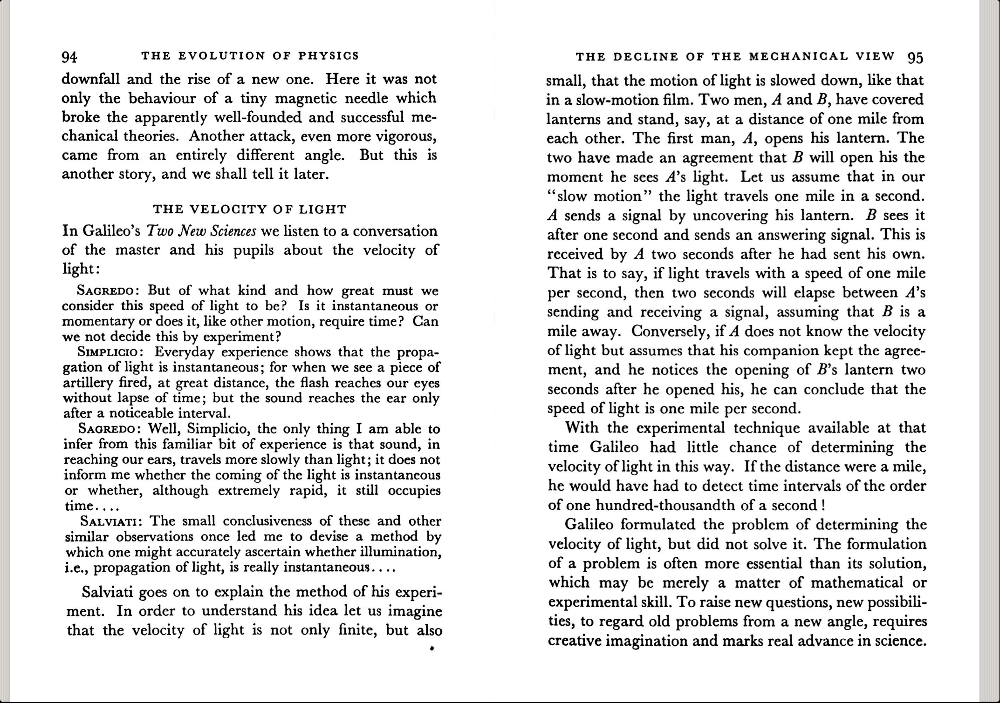
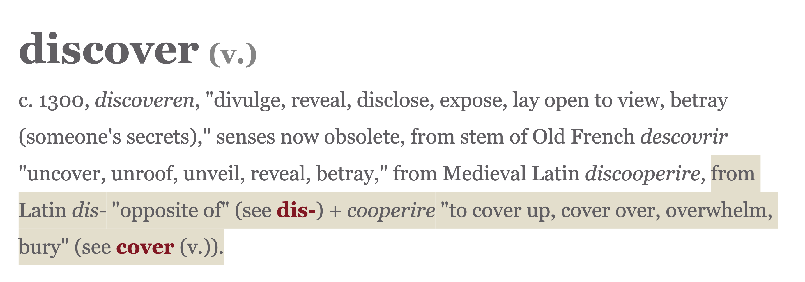
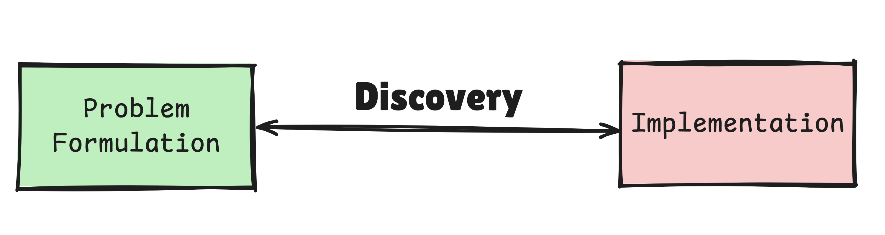
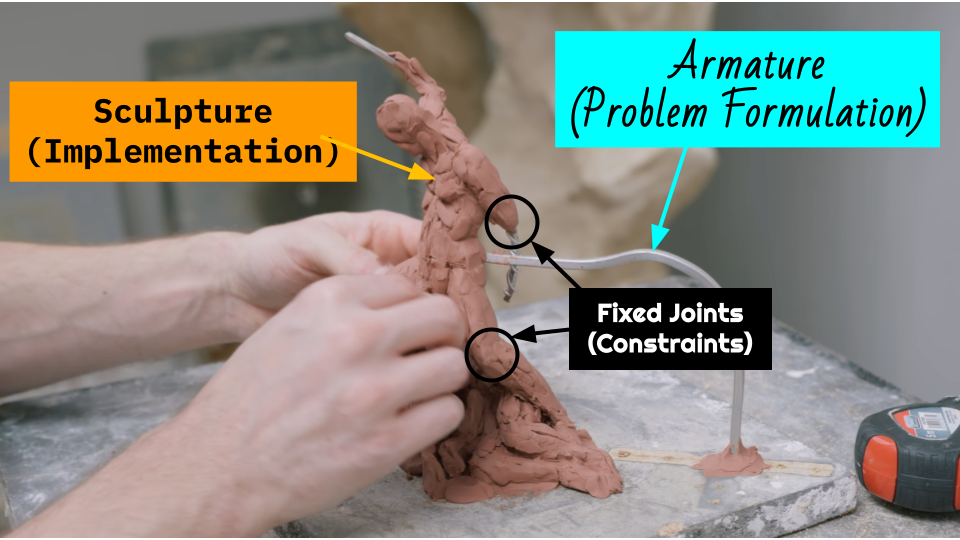

"The formulation of a problem is often more essential than its solution, which may be merely a matter of mathematical or experimental skill. To raise new questions, new possibilities, to regard old problems from a new angle requires creative imagination and marks a real advance in science."

— The Evolution of Physics by Elnstein,Albert and Infeld,Leopold (Chapter: The Decline of the Mechanical View, Section: The Velocity of Light)

## The Correct Problem Formulation is Emergent

What organizational cultural characteristics are needed to allow the right problem formulation to emerge on an ML project? I think at least three:

- Discovery (Structural Curiosity)
- Perception (Structural Perspicacity)
- System teardown ease (Structural Velocity)

### Discovery (Structural Curiosity)

You start with a vision, which gets encoded into a system architecture diagram. You clean and validate the data, write a good first set of tests and agree on an implementation plan.

The first iteration of the implementation passes (both tests and the vibe check), generates outputs that you like, and justifies the vision.

Over time, your implementation gets more refined and more complex. Features get added; data drift and distribution drift get accounted for; metrics improve, and the pipeline matures. What does system maturity mean?

A culture of discovery allows engineers to look at _and past_ what was built to see and reformulate the problem formulation upholding the ML system.

### Perception (Structural Perspicacity)

Assumptions (about the problem formulation) are not always explicitly expressed in implementation code. "Here's what we're doing" or "here's why we're doing it" capture a particular implementation strategy and a particular solution space, respectively. "Here's what we assumed about the problem formulation before we started coding" usually gets documented in early architecture diagrams, if at all.

You want to instrument your codebase to remind you how you framed the problem before you built on top of it.

Monitoring diagnostics and metrics, however granular, is not sufficient. Monitoring a sample of inputs and outputs is better, but still obscures the early problem formulation reasoning encoded in the pipeline.

A simple yet minimum data lineage visualization should show you in one screen the raw inputs, intermediate transform artifacts, outputs and relevant metrics for each step. The intermediate artifacts are the most critical. Any data transform should be made visible.

Take for example [the ColBERT indexing pipeline](https://vishalbakshi.github.io/blog/posts/2025-05-10-RAGatouille-ColBERT-Comparisons/). To understand and predict the impact a change in algorithm (such as FAISS --> [flash-kmeans](https://github.com/svg-project/flash-kmeans)) will have on users, it's not sufficient to look at queries and search results. You have to look at the intermediate centroids, embeddings, residuals, quantization buckets, and so on. These artifacts show us if our assumptions hold when data hits the pipeline.

### System Teardown Ease (Structural Velocity)

Building fast matters. Building the right thing fast matters more. Being able to quickly tear down and rebuild a system when someone diagnoses flaws in problem formulation matters the most. Without it, building fast is a trojan horse for unverified beliefs that your system is solving the right problem, leading to endless rework when--if--you realize it isn't.

Building in system teardown-ability in a legacy codebase doesn't have to be immediately comprehensive. There are a thousand small refactors accessible in a complex codebase. Identify one small incorrect problem formulation, tear it down and rebuild it correctly. It could be a data normalization step, a data transform diagnostic or an evaluation set metric. Each one of these reformulations nudges the system toward alignment with reality. These corrections compound over time.

## The Clay Maquette

The clay maquette is the perfect metaphor for organizational cultural conditions and characteristics needed to allow the right problem formulation to emerge on an ML project. The clay is the organization's culture. The armature is the problem formulation. The fixed joints are unavoidable and necessary constraints. And the sculptors are the people on the project.

The right clay allows you to iterate between building and system teardown, and the sculptors' perception enables them to see when that's needed. 

*Keep the clay soft* when you're not sure it's the right shape of the solution.

*Keep some joints fixed* when you can't change a constraint\*.

* from [Evan Balzuweit](https://www.linkedin.com/in/ebalzuweit/)

### Conclusion

Discovery, perception, and systemic teardown ease are structural at the organizational level.

You can have an ML team that implements the necessary instrumentation, observability, and monitoring allowing them to perceive flaws in the problem formulation; but if the cost to acting on that discovery is too high, it's unlikely that the act of discovery will be incentivized. This guarantees that even incremental teardown ease will not be optimized on the project and thus will not be developed in the team's capacity.

If the organization values correct problem formulation, and the team continues to execute that value, the cost of being wrong decreases over time. 

An organization that values correct problem formulation hires and promotes discoverers with perception, budgets time for planning and executing system teardown, and designs their coding guide, PR review process, agent's skill files, and professional development accordingly.