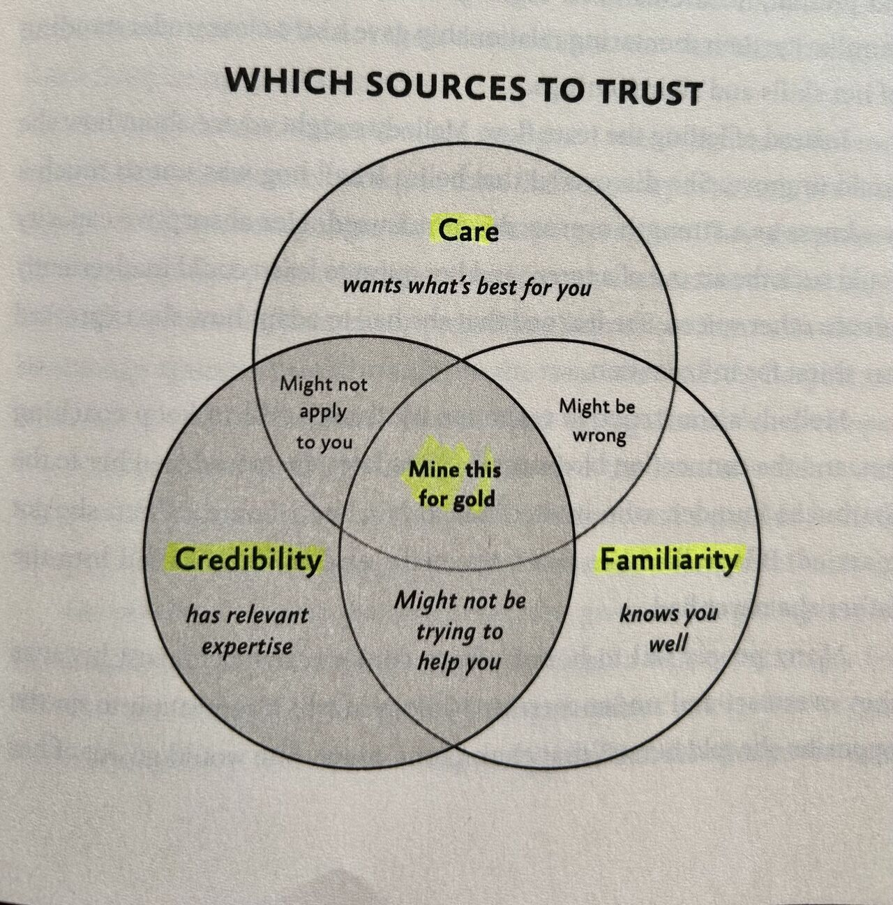

I learn from first principles. This usually results in me reverse engineering the core philosophies and theories (now with the assistance of LLMs) from practical applications. 

Take, for example, measurement theory. I didn't know anything about formal measurement theory until one day I was looking at an image on a machine learning project for the thousandth time, and the metrics calculated from it were conflicting. One metric was counting an object regardless of its position, and the other was counting it only if two measures of position (location and orientation) in the data were correct. In the first world, an object exists as long as it exists in the image. In the second world, the object exists only if it's in the right location and orientation. I went through a very long conversation with Opus 4.6, starting with the following prompt: 

> I think the main thing I think the main thing I'm trying to address is, like, you know, this only applies to situations where you can't measure the thing directly. And, the more I think about it, the more I'm realizing that measurement itself is not a direct Phenomena. Like, there's nothing intrinsic to an object that makes it measurable, if you know what I'm saying.

{width=40%}

Claude, to its credit, did know what I was saying, and found teachings from 250 years of measurement theory study to enrich my understanding:

> Kant's (1781) distinction between phenomena (things as they appear to us) and noumena (things in themselves, the Ding an sich) is essentially the claim that we never access reality unmediated.

> Helmholtz (1887); "What is the objective meaning of expressing through denominate numbers the relations of real objects as magnitudes, and under what conditions can we do this?"

> Krantz, Luce, Suppes & Tversky (1971): "Measurement involves the construction of homomorphisms (scales) from empirical relational structures of interest to numerical structures that are useful." 

> Bridgman (1927): Bridgman was troubled by the fact that different domains require different operations for the "same" concept. You measure the length of a table with a ruler. You measure the distance to the moon by timing light. You measure subatomic distances by scattering particles. Bridgman argued these are actually different concepts covered by the same word for convenience. Each set of operations is a different mapping, and therefore produces a different concept entirely.

> Korzybski (1931): "A map is not the territory it represents, but, if correct, it has a similar structure to the territory, which accounts for its usefulness."

I've had similar conversations on concepts like normal distributions, Pareto distributions, and Bayesian modeling, to name a few. In each case, I start with practical, real, often seemingly mundane data that I'm looking at, trying to understand what it means and keep asking "why" like a five year old (one of the reasons the infinite patience of LLMs, within usage limits, is a godsend for a student) until we get to the core of it.

My brain seems to simply be wired this way. I joke that I ask really good questions because I don't understand anything.

You might think that taking and acting on advice that I don't understand fights this urge to obsessively understand everything from first principles (_wait, you want me to do this thing without understanding it?_) But it doesn't! As long as there's trust, understanding if someone's advice is true—from first principles—requires action. 

Every inflection point in my life is a result of me uncritically doing what someone I trust says. Whether it's my wife or a friend, colleague, author, teacher, or mentor, when my sight is obscured is when I trust the most.

Adam Grant has a great venn diagram on this topic (thanks to [a post by Ren Saguil](https://www.linkedin.com/posts/rensaguil_one-of-the-most-challenging-aspects-for-activity-7127765180700119040-yY8r?utm_source=share&utm_medium=member_desktop&rcm=ACoAAAGsrkUBFXvUJXwrWpiaLTzjyYn6SoZr1Jo) with this image).

{width=40%}

I used [MentorCruise](https://mentorcruise.com/) to find my mentor. One of his positive feedbacks is that I act on advice. The reason I act on his advice is threefold:

1. When I read his published "personal operating manual", not only did I see myself in those words, but many of his phrases gave me the words to articulate aspects of myself that I couldn't before. 

2. When I share challenging crossroads and decisions I am encountering, he has multiple examples of when he experienced something similar. 

3. He is wildly successful in his career by many standards, but most importantly, mine: he's built a life for him and his family full of joy, peace, and growth and is able to share his lessons learned with others.

From the very first call, I knew he was the right fit because when he gave me advice on what to do for X, Y, Z, it was uncomfortable. But because of the above three points, especially number one, I _trusted_ him. In the following weeks and months, some of my "homework" was grueling, but I kept at it because that of that balance of trust and discomfort. Ultimately, it paid off and improved my life and career trajectory. 

Eric Reis, in his lesson during the first AnswerAI SolveIt course, said something to the effect of: be vocal about what you believe in so that your people can find you. If my mentor hadn't published a personal operating manual, if my family and friends weren't honest with me, if the blog posts, articles, books, and posts that changed the trajectory of my life after reading them were not written, I shudder to think where my life would be.

