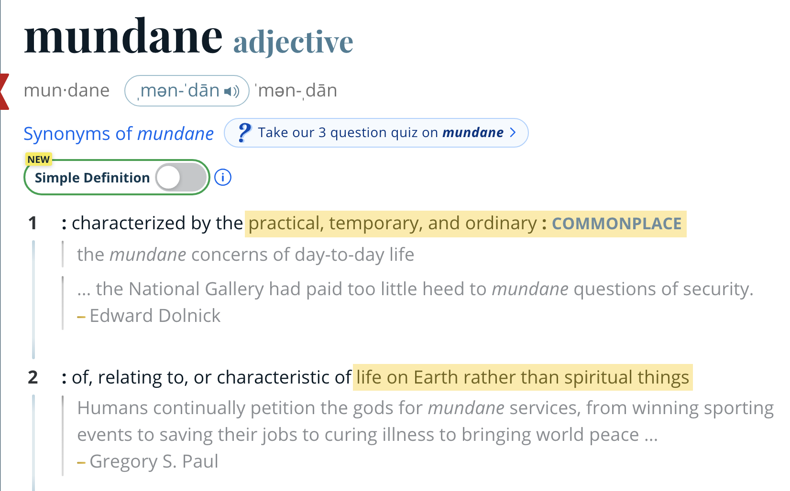
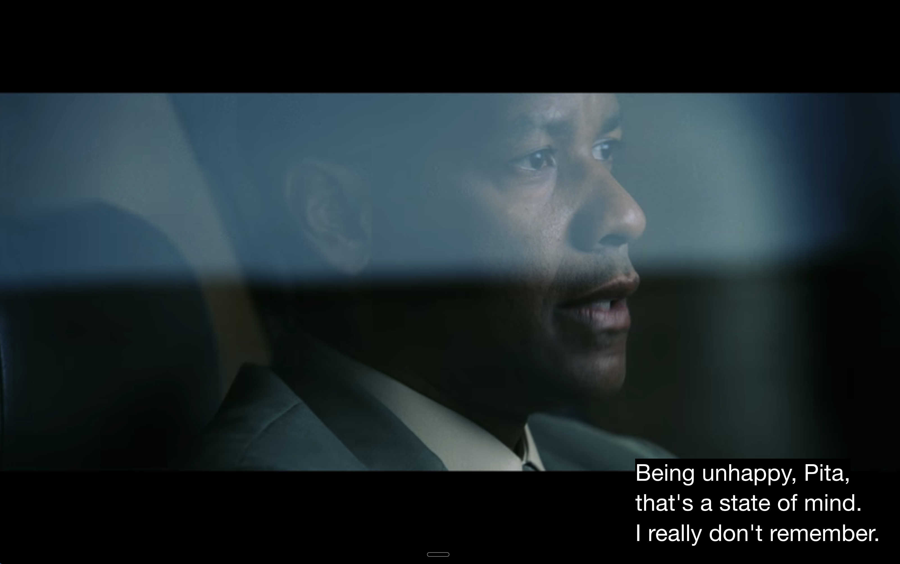
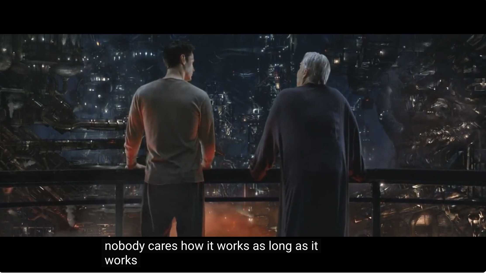

if the devil is in the details, god is in the mundane.

one of my greatest successes in life is reaching a state of mind multiple times during the week, or even a day, where i see beauty in the mundane and feel peace or excitement.

"beauty" is an understatement. awe-inspiring, ethereal, spiritual are more accurate.

{width=60%}

the feelings of peace usually come when i look at trees, leaves, or light coming through them when i take my dog out for a potty break.

the feelings of excitement usually come when i look at data, especially about physical objects (e.g. mundane images of products or packages or barcodes with object detection annotations, query results with product codes and inventory bin numbers, shipment quantities with scheduled times, palletization XML files, truck loading diagrams, route plans). 

if you look long enough at that image, and think deep enough about it, asking "why?" repeatedly, peeling back the layers you will hit some of the core unanswered questions about life and the universe.

one of my favorite [glimmers](https://www.usatoday.com/story/life/health-wellness/2022/03/23/glimmers-opposite-triggers-mental-health-benefits/7121353001/) to come across on walks is some piece of underground infrastructure peeking up from the ground (a sewer/water valve cover, electrical box cover, or vintage pad-mounted transformer)

{width=80%}

it's a reminder that there is a world hidden from view that (literally) powers the one we see. you can almost _feel_ the magnitude and scale of it, just by seeing it. _oh yeah that's why i can space out on my walk_.

infrastructure allows us to offload the most fundamental necessities to an entire ecosystem built by strangers that "just works" so that we may spend our precious energy exploring the rest of the world. imagine having to spend conscious cognitive energy to pump our heart, balance our digestive acidity or filter our blood from impurities. we're grateful when those things _just work_.

individualism is impossible without infrastructure. you could escape and move to the most remote part of the U.S. and there will still be a USPS carrier coming to you [by mule or snowmobile](https://news.usps.com/2017/06/13/special-deliveries/) to deliver your mail. 

you cannot escape the mundane! you _should not escape the mundane!_

the mundane keeps us sane and grounded.

meditation (which can be just staring at the ceiling or a wall, or off into the distance), breath work, mindfulness, all the things that restore our mental balance are about being consciously present with the mundane (a noise, a word, a sound, a scene, etc.) 

relationships, especially marriage, require seeing the beauty in the mundane. most of our cohabitated lives are mundane. 

> Marriage as a long conversation. — When marrying you should ask yourself this question: do you believe you are going to enjoy talking with this woman into your old age? Everything else in a marriage is transitory, but most of the time that you’re together will be devoted to conversation. _Friedrich Nietzsche, Human: All Too Human._

listening—truly listening and not planning to predict what's next and/or what you want to respond to that——requires fascination in the mundane. 

comfort with mundane, especially in 2026, especially in tech, especially in ML/DS/AI, even if it comes easily for you, requires disciplined practice. the glorious benefit of our field is that it's full of mundane.

there's so much mundane in our field _that we are actively trying to free our attention of it with AI_.

so, yes, fine, if your LLM workflow is working, don't read your code, don't look at the data _for the purpose of productivity_. look at it as a practice of being with the mundane.

