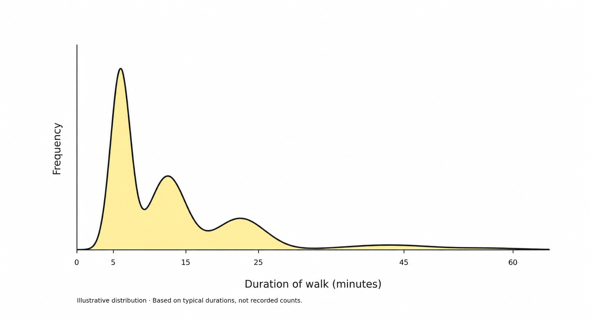

Life is a collection of systems. Systems generate experiences. Some of those are routine. Routine experiences compound into habits, expertise, and shape our identity.

Take, for example, my experience of taking my dog out for potty breaks. We go at certain times with certain goals based on when he's eaten food and drunk water. He dislike wind and rain and wants to finish business and jet back inside. Sometimes I have a busy day and need to do the same. Sometimes I don't and can dillydally. As a result, each walk has a slightly different duration.

Over a year, if we were to plot the distribution of walk durations, it might look something like this:

We don’t end up forming a 60-minute-walk-habit for potty breaks given this system.

What if we wanted to form that habit? 

It requires effort to change the routine experience of an activity, and changing even seemingly mundane routine experiences have second order effects.

Change the routine experience by changing existing systems.

Something around the walk would have to change: taking fewer/shorter meetings, or requesting more flexibility in work hours, start getting up earlier, go to a park every evening, or go for a really long hike on the weekends. 

Each change will have second-order effects. Maybe flexible work hours are not sustainable for the work involved on a project. Maybe longer walks means I can’t read or write as many blog posts, work on open source, watch as many shows/movies, have as many conversations with family and friends, and so on.

When you want to change multiple routine experiences, the amount of effort required to change the systems compounds.

Take, for example, career changes.

For relatively out-of-domain career transitions (e.g. structural engineering intern --> community college instructor; community college instructor → data analyst; data analyst → machine learning engineer), the second order effects compound quickly. You start to take an online course, get involved in the community, start working on volunteer or open source projects, and keep up to date with social media content in that field. You're more tired by the end of everyday, but also more energized during the day. You start forming new social relations but some existing relations naturally weaken. Goals become lived experiences. It's a transformative experience! 

For relatively in-domain career transitions (e.g. ML for sales forecasting → ML for logistics) I can sometimes change my routine experience within a role. If an opportunity came up to work on a different project in the company and it matched the terms of my contract, I can take that opportunity and change my routine experiences. There's still that transition period—overlapping off-boarding and onboarding—and there's always some long-term maintenance on older projects.

The goal in these transitions is to consistently accumulate time spent interacting with people and tasks in the domain you're shifting into.

How can you tell what your routine experience will be in a different system without being in it? It’s often like trying to predict the shape of a distribution based on knowing just the mean and the variance, and no other constraints.

One approach is to sample many people's experiences from similar systems (social media posts, blogs, books, podcasts). This is why representation matters. This is why sharing your experience publicly matters (i.e. you never know who's trying to find their people, and you might be one of them). 

Changing a system involving humans [is diplomacy work](https://vishalbakshi.github.io/blog/posts/2026-09-08-talk-to-everyone/).

Even once you're inside the system, you should not stop sampling. Talk to everyone, including folks who are not in your domain and those who are not on your team or project.  The same rule applies online: follow and engage with people's content across domains you might know very little about. Everyone will have a different set of routine experiences. Collectively, they will give you a sense of what it means to work in that team, organization and industry.

Not all systems are designed to receive or integrate corrective feedback. This is not strictly a bad thing (e.g. routinely changing database schema). Nor is it strictly a good thing (e.g. refusing to write any documentation). What I do know is that if incentives across the components in a system don't align, the routine experience will be full of friction.

If you sample enough people's experiences genuinely, listening to what they say and sharing with them what matters to you, you will start to find opportunities to build bridges across diverse thinking to find mutual benefit. I don't need you to subscribe to my school of thought, but if a certain action is mutually beneficial for our incentives, it would be weird if we didn't agree to do it. 

In this way, changing just a single component of a system, because of second-order effects, can produce routine experiences that I want and you want, even if we want a different overall system to be put into place.

