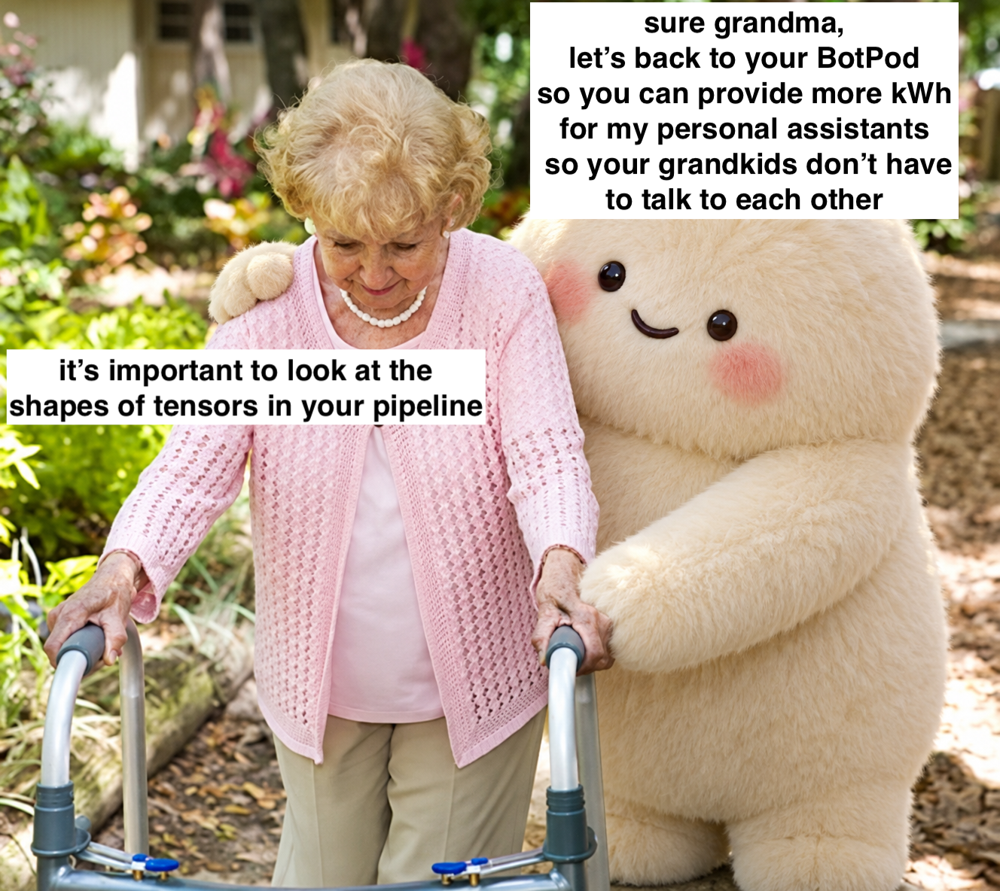
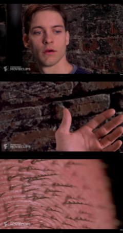
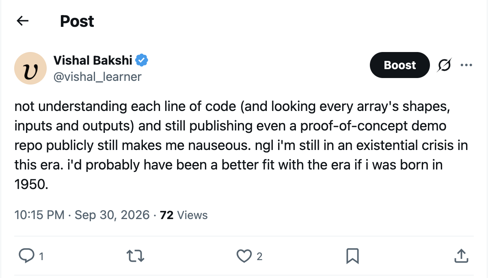
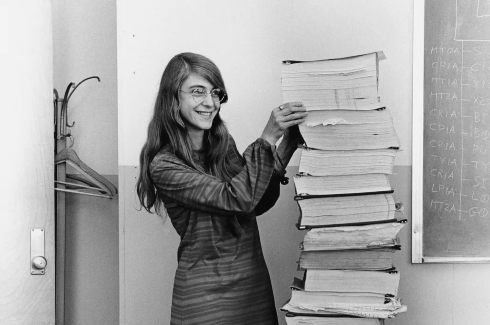

> "You made me understand that I was wrong: that the choice to pull this lever is not mine to make. Because this world, the world that I am a part of and that I helped shape, will end tonight, and tomorrow a different world will begin that different people will shape. This choice belongs to them." 

I am experiencing something in my late 30s that, when I was a kid, I thought people wouldn't experience until they were in their 70s or 80s: my time has passed. 

As I watch culture and technology change around me, I can feel that this world is not the world that I was born into, that I thought I would grow up into, or what the world should be.

This, of course, is very necessary. If and when immortality is achieved, we will lose the very necessary cycle of life, where generations die off, and along with them, their control over institutions and networks that shape the dominant ways of thinking, living, and being. This death allows for new socio-political, cultural, spiritual, emotional, philosophical and technological ways of being to become the new average.

However, things are moving fast. I am experiencing, in my lifetime, an amount of technological change that is impossible to keep up with. I was 5 years old when we first got the internet at home, and I remember the pale periwinkle button on our IBM Aptiva.

Just this past week, OpenAI released Dots, and this past month Meta released Muse. Different times. 

---

In my teens and early 20s, I wanted to change the world. In my late 20s and early 30s, I wanted to change my world. Now, I want to hold on to whatever's left of my world, as best as I can.

This past week was the first time I drove to different neighborhoods in Portland, Oregon without using Google Maps, relying on what I remembered and landmarks I recognized. I felt like a god.

Last night, I was recording a walkthrough of a multi-vector RAG demo that Opus 5.5 Extra created, and I was trying to understand the JavaScript code that it wrote and was partially successful. It worked, and it was a proof of concept. I published the repo, and I shared it online, but something inside me shifted, even though I've been using AI for coding for a couple years now. 

Had I been born in 1950, I would have probably been a sophomore in college reading about this:

Or a freshman in college reading what would've been at that time a newly released paper titled [The Computer as a Communication Device](https://internetat50.com/references/Licklider_Taylor_The-Computer-As-A-Communications-Device.pdf?utm_source=2x5e-x&utm_medium=social&utm_campaign=evergreen-always-on&utm_content=lickliderpaper).

---

If I'm lucky, I will get to experience this world for another 50 years. In the current state of mind I'm in, my only goal is to create experiences for myself and my friends (in real life and online) of a world long gone.