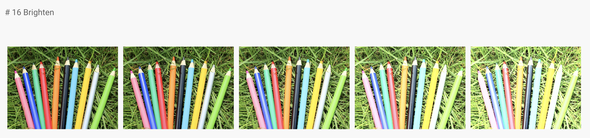
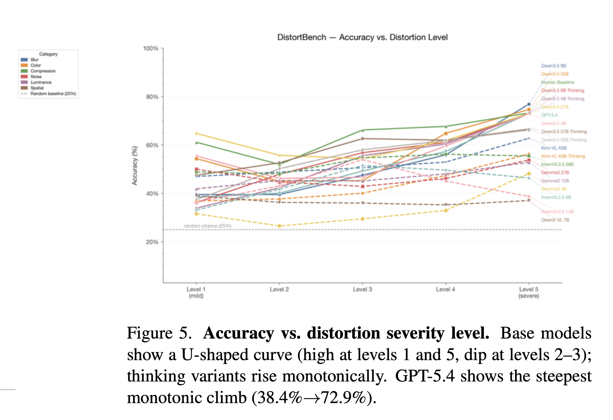
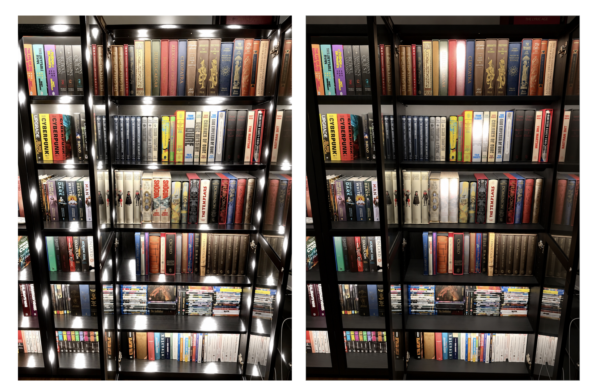
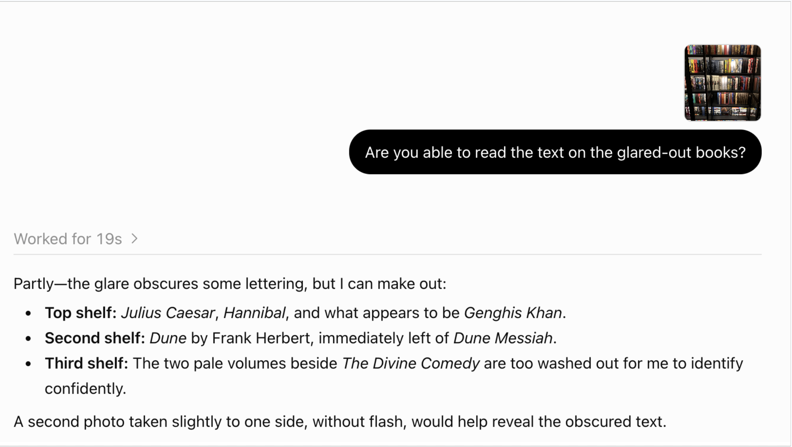
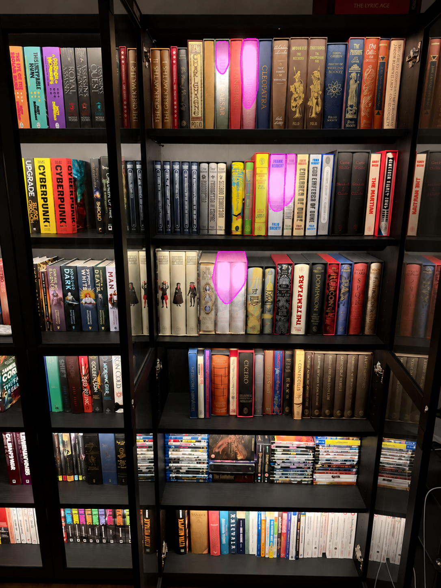

::: {.callout-tip}
## Let's Partner and Collaborate

I'm a data and ML consultant. If your team has a project that's stuck, I'd want to hear what's blocked, which options you've considered, and what their limitations are. Book an intro call: [vishalbakshi.com](vishalbakshi.com)
:::

Let's say you want to train a model to quantify (regressor with continuous outputs) or classify (classifier with discrete classes) image quality, and you need to annotate a set of production images. You provide clear, tested instructions and many examples to third-party human annotators and ask them to label images, with instructions like the following:

How much {distortion} is in the image? 

- 5 - imperceptible
- 4 - perceptible but not annoying
- 3 - slightly annoying
- 2 - annoying
- 1 - very annoying

_where {distortion} could be "glare", "blur", "occlusion", etc. The scale comes from the paper DeepFL-IQA: Weak Supervision for Deep IQA Feature Learning by Hanhe Lin, Vlad Hosu, Dietmar Saupe._

## What claims about the data do these labels make?

The labels increase linearly from 1 to 5, so you should verify that the way annotators label images supports two claims:

Claim A: the amount of defect increases linearly with its perceptual measurement (imperceptible → perceptible should look/feel like the same increase as annoying → very annoying).

Claim B: an annotator's label reflects the actual amount of distortion (two images labeled 2 contain a similar amount of defect).

## How do we verify Claim A during dataset curation?

In the paper DeepFL-IQA: Weak Supervision for Deep IQA Feature Learning by Hanhe Lin, Vlad Hosu, Dietmar Saupe [arxiv] the authors calibrate the synthetically distorted images: 

We manually set the parameter values that control the distortion amount such that the perceptual visual quality of the distorted images varies linearly with the distortions parameter, from an expected rating of 1 (bad) to 5 (excellent). The distortion parameter values were chosen based on a small set of images and then applied to all images in both datasets.

Synthetic training data might not work for your use case (the paper concludes that the features learned from artificially distorted images are "not suitable for IQA on authentically distorted images"). Regardless, when you curate examples for annotation, you should sample distortion amounts to match linear perceptual changes.

How do you sample distorted images without a quality classifier/regressor?

I think you can take a couple of approaches:

- Option 1: use synthetic data for annotation examples.
- Option 2: use synthetic data to visually select similarly distorted real images.

While the paper doesn't share the explicit methodology for how they calibrated the synthetic distortion data generation parameters with linearly increasing levels of perceptual quality, how I would approach it is to create a script using codex, claude code or similar (*gasp* hand-code it?), where you can iteratively change the synthetic generation parameters, generate synthetic distortions, and have humans annotate the levels 1 through 5 until you get that calibration. 

For Option 2, I would create an HTML UI and use these calibrated synthetic images to select comparably distorted images from prod.

This is one of my favorite uses of AI (custom UIs for dataset evaluation) so I'll make a video on it later this month.

## How do we validate Claim B during dataset curation?

Claim B: an annotator's label reflects the actual amount of distortion (two images labeled 2 contain a similar amount of defect).

We can again draw inspiration from research. In the paper DistortBench: Benchmarking Vision Language Models on Image Distortion Identification, the authors found that this claim is hard to achieve: three imaging experts identified the correct severity level of synthetically distorted images only 69.9% of the time, even though they named the distortion type correctly 83.6% of the time.

They also found that VLMs struggled with accurately assigning labels:

I’d be curious to see GPT 6-level models’ performance on this kind of task in an evaluation study similar to what Roboflow folks have done for Astra on object detection and segmentation.

It's hard to see in that chart, but humans picked the right answer most often for the most severe distortions (77%) and least often for mild ones (54–62%). In my experience this holds: annotators reliably label the most severe cases and drift toward the middle of the scale for everything else.

## We nailed down both claims, annotation is solved!

Not quite! Even if we can reliably quantify defects, there's still one more post-training claim that matters for our ML pipeline and business objectives:

- Claim C: on average, all defects are NOT equal

Suppose you are running a pipeline where production images get sent to an object detection model. You've trained a classifier or a segmentation model like YOLOv26 on GPT Astra-annotated images to a desirable level of performance so that it can flag images with a large amount of defects, such that highly defective images don't get sent to the object detection model.

The underlying assumption is that a high amount of defects correlates with low performance and low accuracy of object detection. This is not always the case for a couple of reasons.

Reason 1: (A contrived example for illustrative purposes) I gave the same image of bookshelves to GPT-6 Astra to synthetically add glare.  Suppose you are running object detection and OCR to read the book titles for inventory purposes. The amount of glare in the left image is significantly higher, but it's in locations that don't matter (physical shelves). The amount of glare in the right image is relatively lower, but it's in places that matter (text on book spines).

Reason 2: what hurts human perception doesn't always hurt the model. In the right image, glare on five book spines makes the titles hard for a person to read, yet Astra can still read two of the five.

## Illustrative example: what can go wrong?

What can go wrong if these claims are not rigorously validated?

### Claim A: the amount of defect increases linearly with its perceptual measurement

If not, a regressor trained with MSE treats every one-level error as the same size, even though the levels aren't. Ordinal losses drop that assumption, but then the output tells you order, not amount. From the Deep Neural Networks for Rank-Consistent Ordinal Regression Based On Conditional Probabilities (Shi, Cao, Raschka, 2023) paper: 

Moreover, unlike in metric regression, we cannot quantify the distance between the ordinal ranks...Hence, ordinal regression (also called ordinal classification or ranking learning) can be considered as an intermediate problem between classification and regression.

### Claim B: an annotator's label reflects the actual amount of distortion (two images labeled 2 contain a similar amount of defect)

If not, and suppose you train a quality regressor or classifier on these labels/images, the information in pixel space doesn’t map to the information in label space.

### Claim C: on average, all defects are NOT equal

Images the quality model correctly rejects may be fine for object detection, and images it passes may still break detection.

## Segmentation Masks Instead of Human-Perceived Quality Labels

While I have not tried this in production, I think using segmentation masks instead of a regressor or classifier trained on human-annotated quality labels can sidestep Claims A and B, and lets you test Claim C directly.. With GPT-6 Astra's performance on segmentation masks (as the Roboflow evaluation shows), I think training a YOLOv26 on Astra-annotated data or similar model may achieve consistently reliable results in detecting distortions in an image.

Take, for example, glare in an image. Instead of a human looking at reference examples (however calibrated they may be) and making a judgment call on a different image, using Astra to create a segmentation mask for glare locations gives you pixel-information on where exactly the distortions are.  Then you can intersect your object detection results with your segmentation mask pixels and calculate which distortion areas result in inaccurate object detection.  Again, with AI, I think creating an experiment like this, from dataset annotation to YOLOv26 training, is becoming a trivial task.

As a quick back-of-the-envelope one-shot example, Astra struggles to capture what I would consider the full area of glare on the first annotation in the topmost shelf. I'll put this kind of experimentation on my to-do list as a follow-up to this article.

Ultimately, annotating image quality comes down to two questions. Do our labels teach the model what we want it to learn from these pixels? And are we judging image quality by human perception, or by the perception of the model that has to use the image?

---

I'm a data and ML consultant. If your team has a project that's stuck, I'd want to hear what's blocked, which options you've considered, and what their limitations are. Book an intro call: https://vishalbakshi.com

