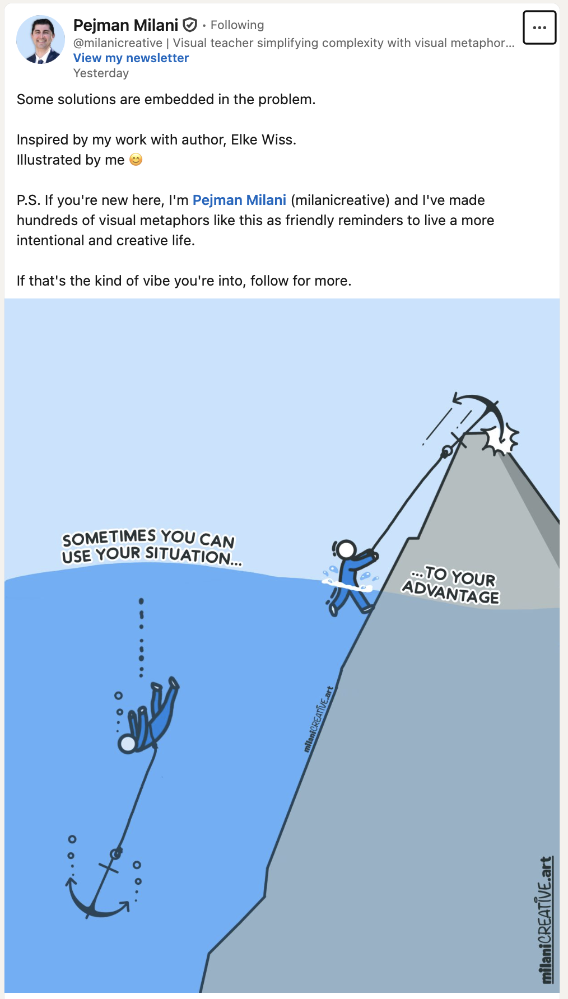
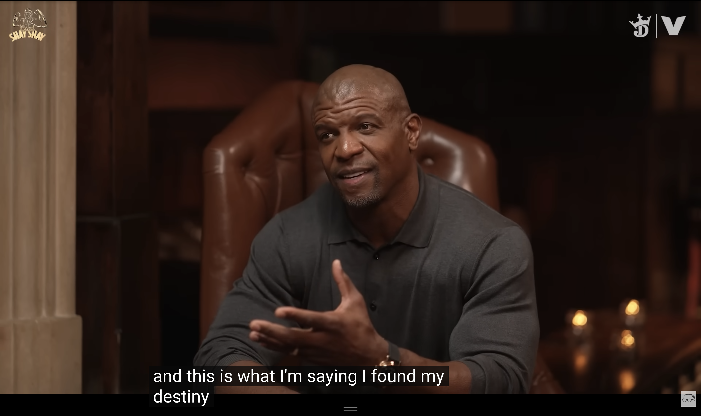

Every so often I come across something that makes me want to run through a brick wall (or, in this case, write a LinkedIn article). A recent [LinkedIn illustration+post](https://lnkd.in/p/gQqwaf4X) by [Pejman Milani](https://www.linkedin.com/in/pejmanmilani/) is one of those things:

The dynamism is palpable. Can't you just feel the moment when the person drowning realizes what's weighing them down is what will elevate them to the next level? The moment when they reframe the situation in their mind and the body kicks into gear, swinging the anchor up and out of the water with superhuman strength? It's an electric message about the power of reframing your perspective.

But this reframe is only possible through humility.

I've been wanting to write about an influential interview I watched a couple years ago, and have been waiting for the right moment to do so. This post triggered the inspiration I was waiting for.

---

In 2024 a pivotal catalyst in my professional and personal identity development arc was Terry Crews' interview on Shannon Sharpe's "Club Shay Shay" podcast.

I'm going to talk through some of the key quotes from Terry that resonate with the feeling, the moment, and the dynamic in Pejman's illustration. The entire interview is worth a watch and I've probably watched it 10 times since its release.

## Arrogance and Suppressing Your Calling

Terry reflects on his relatively unsuccessful NFL career, during which he entered the league in the 11th round as a "glorified free agent" and bounced around different teams for a few years before calling it quits.

The anchor that was weighing Terry down was twofold:

1) He wasn't respecting his calling. He had always wanted to be in entertainment, and football was a means to make some money along the way.

> I realized it was because of this deep-down belief: I really didn't like football that much. I wasn't really studying it. There were just so many other interests. I'd be in practice and my mind would be going off on what I was going to be doing afterward and what I was going to do before.

2) Arrogance was preventing him from seeing that his lack of interest resulted in a lack of effort, attention to details and rigor—it prevented him from becoming a student of the game:

> When I look back, though, I see that there were people who were just better. They were willing to do more.

## Million Dollar Habits

Leaving the NFL, broken-hearted and with broken dreams, working random jobs (sweeping floors, filing papers) sent Terry into a depression. What allowed him to swing his anchor into an ice axe to help him climb his mountain was the power of habit:

> These are the little bitty mindsets. I remember I was like, "Okay, I have to imagine I'm going to get $1 million if I sweep this floor correctly," because I had to play these kinds of games with my head in order to get over the depression. I remember sweeping and sweeping and sweeping, and all of a sudden I forgot about my problems. I forgot about it. In fact, I was doing something about my situation. These things are incremental, it's not one big giant thing.

Objects and tasks don't inherently come prescribed with meaning—people apply meaning to them. A friend of mine who is a caregiver illustrated an example: the act of using an elevator. To successfully do so, you have to touch a fob on the detector, locate the correct floor you want to go to, and press the button all within a few seconds before the fob-authorization expires. For someone with a cognitive or motor disability, this can be an extraordinarily difficult task, and they might feel shame for that. That shame comes from society prescribing "easy" to that task. But ease/difficulty is relative to the state of our mind and body.

Terry capitalized on this fungibility of meaning. He took a task that society prescribes a particular meaning to ("menial" jobs) and reframed it as a million-dollar task. As a result his experience in and relationship to life changed.

## It's Never How You Start, It's How You Finish

> People measure success by comparing people who are good to those who are great. To me, the true measure of success has always been how long your journey was, meaning it was horrible to great. It's never how you start; it's how you finish.

Your anchor drowning you is how you start. Flipping it into an ice axe is how you finish.

## Separating Yourself from the Work Unlocks the Reframe

> It's a big, big world, and there's so much out there for you. This is what I would tell every young man: there's something bigger than the league for you. You have to find it, though. That's a hard belief when you spend your whole life, 24/7, being this thing, and you have to flip it, and all of a sudden it means nothing anymore...You have something that no one else has, but it's up to you to find it. And you don't find it by comparing yourself with everybody else or whatever. You find it by figuring out what you want to do.

A staff engineer once gave me advice: the way you scale the team's capacity is by separating yourself from the work. Don't make yourself a bottleneck. Don't make the work depend on you. That requires humility.

I think scaling your career (both in terms of scaling a mountain and scaling your impact) works in a similar way. You have to separate your identity from the work. Don't make your identity depend on what you do. The labels we prescribe to ourselves: engineer, product manager, developer, CEO, or Director, whatever that label is, can become an anchor that drowns you. If you can transcend that label and find the core identity underneath, you can flip the anchor to the ice axe that frees you.

Earlier this year I was catching up with a friend and they asked me, "Will you always work in machine learning?" I told them that I certainly plan to be involved in this industry for a while because I've been enjoying working on these problems every day for years. But if I came across a point in my career when ML no longer served my needs and became an anchor, I think I could approach any career with the same joy, because many things about data and machine learning that excite me are scalable beyond those domains:

- being detail-oriented
- writing, documenting and teaching
- being methodical
- looking at data
- running experiments
- formulating (and re-formulating) problems correctly
- communicating with cross-functional people
- scaling a team's capacity
- removing friction from workflows and work systems
- making it easier for the team and business to achieve their objectives

But career shifts require humility when your identity is tied up in the excellence you pursued in that domain. Humility is not about self-deprecation or modesty. It's about understanding that your interests and passions no longer align with where your responsibilities lie. Terry Crews talks about how very few players get to leave the game on their own terms, like Barry Sanders did, and I think that's a clear example of exercising one's humility.

## What Happens Once You Hit Your Calling

I'll end on the most electrifying moment in the interview, when the anchor flipped into an ice axe and hooked onto the mountain, is when Terry describes his first break in acting. He was a casual spectator during the filming of the famous "King Kong scene" by Denzel Washington in the movie Training Day. The director, Antoine Fuqua, saw Terry and asked him to be in the scene, which set off a chain reaction of opportunities that led Terry to stardom. In that opportunity and in the subsequent opportunity in the movie Friday After Next, everything that was in front of Terry when he was in the NFL—that was not accessible to him because his passion wasn't in it—was now available to him, and he had learned the humility needed to put in the requisite work—and let go of any former identity that didn't serve his passion—which now felt like play because his heart was in it.

> I knew I was in my destiny. When I say, "I found my destiny," I was GONE.
